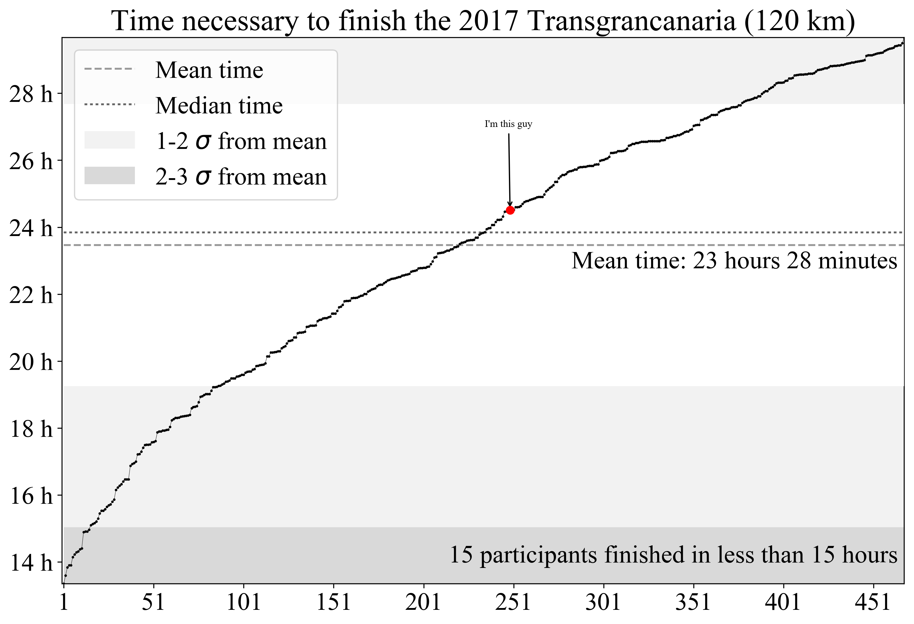
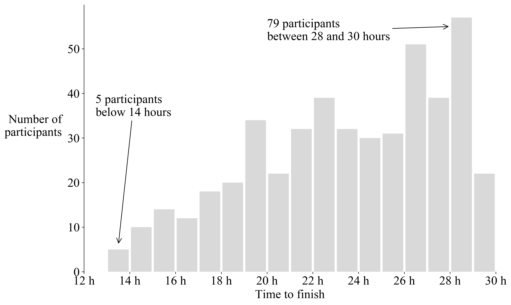
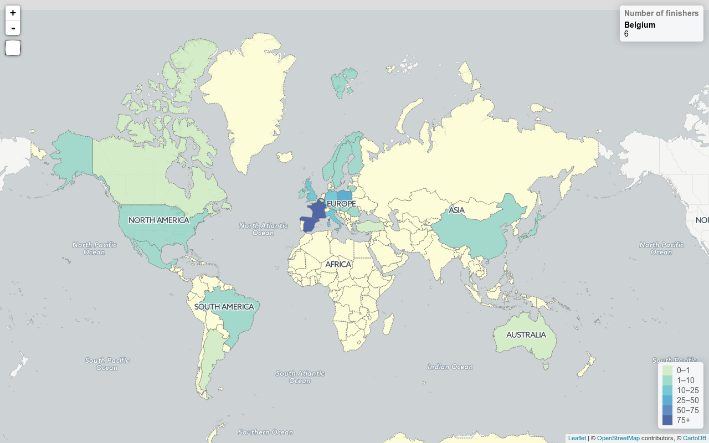

Just after the race I decided to play a little bit with the data to see some cool stuffs. More than 6 months later, here they are.

### Data extraction

First (and usual): get the data in a usable format. From the race web page, I downloaded the `pdf` file storing the results and copied its content in a text file. The result is pretty bad as everything (names, times, countries) is mixed up. Luckily with regular expressions it was easy to extract the information needed.

### Time to finish the race

The dates extracted in the previous steps are converted to seconds for the calculation of durations.

#### Time series

Here we show all the finishers' time along with basic diagnostics (mean, standard deviations from mean, ...). For the first runners, long gaps are visible, especially below 22 hours. Such gaps tend to diminish for longer race times. The median time is slightly below 24 hours of race, almost twice the winner's time. The fact that among the participants we have both professional runners and amateurs can explain these observations.

|  |
|:--:|
| _Each dot is a runner: the x-axis is it's ranking, the y-axis is the elapsed time._|

#### Histogram (classic)

The idea is simply to count the number of runners by bins of 1 hour. The distribution is clearly non-Gaussian and shows that in general more participants require more time to finish. The maximal time allowed to finish the race is 30 hours but it would be interesting to see how many persons can do it in less than, let's say, 32 hours.

|  |
|:--:|
| _Histogram showing the race time of all the finishers._|

### Distribution by countries

It is not a surprise, but most of the finishers come from Spain and from France (they had holidays during the week of the race). Africa is the only continent without a single finisher. Finally we can see that we were (only) 6 from Belgium, which means I cannot be too proud to be the 1st of them.

|  |
|:--:|
| _Choropleth map displaying the number of finishers by country._|
