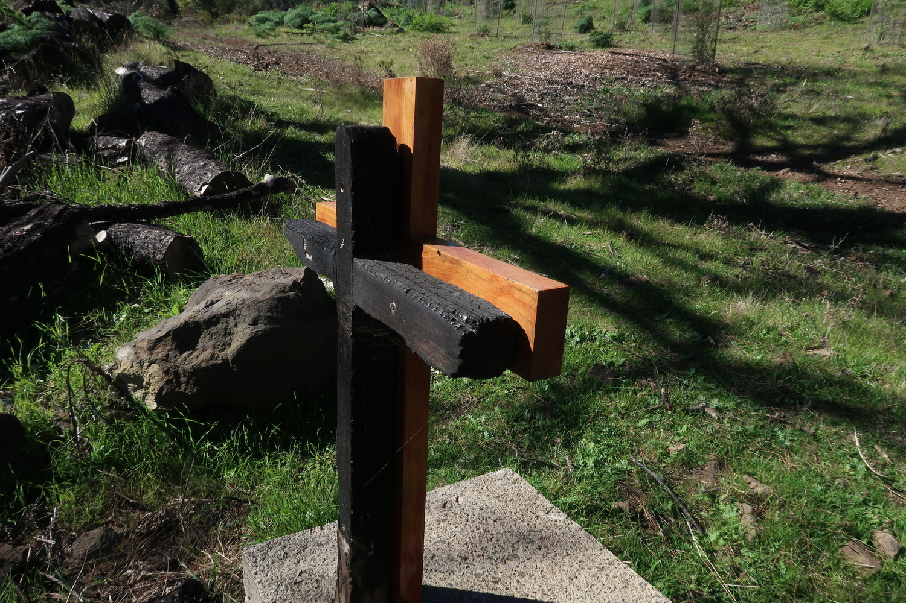

Ici j'avais envie d'écrire un mois après la course, malheureusement les choses sont ce qu'elles sont et on fait ce qu'on peut, pas ce qu'on veut.
Plusieurs points à aborder, en premier lieux un petit retour sur les entrainements, ensuite on parlera des sensations physiques, et enfin, un peu de mental.

## Programme d'entrainement

Le gros resumé c'est que je me dis que j'ai de la chance d'avoir fini en bon état vu les nombreuses carences de le programme de préparation de la course. Quand je dis _programme_, c'est un peu optimiste, ça donne l'impression que j'ai suivi quelque chose de structuré. Hors ma vie en ce moment est loin d'être structurée (famille, boulot, voyages, ...), rendant délicat le suivi d'un planning rigide.

Alors, que faire? Le plan de base était simple: accumuler des kilomètres. Vers juin, je m'étais fixé comme objectif de tourner à 100K par semaine (ça fera l'objet d'un article prochain). Ce qui fait une moyenne d'environ 14 km par jour. En théorie pas trop difficile. En pratique ça implique de quasiment courir tous les jours. Le but c'était d'apprendre à courir en étant fatigué (ça a marché), et aussi évidemment construire un gros volume en endurance fondamentale.

|  |
|:--:|
| _De Retour à Gran Canaria, au dessus de la mer de nuage._|

Curieusement lors de cette période à 100K/semaine j'ai quand même fait quelques courses et ça c'est vraiment très bien passé, je pense même avoir fait mes meilleurs résultats sur certaines courses. 

Maintenant parlons des faiblesses de ce plan:
1. La manque (voire l'absence) de sorties longues;
2. La faible quantité de dénivelé positif;
3. L'absence de prépa physique (muscu etc).

## Les sorties longues

Pour moi, faire (et surtout terminer) cette course était un pari: peut-on y arriver sans sorties longues? La réponse est oui. 
Ci-dessous sont listées les plus longues sorties effectuées dans les 4-5 mois avant la course. Il y a une seule sortie de plus de 30 km, le trail de Manaihant (11 km?) où on était allés en courant avec Arnaud. Ensuit 2 sorties entre 20 et 30 km, dont celle du 19 août qui était quand même assez plate (Ravel le long de l'Ourthe).

|  |
|:--:|
| _Lors d'une sortie longue à Gran Canaria._|

| Date           |   Séance         | Temps         | Distance       | D⁺ |
|:-------------|--------------|--------------|:--------------:|--------------:|
|13 octobre		|4 X 2000 m | 	1:15:19 |	14.99  |	61 |
|5 octobre 		|Verviers - Pépinster| 	1:24:30 |	15.23  |	366  |
|2 octobre  	|Trail de Manihant pluvieux  |	2:29:35  |	30.59  |	501  |	
|15 septembre	|Trail Grand Rechain & Chaineux | 	1:49:21 |	19.04  |	452  |	
|10 septembre 	|Verviers - Polleur |	1:36:16 |	17.92  |	342 |	
|6 septembre 	|Explo Andrimont |	1:33:20 |	16.00 |	398  |
|3 septembre 	|Verviers - Baraque Michel| 	1:57:37 |	20.23  |	678  |	
|29 août		|Verviers - Pépinster - Sohan |	1:37:22 |	18.24  |	470  |
|19 août		|Sart Tilman - Guillemins avec petit détour |	1:53:58  |	22.60  |	115  |	
|25 juillet		|Valleseco - Teror - Valleseco |	2:32:01  |	17.38  |	936  |
|11 juin		|ExtraTrail Bleu Theux 	| 1:39:43 |	17.98 |	512 |

À noter aussi la séance `4 X 2000 m` pour accompagner Guillaume qui préparait le Marathon de Rotterdam, séance qui me permet d'avoir une sortie de quasi 15 km. 

## Manque de D⁺

Point de vue D⁺, il y a évidemment une sortie à Gran Canaria le 25 juillet (936 m, pas énorme) et si on se concentre sur la Belgique, il y a eu la montée à la Baraque Michel (678 m). Bref, rien de bien bien costaud, vous en conviendrez. Souvent on me dit que je pourrais aller faire la côte à Coo que tous les traileurs font avant une course de montagne. Le problème c'est que Coo c'est pas la porte à côté, si je dois me taper 30 minutes (?) de voiture 2 fois pour y aller (voiture que je n'ai d'ailleurs pas), ça ne m'arrange pas fort point de vue temps. Je préfère courir une heure de plus près de la maison. 

|  |
|:--:|
| _Montañón Negro, un ancien volcan._|

Je me dis (ou pense) souvent mais tous les coureurs qui habitent aux Canaries ont un énorme avantage de ce point de vue là. Par exemple à Gran Canaria la sortie "de base" que je fais le plus (Valleseco - Cruz de Tejeda) doit faire dans les 12 km et 600 de D⁺. Au Sart Tilman où on s'entraine pas mal, déjà arriver à 300 m de D⁺ c'est déjà une sortie très solide.

La solution? A priori aucune, on fait avec ce qu'on a. On pourrait dire d'aller un peu en avance sur place, mais "un peu" ça voudrait dire environ 6 semaines (sinon pas le temps d'assimiler), 6 semaines c'est long et je ne sais pas qui pourrait se permettre ça (enfin si je sais: des gens qui font un doctorat entre les Canaries et la Belgique). 

## Pas de prépa physique générale

Ici pour être précis je veux surtout dire muscu: là où en 2010 j'allais probablement 4-5 fois à la muscu par semaine, je crois que mon dernier abonnement à la salle date de avril 2019. Je me dis que justement toutes ces années à soulever de la fonte ont servi pour construire de la masse musculaire, notamment dans les jambes.

|  |
|:--:|
| _La Caldera de Tejeda._|

À côté de ça j'ai quand même travaillé avec un préparateur physique pour tout ce qui est: mobilité (dévérouillage articulaire), plyométrie, proprioception, étirements dynamiques et éducatifs. C'est venu quelques mois avant la course, j'ai senti que ça aidait et j'imagine qu'avec le temps et la pratique ça aidera encore plus. 

Avec plus de temps libre je crois que j'irais 2 fois par semaine à la salle pour travailler aussi bien le haut du corps que les jambes. 

## Sensations physiques

Après la course j'ai assez vite repris et ça allait plutôt bien: aucune blessure, quasi aucune douleur, presque comme si de rien n'était. Mon but, après quelques jours relativement calmes, était de faire quelques cycles d'entrainement avec des séries courues à une vitesse proche de la VMA, afin de retrouver de la vitesse pour des courses plus courtes. 

Au début j'avais juste l'impression de ne pas avancer. Donc pas de super sensations. Par contre j'ai quand même réussi à prendre un segment _Strava_ à un ami à Gran Canaria: un tour de 1200 m avec un peu de montée, une maigre consolation même si c'est toujours drôle de prendre un segment à quelqu'un qu'on connait.

## Sensations mentales

Peut-être le plus intéressant ici: avant la Transvulcaniaµ, je me sentais bien par rapport à la course à pied, j'avais de bonnes jambes et donc pas mal de confiance en moi. Après la course, une fois que l'euphorie est passée, je me suis senti plutôt à plat, j'ai l'impression que tout le monde est meilleur que moi en course à pied, et aussi que tout le monde aurait pu terminer la course dans un meilleur temps que moi (et même maintenant je le pense toujours un peu).

|  |
|:--:|
| _Forêt de pins canariens._|

D'ailleurs 2 semaines après La Palma, un ami me propose une sortie d'une trentaine de km. Le trajet ne m'excitait pas vraiment mais je décide malgré tout de me joindre au groupe. Comme ils allaient passer près d'où je logeais, je me suis dis que j'allais les retrouver sur le parcours, évitant ainsi quelques kilomètres de descente. Au final je ne les ai jamais trouvé: j'ai fait les 35 km en solo, à un rythme calme mais en pensant que j'allais me faire rattraper puis dépasser par le groupe assez vite (vu que tout le monde est meilleur que moi).

L'aspect positif c'est que maintenant je suis motivé pour m'entrainer très sérieusement: continuer à viser les 100 km par semaine car c'est un gros, gros défi, non pas physiquement mais du point de vue de l'organisation, et puis suivre un bon plan pour ce qui est VMA et seuil. La confiance, je l'espère, reviendra avec le temps et aussi avec les courses. 

