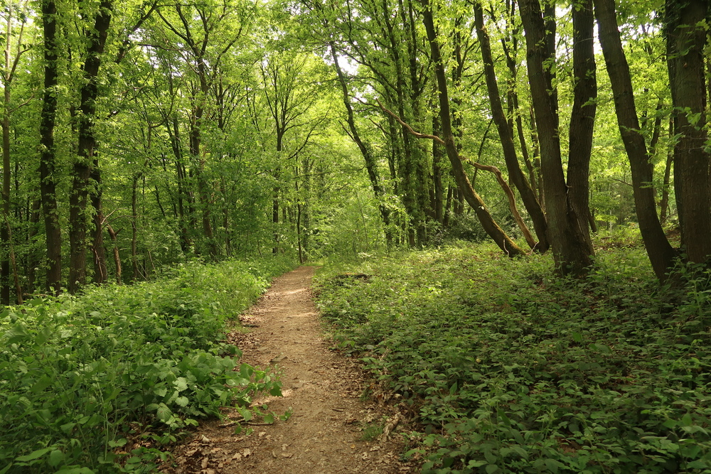
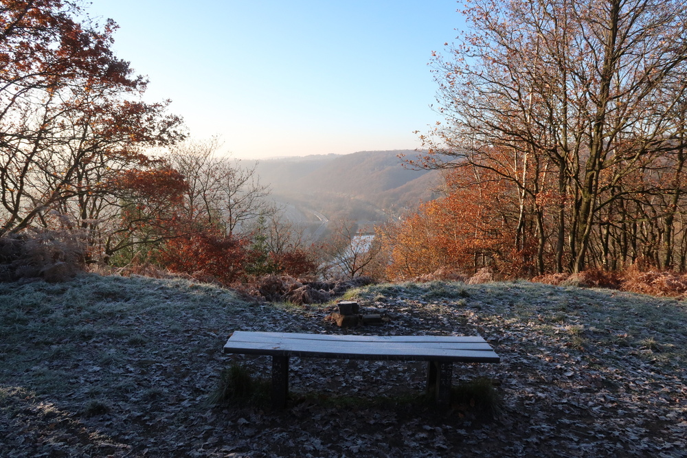
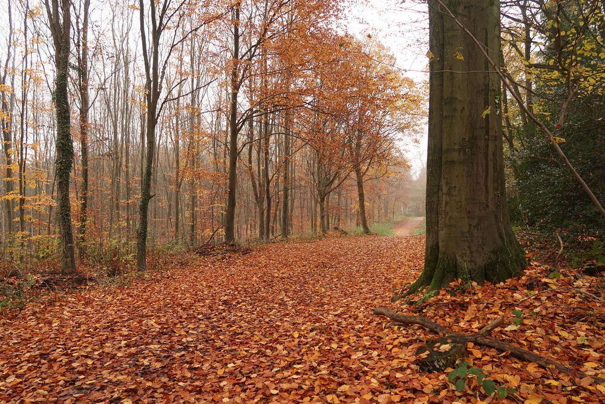

Un article que j'avais envie d'écrire depuis longtemps, sur le thème "courir 100 km par semaine". Rien de révolutionnaire, juste l'idée de raconter comment j'en suis arrivé à courir ça chaque semaine depuis environ 1 an.

## Le commencement

Personnelement, malgré mon profile ingénieur/scientifique (hum hum), je n'ai jamais voulu passer trop de temps à analyser les données relatives à la course à pied. On pourra dire que c'est pour séparer le professionnel du privé. Jusqu'à il y a peu, la seule chose que je contrôlais était le nombre de sorties par semaine, approximativement. Le volume hebdomadaire? Aucune idée.

Puis un jour j'ai découvert les excellentes vidéos de Maxime Lopez, alias [Runwise](https://www.youtube.com/@RunWise_) sur Youtube. Et dans une de ces vidéos, il expliquait comment et pourquoi courir 100 km par semaine. Au début ça ne me paraissait ni facile, ni difficile, je crois qu'en fait je m'en tapais un peu.

## La mise en route

Vers fin mai 2022 que j'ai commencé à mieux compter les kilomètres. À l'époque j'avais toujours ma montre Suunto que n'était pas top si je puis dire; il fallait noter les kilomètres puis faire le total à la main. Avec Strava malgré tout ça devenait plus facile et on pouvait voir le volume hebdomadaire assez facilement. 

Les premières semaines j'étais vers 90-95 km, ça allait sans trop de soucis. Et aussi, ça correspondait à l'époque où j'ai arrêté de prendre le bus pour aller au bureau, ajoutant ainsi pas mal de kilomètres au total. Je me souviens d'avoir faire des sorties le dimanche en fin de soirée pour finalement arriver aux fameux 100K. C'était bête, c'est sûr, mais voilà, si courir 5-10 km un dimanche soir permet d'accomplir un objectif, 
alors pourquoi pas.

En juillet 2022: changement de montre, la nouvelle Garmin affiche par défaut le nombre de km couru au cours de la semaine. Plus de prise de tête, merci Garmoin. Depuis, c'est un peu la routine, enfin c'est ce qu'on va expliquer. 

## Les avantages

### 1. Se calmer dans les séances de qualité

Les séances VMA, tout le monde les aime, et aller s'exploser le cardi sur des 200 m c'est sympa, mais est-ce vraiment ce qu'il y a de mieux? Je n'en suis pas certain, surtout quand on n'a plus 20 ans. Dans mon cas, ces séances de qualité sont souvent placées au milieu d'une journée où je cours aussi le matin et soir, donc a priori je ne peux pas me détruire sur la séance de midi, sinon je ne rentre pas à la maison. 

### 2. Progrès général

Là c'est peut-être subjectif, mais depuis que j'ai augmenté le volume, les résultats en course sont bien meilleur. J'ai l'impression que c'est beaucoup plus facile de courir vite et longtemps. 

### 3. Apprendre à courir fatigué

Dans les longues courses, surtout les trails, il y a toujours un partie où on commence à être bien crevé. C'est toujours un peu délicat à gérer au début, sauf si on n'y est déjà habitué. Avec les 100 km par semaine, il y a plusieurs séances où je suis bien détruit. Besoin de repos? Oui, certainement, mais courir _sans jambes_ me semble aussi pertinent. Pour les sensations (mauvaises). Pour la vitesse (lente). Pour l'alimenation (plein).

### 4. L'alimentation 

J'allais l'oublier: plus besoin de se tracasser de la quantité de nourriture, tout passe bien, à la limite la difficulté c'est de manger assez (surtout au bureau). Que du positif, même si malgré tout il faut faire un minimum attention.

### 5. La polyvalence

Ici peut-être que je me trompe mais j'ai l'impression qu'avec ces km on est préparé relativement bien pour plein de distances: 10 km, semi, marathon, long trail, ... et ça c'est quelque chose que j'ai toujours recherché: si un jour un collègue me dit: 
> "tu viens courir 40 bornes avoir moi demain?", 

j'espère toujours être en condition pour le faire. 

## Difficile ou facile?

Il y a évidemment plein d'aspects à considérer. D'un côté je dirais que oui, c'est facile; d'un autre, ça ne se fait pas en 2-3 semaines, il faut déjà une bonne expérience je pense.

### Physiquement

Là mon point de vue c'est que physiquement ce n'est pas le truc le plus dur, à partir du moment où on a déjà un bagage en course à pied.
Passer de 50 km à 100 km par semaine n'est clairement pas une bonne idée, il y a des trucs à respecter concernant l'augmentation progressive du volume entre les saisons.

Des douleurs? Oui, parfois, rien qui dure vraiment longtemps.     
De la fatigue? Pas du tout, c'est plutôt le contraire.

### Mentalement

Je pense souvent que c'est plus facile de courir tous les jours de la semaine (ou même plusieurs fois par jour) que de courir 2-3 fois par semaine. Pourquoi? Parce qu'il n'y a pas besoin de réfléchir: tu te lèves, et tu vas courir. Si ce n'est que 2-3 fois, il y a toujours un prétexte pour reporter une séance (trop chaud; orage; réunion), et puis rapidement on se retrouve fin de semaine avec aucune séance réalisée.

### Organisation

Bon OK, si c'est facile physiquement et mentalement, c'est quoi le soucis. En un mot: l'organisation. Dans un monde idéal, on peut toujours prévoir et placer les séances quand on veut, par exemple

|   	|   	|   	|
|---	|---	|---	|
| Lundi  	| | 15 km 	|
| Mardi  	| | 15 km 	|
| Mercredi 	| | repos 	|
| Jeudi 	| | 15 km 	|
| Vendredi 	| | 10 km 	|
| Samedi 	| | 15 km 	|
| Dimanche 	| | 30 km 	|

Ce genre de plan ne parait pas la mer à boire (indépendamment ce que qu'il y a dans chaque séance). Toutefois avec la famille, le boulot, les réunions, les missions à l'étranger avec réunion dès 9h du matin et restautant le soir, combiner le tout devient vite une casse-tête. D'où le sous-titre de ce blob: "_every kilometer counts_".

## Conclusions 

L'objectif de courir 100 km par semaine est plutôt simpliste, mais mieux vaut ça que pas d'objectif du tout. Si je devais donner un conseil à quelqu'un qui veut se lancer là-dedans, c'est très simple: avant toute chose, il faut aimer courir, sinon ça n'ira pas à long terme.

Dans mon cas courir est évidemment un plaisir et aussi un moyen de transport (vu que je n'ai pas de voiture). Donc la matin à la boulangerie, ça peut déjà donner entre 2 et 4 km. Mulitplié par 7, on approche déjà des 20 km (gratuits j'ai presqu'envie de dire). 

Aussi super important: prendre en compte les spécicificités de chacun: perso je sais que les weekends sont peu propices à la course à pied, contraiement à d'autres qui en profitent pour réaliser leur sortie longue. Donc je sais que je veux être à 100 le dimanche soir, il faut que je sois déjà à 80 (environ) le vendredi soir.

Voilà qui termine cet article sur les entrainements. Il y a beaucoup de bonnes sources d'information dans des sites consacrés à la course à pied, rien de tel pour trouver des idées et des conseils.