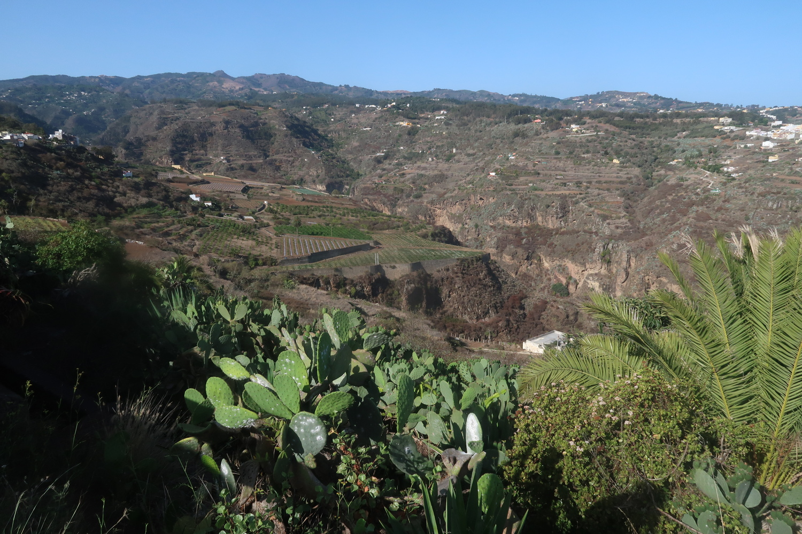

Tradition oblige, chaque fois que je vais aux Canaries, j'essaie d'aller courir avec des amis. En général ça fonctionne plutôt bien, mais ici j'ai eu droit à un plan bien foireux, la bonne excuse pour écrire un article ici.

## Comment ça a commencé?

Mon ami, que l'on appelera `JM`, est ce qu'on peut appeler une _bête_, une _machine_, certains disent même un _tueur_. Le genre de gars qui fait régulièrement des podiums sur les courses locales, et qui me bouffe, surtout en montée (il n'y a que sur le plat que je pense pouvoir le devancer). Donc `JM` me propose une sortie le samedi, selon les termes suivants:
> Une sortie tranquille, avec moi, un autre coureur rapide (qu'on appelera `D200`) et 2 coureurs plus lents. 

Ça s'annonce plutôt bien. Aucune idée du parcours ni du kilométrage, ça ne me tracasse pas trop, dans ma tête ce sera minimum 15 et maximum 35. Le jour avant je me fais un peu plus de 20K - 1000 m D+, mais sans forcer.

## Rendez-vous sur le parking du terrain de foot

On va donc ensemble en voiture avec `JM` au point de rendez-vous. Et là c'est la surprise: au moins 10 voitures d'où sortent des gens vêtus comme lors d'une course, et dont le physique ne trompe pas: des coureurs de trail. Sacrée coincidence, me dis-je: ils ont pris le même point et la même heure de rendez-vous que nous. Sauf que non, ce n'est pas une coïncidence, ils viennent aussi! 

Un des gars semble être le leader, l'organisateur. Il parle fort et gesticule au milieu du parking, et j'avoue que j'ai du mal à le comprendre (pour info je parle, lis et écris en espagnol tous les jours, et ce depuis plus de 10 ans, mais soit...). Il faut lui trouver un nom, ce sera: `Menalu` (pour "Meneur d'Allure").

D'autres voitures arrivent, `D200` se gare à côté de nous et explique (enfin) un peu ce qui est prévu de faire comme parcours, sans vraiment parler de temps, de distance ou de D+. Des détails quoi. Un peu avant de partir, `JM` me lance, l'air surpris:
> Ah tu as pris un sac à dos avec de l'eau?

Logique pour moi: aucune idée d'où on va, si on trouvera de l'eau, s'il y aura une boutique ou un bar à proximité, si on fera un semi-marathon... Au final sur ce gros groupe, on est 2 à avoir un sac. Trop tard pour changer de toute façon.

## Le départ

`Menalu` gesticule (encore), crie et commence à courir. Plutôt vite. C'est plat donc ça va, mais direct on sent que tenir ce rythme 30K sera difficile... Même 20K. Le parcours est plutôt pénible, avec beaucoup d'asphalte, des pistes un peu pourries, et une alternance rapide de montées et de descentes. Ça discute dans le peloton, mais seulement sur un des 2 thèmes suivants:
1. les courses passées et parfois les futures;
2. les chaussures de trail.

Peut-être que je ne suis pas super ouvert mais moi, savoir que telle ou telle course passe par tel ou tel chemin près d'où on se trouve, je m'en tape un peu. Le truc sympa aurait été de rencontrer, de discuter de tout et de rien avec tout le monde, comme on le faisait dans d'autres sorties.

Je me trompe peut-être mais je crois que si un jour, un coureur venant d'un autre pays vient courir avec notre groupe au temps de midi, on essaiera quand même de discuter avec lui (qui plus est s'il parle notre langue sans soucis).

Bref, retour à la sortie, progressivement le parcours se dessine, Menalu propose de passer par une petite montagne (1000 m) pas trop loin, mais on lui explique (ou plutôt: on essaie de lui faire comprendre) qu'avec l'alerte incendie qui est en place ces jours-là, les chemins sont fermés.

> - Oui mais si on prend le petit chemin derrière qui passe par...
> - Non, je te dis qu'on ne peut pas, les gendarmes surveillent.

On bifurque à droite, vers un ravin, le moins qu'on puisse dire, c'est que ça trace. Mon sac me fait vraiment ch*** (trop large), et je suis bien conscient que ça ne va pas aller à ce rythme-là. Il n'y a que 3 personnes derrière moi, dont `JM` qui me reprend et me dépasse dans la montée dans le ravin. 

## Mi-course: on arrête?

Dans ma tête je me dis: OK, je rentre cool en courant/marchant jusque la maison, et ce sera bien. Je sors (enfin) l'appareil photo, que gisait au fond de mon sac. Quelques minutes plus tard je tombe sur `JM`, un peu cassé, qui m'attend et me dit que les autres sont fous, qu'ils sont partis pour 40K. Les 2 autres qui étaient derrère moi nous rejoignent, et c'est parti pour une montée à 15%-20%. 

Assez vite dans la montée, on tombe sur un coureur bien bien crâmé: il s'agit ni plus ni moins de l'ami `Menalu`, qui a tellement bien mis l'allure qu'il a explosé (ou qu'il s'est explosé tout seul). Quand j'y repense ça me fait rigoler. La montée est vraiment dure, mais on finit par arriver à un petit village où ceux qui le souhaitent peuvent acheter de l'eau. C'est le bon moment pour faire un _reset_ et repartir comme si de rien n'était.

## Descente et retour vers le départ

On est donc un petit groupe de 5, incluant `JM` et `Menalu`. Ce dernier nous indique le trajet que l'on va prendre. Le rythme s'accélère, comme c'est plat et en descente je n'ai aucun soucis à le suivre et même le dépasser, mais pas trop vu que je ne connais pas le chemin exact. Je suppose que ça fait partie du charme de cet entrainement.

Il me parle de temps en temps quand on est un à côté de l'autre, mais je dois avouer que je ne comprends pas grand chose. Sauf qu'il trouve que le parcours est vraiment chouette et qu'il le fait souvent! Bon, chacun ses goûts, alors que l'on passe à côté d'une carrière desafectée, ça vent du rêve comme on dit. 

On doit avoir 5K de descente, aucun soucis, j'ai bien bu et même pris des gels, on regagne le parking après 22K et un peu plus de 2 heures. Le reste du groupe est déjà sur place, mais visiblement pas depuis très longtemps vu qu'ils commencent à peine à se changer.

J'écoute les discussions, assez drôle d'entendre que certains ont été plus rapide que lors d'une course sur certains segments du parcours. D200 n'est pas super content non plus, car certains ont terminé à du 3'10/km et il ne vois pas à quoi ça sert. `JM` arrive en marchant, blessé. 

## L'after

Il est 11h, le bon moment pour rentrer à la maison. `JM` n'est pas non plus du genre à rester pour prendre une chope, tant mieux comme ça on ne perd pas du temps.

La sortie ne m'a pas cassé physiquement, mais m'a bien saoulé. Je n'ai jamais été contre des imprévus dans des entrainements voire en course, mais quand tout le monde a l'air de savoir ce qu'on va faire mais que l'info n'est pas transmise, pas super.

Après, on voit clairement la différence entre des coureurs locaux moyens-bons et moi: ils me bouffent tous aussi bien en montée qu'en descente technique. Sur du plat je pense être devant, mais le plat n'existe pas vraiment là. 

À refaire? Bien sûr que non. Même `JM`, qui m'avait invité, n'était pas vraiment content. Ensemble on a déjà fait des sorties probablement plus dures, en petit groupe, et tout se passait bien. Ici dès le début ça s'est emballé, au point qu'une sortie annoncée comme "tranquille" s'est transformée en séance de "meilleurs temps" pour certains. L'effet de groupe probablement.

Bon voilà, j'ai presque fini cet article quand j'attendais à l'avion à l'aéroport, puis il y a fallu un long trajet en train pour y mettre la ligne finale. Prochain article, presque sûr, sur la prépa du marathon de Eindhoven, octobre 2024.

