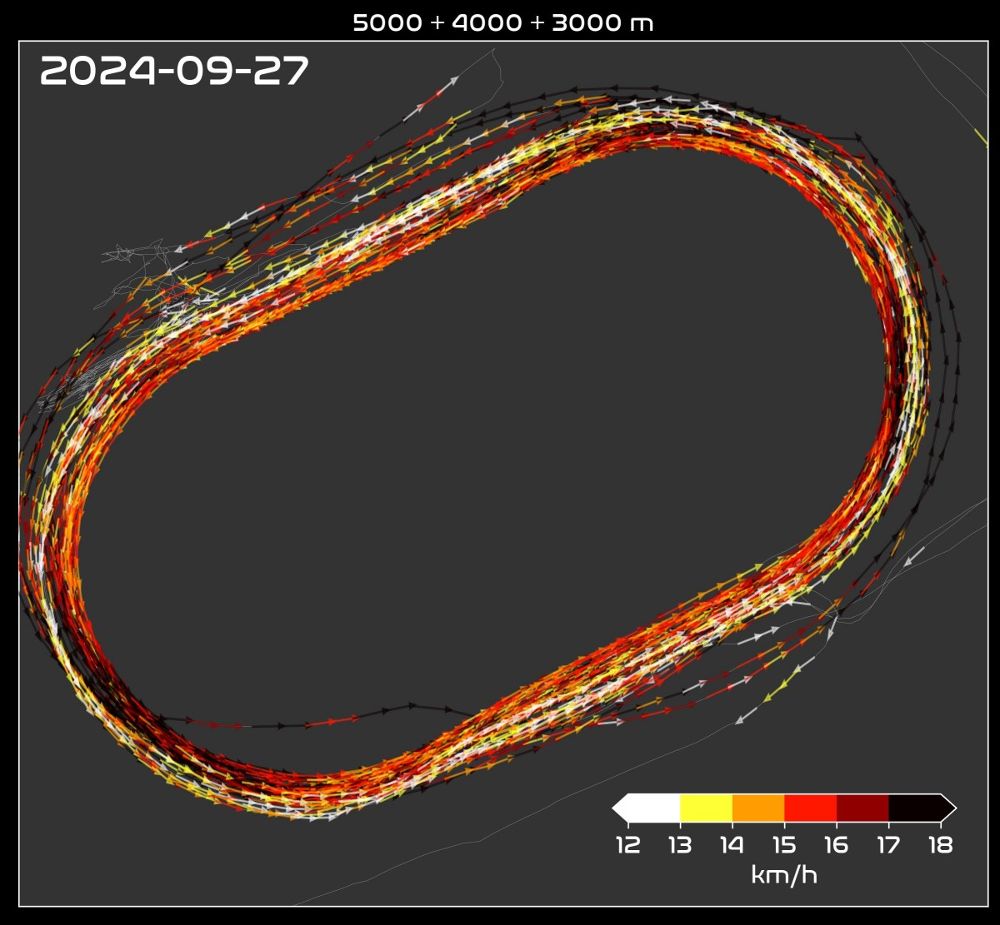

Je vais profiter de différents trajets en train pour écrire un peu sur le [marathon de Eindhoven](https://asmlmarathoneindhoven.nl/) et surtout la préparation pour celui-ci.
Quand j'ai commencé à écrire ce texte, on était 5 semaines puis 3 semaines de l'objectif, et à ces moments-là ça va allait encore assez bien. Maintenant il reste moins d'une semaine et tout a changé...

## Au commencement...

Ici la décision de courir le marathon de Eindhoven est simple: j'ai foiré à [Paris](https://ctroupin.github.io/run/races/20240407_paris/), il faut que je retente. 
Et pourquoi j'avais, à l'époque, décidé de courir à Paris? Probablement parce que j'avais couru le [semi de la Province de Liège](https://ctroupin.github.io/run/races/20231015_semiliege/) et que ça c'était vraiment bien passé.

## Le plan

Avoir un bon plan pour l'entrainement, ça aide. D'habitude je mélangeais un peu plusieurs plan, j'utilisais des séances vues sur Youtube (merci [RunWise](https://www.youtube.com/@RunWise_)), mais la vie de tous les jours fait qu'il était difficile de planifier plus d'une semaine à l'avance. Et quand ce n'est pas planifié, on a tendance à faire, je ne vais pas dire n'importe quoi, mais plutôt quelque chose qui n'est pas optimal. 

Les gros soucis de Paris, je les connaissais (ici je parle uniquement de la prépa course à pied, pas de virus ou autres):
1. Une préparation quasi inexistante: dommage, sans prépa, pas de miracle sur de telles distances.
2. Un manque cruel de sorties longues: un marathon c'est long aussi bien pour les jambes que pour la tête. Si après 1h de course tu sais qu'il te reste environ 2 heures à tirer, il faut être prêt.
3. Un manque de stress (positif): normalement quand on prépare un gros évènement on sent parfois la boule au ventre, surtout au départ, alors qu'à Paris j'étais en mode "touriste", pas grand chose à faire. Donc ici je vais essayer de me mettre une petite pression, même sur certaines séances.
4. L'alimentation: je n'étais pas trop mal mais je n'étais pas non plus super _sharp_. De petites habitudes à changer devraient aider.

### Les entrainements

Jusqu'à présent toutes les séances se passent bien, aussi bien les intervales courts que les séances à allure marathon ou allure semi. Quant aux sorties longues, je prends conscience de la difficulté qu'elles entrainement, même si on ne les court pas très vite. Le progrès se fait sentir semaine après semaine, et ça c'est motivant. D'ailleurs je pense souvent que l'important dans une telle course, c'est le chemin parcouru pour arriver en forme au départ. 

|  |
|:--:|
| _Une belle séance de fin de prépa._|

La course en elle-même n'est que la réalisation de tout ce qui a été préparé avant. Ça veut aussi dire qu'on peut foirer tout sur une petite erreur, c'est pour cela qu'il faut bien préparer tous les aspects (entrainement, repos, alimentation, mental) et ne pas se mettre une pression de dingue.

### Sensations et mental

Un truc qui manquait cruellement lors du marathon de Paris, c'était le manque de pression. Souvent la pression est vue négtivement alors qu'elle a aussi du positif. Pas de pression c'est comme si on s'en tapait de la course et ce qui m'était arrivé. Pas seulement sur Paris d'alleurs, mais aussi lors de gros trails il y  quelues mois. D'un côté c'est bien parce u'il y a une époque ou c'était vraiment stressant de prendre un départ. Stressant et négatif. Parfois je disais que ça me stressait plus un départ de course qu'un examen à l'univ ou une présentation orale devant plus de 100 personnes. J'ai jamais vraiment compris d'où ça venait. 

#### Comment se mettre une pression? 

En voilà une bonne question! Peut-être une bonne façon se mettre la pression est de parler de la course et de ses objectifs à tout le monde, genre: 
> Bientôt je fais le marathon d'Eindhoven, je pense le faire en 2 heures xx minutes, si je fais plus de 3 heures je suis une grosse me**e.

Ça ce serait la pression mise au travers des autres, pas une pression "interne". Pour ça j'imagine qu'il faut penser à toute la prépa (12 semaines), aux éventuels sacrifices, ... Malheureusement pour moi ça ne risque pas de foncitonner:
- la préparation je la voie plus comme une chance que comme une punition ou comme quelque chose de difficile: on (= la plupart des coureurs) a la possibilité de faire ce sport, d'être en plutôt bonne santé, d'avoir le loisir et le temps de s'entrainer plusieurs fois par semaine... 
- les sacrificies, pareil, je ne les vois pas. C'est sûr qu'il y a des efforts pour sortir courir tous les jours, bien dormir, manger sainement, se farcir tous ces tours de piste, aligner plus de 100K chaque semaine... Mais si ce n'est que ça, on ne peut pas parler de sacrifices.

Bref, pour se mettre de la pression, ce sera pour une autre fois.

## Les objectifs

Entrons dans le vif du sujet: quels sont les objectifs de la course. 
1. Terminer en moins de 3 heures. Voilà qui est simple (à énoncer) et clair. Point de vue entrainements etc ça devrait passer, après c'est sûr que la réalité peut rattraper la fiction et que tant que ce n'est pas fait, c'est facile à dire. Mon meilleur temps reste une grosse sous-performance et donc de quoi se la jouer avec mes 3h36 minutes et tous ces kilomètres de marche le long de la Seine.
2. Autre objectif important est de terminer en ayant l'impression d'avoir bouclé un marthon, donc en ayant poussé (ou tiré) assez, en ayant senti que ça devenait dur mais que les entrainements permettent de sortir la tête hors de l'eau.
3. Enfin, j'aimeris que cette course me donne envie de refaire un marathon (en plus vite et en mieux).

## Des chiffres, encore des chiffres

Pour Paris, la distance moyenne sur une séance a été de 5.6 km. C'est peu mais c'est expliqué par les toutes petites sortie que je fais,
par exemple pour aller au boulot depuis la gare ou aller à la boulangerie. La distance médianne est de 4.6 km. Enfin, la plus longue est de
seulement 30 km. 

Pour Eindhoven, j'ai vraiment essayé d'allonger toutes les sorties, même les séances de piste, en ajoutant des kilomètres
à l'échauffement et au retour au calme. Résultats: la moyenne passe a 8.1 km (pas excessif mais tout comme pour Paris, 
je conserve pas mal de toute petites séances). La médianne est maintenant de 5.1 km, et la sortie maximale de 32 km.

Pas tellement de différence à première vue, donc creusons un peu plus.

### Distribution des séances 

Si maintenant on représente le nombre de séances pour différents intervales de distance (entre 0 et 5 km, entre 5 et 10 km, ...),
on obtient le graphique suivant.

|  |
|:--:|
| _Nombre de séance en fonction du kilométrage._|

Pour les courtes sorties, c'est évidemment pour Paris qu'il y en avait le plus, tandis qu'à partir de 10 km, c'est 
pour Eindhoven. Par exemple:
- 14 séances entre 15 et 20 km pour Eindhoven (3 seulement pour Paris)
- 8 séances entre 20 et 25 km pour Eindhoven (0 pour Paris!!)
- 3 séances entre 25 et 30 km pour Eindhoven (encore 0 pour Paris). 

### Volume hebdomadaire

Le volume hebdomadaire est un indicateur intéressant, et un bon prédicteur de la performance si j'ai bien compris. Voici donc la comparaison entre les préparations pour les 2 marathons (pour Eindhoven je me suis arrêté à la 10ème semaine):

|  |
|:--:|
| _Kilométrage par semaine lors des 2 préparations._|

La différence est assez violente, surtout que certaines séances lors des semaines 2 à 5 pour Paris étaient plus de la marche rapide que de la course à pied.

Pour en terminer avec les chiffres: sur les 10 premières semaines du plan:     
751 km parcourus pour Paris, contre 110 pour Eindhoven.

## Retour à la réalité

> Everything was going well until sh** happened...

Première semaine d'affûtage, tout va bien, le mardi je me fais une séance de 10 X 400 m qui restera ma séance de 400 m la plus facile de toute ma vie, et puis mercredi aprèm, je suis en réunion (en ligne), et j'ai froid, vraiment froid... J'avoue, à la maison on n'est pas fans du chauffage, mais il y a un truc qui cloche.

Pas de soucis, je n'avais pas prévu de sortie ce jour-là, juste une séance gentille de muscu avec du dévérouillage, gainage, et surtout pas de charges lourdes!! Bref, à 9h me voici à la salle, je passe (trop) vite du froid au chaud, alors qu'à la salle il ne chauffe pas vraiment beaucoup... ça ne sent définitivement pas bon.

Jeudi je suis _dead_, je ne sais pas comment je parviens à aller acheter le pain le matin, c'est la cata!

### Aujourd'hui

Dimanche 6 octobre, à une semaine de l'objectif, je ne suis même pas encore sûr que je vais courir à Einhoven (je suis plutôt quelqu'un d'optimiste dans la vie donc si j'écris ça, ce n'est pas pour rien.) 
Prochaine article la semaine prochaine donc!
 
