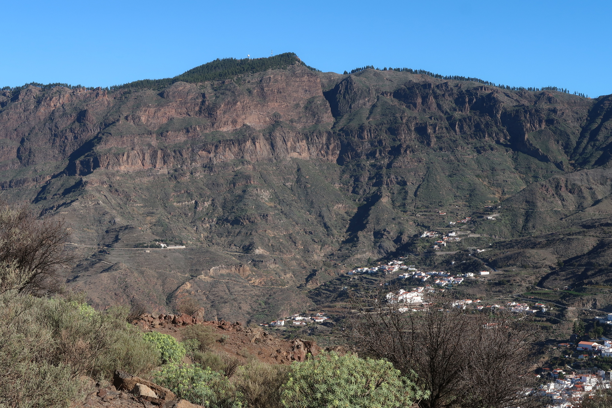
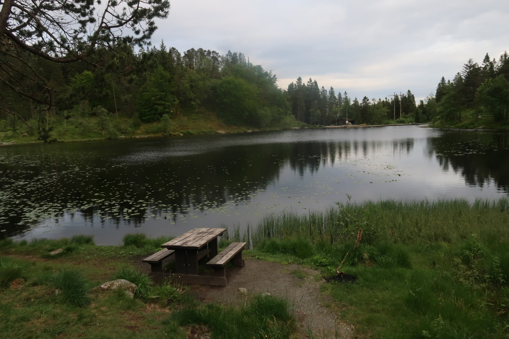
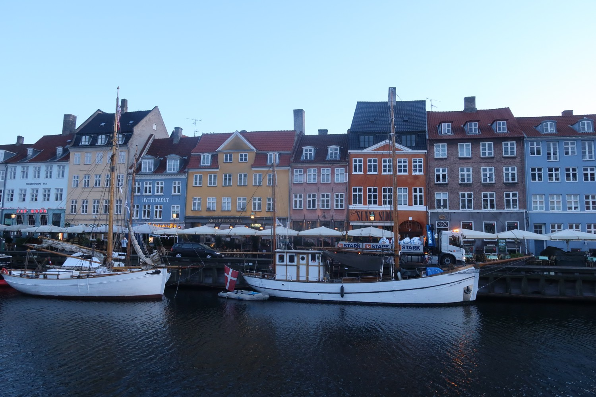
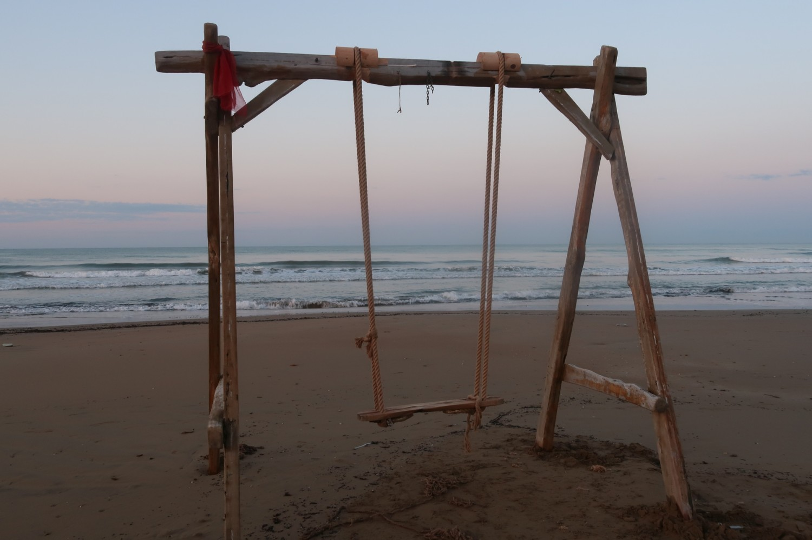

Cette année 2024 a été particulière pour moi: pour une des premières fois de ma vie, j'ai été obligé, 
pour différantes raisons, de ne pas courir! Est-ce grave? Non, pas du tout. J'ai trouvé que c'étaient des expériences enrichissantes.

Je le dis déjà, avant d'oublier: les photos sont prises au hasard et n'ont quasi rien à voir avec le texte.

## Hiver 2023-2024

Suite à une petite opération sans importance, la chirurgienne me dit:
> Pas de sport pendant 2 semaines.

Sur le moment ça m'a fait comme un choc. Parce que je ne l'avais pas du tout envisagé.
> Quoi? Pas du tout de sport? Deux semaines c'est long, non?

(je précise: je ne lui ait pas dit ça, mais je l'ai pensé).

Assez rapidement je me suis fait à l'idée: on dit très souvent qu'une coupure annuelle est une bonne chose, c'était alors le bon moment de tester. Il y avait juste 2 petites choses qui m'ennuyaient un peu:
1. En 2023 j'étais à quasi 5000 km courus sur l'année. Rien d'exceptionnel, mais j'avais envie de casser cette barre symbolique. Et sans courir 2 semaines ça allait être fort juste pour atteindre ce total.
2. On allait partir quelques jours aux Canaries pour les fêtes. Et pour moi les Canaries c'est synonime de courir à la montagne. Être là bas sans courir c'est un peu comme du gachis.

|  |
|:--:|
| _Dans la zone centrale de Gran Canaria._|

Dans les 2 cas, j'ai vite pris mon mal en patience, et voici pourquoi: dans un forum de course à pied, j'avais trouvé des discussions qui traitaient de ce thème-là: courir quand un médecin vous dit de ne pas le faire, suite à une opération. Là je me suis dis: mais quels gamins on est! Et je ne voulais pas être comme ces coureurs (amateurs) qui ne sont pas capables de faire une croix sur leur activité durant quelques jours alors que c'est justifié. 

En fait ce n'est pas un secret que j'aime courir, par contre j'ai parfois du mal avec cette appartenance à un groupe ou cette communauté. Quand le seul thème de conversation (dans la vie de tous les jours) est la course à pied, quand durant un entrainement on ne parle que des courses qu'on a fait ou qu'on va faire, oui, ça me saoule. 

### Les réactions

C'est peut-être la partie la plus intéressante: ma compagne me disait que ce ne serait pas possible, que je ne pourrais pas résister, que j'allais être insupportable, sur-excité etc. Cela m'a fait très plaisir de lui montrer qu'elle se trompait. En réalité, j'ai bien profité de ces 2 semaines de repos (forcé). J'ai quand même marché (calmement), pris plein de photos, lu, écrit, etc.

|  |
|:--:|
| _Sur les hauteurs de Bergen (Norvège) en mai 2024._|

On me disait aussi qu'on allait voir la différence dans l'alimentation (j'allais manger moins) ou dans mon poids (j'allais prendre vite des kilos). Rien de ça ne s'est passé. Après j'en ai parlé à des amis coureurs et ils m'ont dit que pour eux, 2 semaines c'était impossible!

### Les conséquences

Après cette période sans sport, ma motivation était renouvelée, juste par le simple fait de vouloir aller courir comme je voulais. Point de vue physique, la forme était toujours là, pas à 100% mais presque. Et surtout: je n'avais plus aucune douleur nul part: souvent, on ressent des petites douleurs (pieds, dos, par exemple) qui passent presqu'inaperçues, tellement on s'y est habituée. Là, tout était parti, ça faisait presque bizarre.

## Fin janvier 2024

Tout autres circonstances: j'avais commencé un plan marathon début janvier, ça allait déjà super bien, et puis milieu du mois tout s'effondre: je suis malade. Pas malade genre j'ai un ptit rhume et le nez qui coule. Non, je suis déchiré, mort, ardant, et la maladie a finalement un nom grâce aux prises de sang: la mononucléose. 

Pas vraiment envie de revenir sur cette période, j'avoue que j'en garde un très mauvais souvenir.

|  |
|:--:|
| _Copenhague, septembre 2024._|

Cette-fois là, je n'ai pas eu vraiment besoin du conseil d'un docteur pour comprendre qu'il faudrait lever le pied. 

### Les conséquences

Il est évident que les effets n'ont pas été vraiment positifs. On ne parle pas de 2 semaines de repos, mais de plusieurs semaines à lutter contre un virus (de merde). Même si les jambes avaient pu tourner, le reste n'y était pas.

Une fois que ça a été mieux, j'ai repris, d'abord calme puis ensuite plus intense. Ça a pris très longtemps pour revenir au niveau d'avant, probablement 3 ou 4 mois. 

|  |
|:--:|
| _Side, en Turquie._|

Le pire c'est qu'il n'y a pas vraiment de leçons à tirer. Le corps a souffert, il n'y a rien eu de positif à en tirer, sauf peut-être d'améliorer la patience. On lit ou on entend souvent la fameuse phrase:
> Ce qui ne te tue pas te rend plus fort.

Avant j'y croyais, jusqu'à ce que j'entende à la radio le témoignage d'une dame qui expliquait qu'après une sâle maladie, elle était vraiment ressortie affaiblie sur le long temps. Elle contredisait totalement le dicton. Moi j'ai pensé pareil après la mono: ça ne te tue certainement pas par contre ça te rend vraiment plus faible.

## Conclusions

Pas vraiment l'article le plus drôle à écrire, bien que cela faisait pas mal de temps que ça trottait dans la tête. Ça me fait d'ailleurs penser à un ami qui comme moi court tous les jours, voire souvent deux fois par jour. La grosse différence, c'est que lui est totalement incapable d'arrêter de courir, même s'il a de bonnes raisons.

Je ne sais pas si cela s'appelle de la bigorexie dans son cas. Pour ceux qui ne savent pas, la bigorexie, c'est quand un sportif ne peut pas s'empêcher de pratiquer son activité, sous peine de conséquences telles que mauvaise humeur, sensation de regresser, stress etc.

Certains m'ont déjà dit (pour rire) que je souffrais de ça. Mais non c'est pas pareil. Si je peux faire du sport, je suis conscient que c'est une chance, et je le fais. S'il arrive quelque chose et que je ne peux pas, ainsi soit-il.

