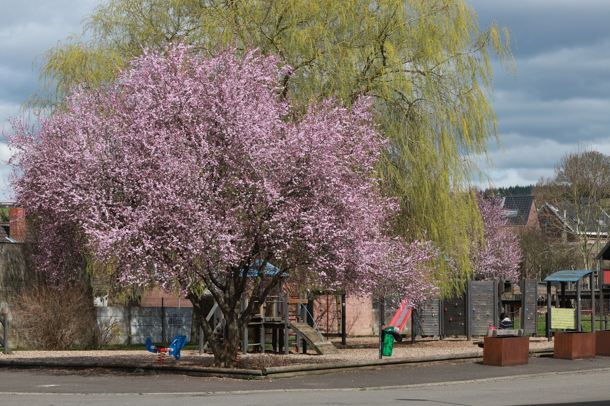
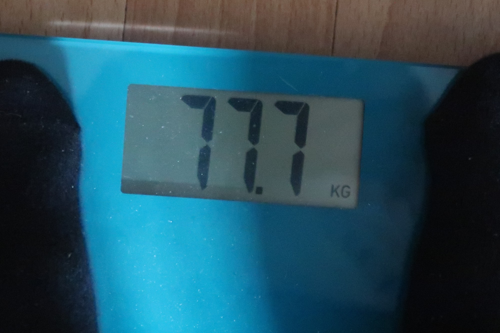
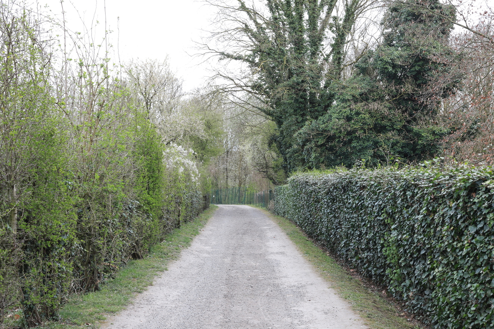

Aujourd'hui ça fait pile 5 semaines que je me suis fait opéré. C'est assez drôle de voir l'évolution de ce blog,où à la base je pensais écrire sur les courses et les entrainements, et puis finalement j'écris plus souvent sur ce qui se passe quand on ne court pas.

Avant que ça n'arrive je m'imaginais certains choses, maintenant je comprends que je me suis trompé.

## 🏃 Est-ce que ça me manque?

Probablement la question la plus importante. La réponse est simple: non! Passer de courir tous les jours à ne plus courir est assez brusque, et pourtant ça se passe bien. Plusieurs raisons à ça:
1. "Loin des yeux loin du coeur": il faut que je reste à la maison durant la convalescence, donc je n'ai pas vraiment de contact avec le monde de la course, en dehors de Strava, où je me connecte de temps en temps pour ajouter d'anciennes activités. D'habitude j'allais le matin chercher le pain en courant, ici j'y vais en voiture, parfois en marchant, donc ça ne change pas énormément.
2. La concentration sur la récupération: un seul objectif, se retaper correctement et le plus rapidement possible. À quoi cela me servirait de penser à une activité que je ne peux pas exercer?
3. Ça aurait pu être pire: pour le moment je peux marcher, jouer avec les enfants, faire des activités un peu physiques... alors qu'on départ je pensais que je ne bougerais pas du tout. Donc c'est mieux que prévu, on ne peut pas se plaindre.

## 🍴 Est-ce que je mange moins?

Ma compagne me dit souvent:
> Toi quand tu ne feras pas de sport tu mangeras beaucoup moins!

Et non! Les premiers jours après l'opération c'était un peu vrai: j'avais un peu peur de devoir aller aux toilettes donc je mangeais un peu moins, et je me disais que je ne pouvais pas grossir (de trop) donc je faisais plutôt attention, tout en évitant les petites gaufres du Colruyt etc.

Ensuite quand j'ai refais un peu d'exercices (muscu), automatiquement j'ai re-mangé plus, je ne sais pas si autant qu'avant, mais sans doute similaire. Je me dis que pour me réparer, il faut fournir du carburant au corps (protéines, minéraux etc) donc autant bien manger. Au pire, je prends quelques kilos (muscle et graisse), et ils s'en iront quand ils devront.

## ⚖️ Est-ce que j'ai pris du poids?

Question un peu similaire à la précédente, mais à laquelle je n'ai pas de réponse claire. Et pour cause: je ne me suis pas peser avant l'intervention. Je devais tourner autour des 75 kg, ici je suis à 77.7 kg, rien de dramatique. 

Ça me fait penser qu'un jour il faudrait que je le lise un peu plus pour tout ce qui est poids et course à pied, il est évident que ça joue beaucoup, mais je ne sais pas à quel point. Un Youtuber le mentionnait justement dans ses vidéos: les coureurs élites sont toujours maigres, pas de secret, chaque kilo à transporter (surtout avec du relief ou de longs parcours) augmentera la dépense énergétique, même si on est capable de déployer plus de puissance.

## 🥱 Est-ce que je m'ennuie?

La meilleure question!! À la base je pensais que j'allais m'ennuyer, que je ne saurais pas quoi faire, j'avais même pensé à une liste de petits projets qui m'auraient aidé à passé le temps. 

Voici quelques exemples de choses que je pensais faire et ce que j'ai effectivement fait:

- 📷 Photographie: une de mes passions en dehors du sport. J'imaginais que je serais aller me promener en ville avec mon objectif 50 mm, par exemple je voulais faire des photos de chaque pont de Verviers. La réalité c'est qu'en dehors des compétitions du petit, je n'ai quasi pas pris de photos, faute de temps, faute d'envie.
- 📔 Guide de randonnées à Gran Canaria: un autre projet que j'ai entamé il y a déjà (trop) longtemps, mais que je ne parviens malheureusement pas à teminer. Sur ces 5 semaines je n'ai pratiquement rien fait.
- Musculation: avec l'amélioration de ma condition, je suis allé quelques fois à la salle, calmement, sans transpirer. Initialement je croyais que j'y serais allé tous les jours, c'était sans compter sur la réalité: les enfants, le ménage à la maison, les courses (pharmacies), les visites médicales, ... 
- 🖊️ Blog de coureurs: peut-être le seul projet que j'ai pu mener à bien: le site web de [Sordeye running](https://sordeye-running.github.io/)! Le but: créer un site web où on recenserait les principaux parcours qu'on fait autour du Sart Tilman, et aussi des portraits des différents coureurs, afin qu'on puisse se connaitre un peu mieux.

À côté de ça il y avait aussi: petits travaux dans la maison, rangemenent, jardinage, films, documentaires, verre avec des amis... En plus de l'opération, je devais aussi soigner une douleur à l'épaule (contractée en dormant, me semble-t-il), ce qui veut dire: exercices, kiné, ...

Donc en résumé: non, pas moyen de s'ennuyer, au contraire, pas le temps de faire tout ce que je souhaiterais.

## Quand est-ce que je recommence?

Cette question je ne me la pose pas vraiment. On m'avait dit: 8 à 10 semaines à la maison avec infirmière tous les jours, donc j'en ai encore pour pas mal de temps. Quand ce sera le moment, je reprendrai. 

## Conclusions

Les conclusions, elles sont simples: ce n'est pas la mer à boire. La vie ce n'est pas que courir (ou que bosser, ou que ...), il y a plein de choses à côté, et sutout: ça ne sert à rien de se focaliser sur des choses sur lesquelles on n'a pas contrôle: si ça prend X semaines de repos, il faut l'admettre et faire de son mieux pour que ça se passe bien.