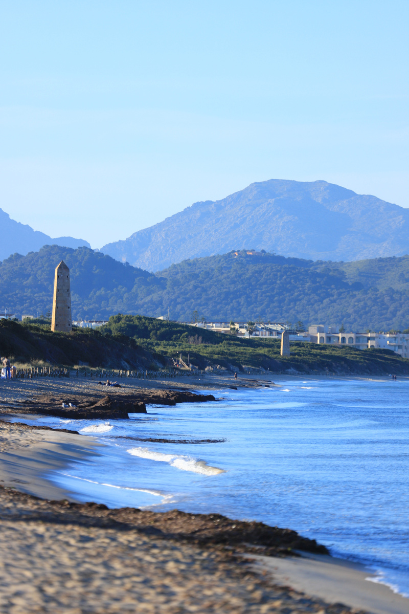

Le titre est légèrement trompeur: non, on n'est pas allé à Majorque juste pour courir. Par contre j'ai fait de mon mieux pour courir le plus possible, et j'en profite pour essayer de parler de où faire des sorties running, des sorties trails, et éventuellement des courses de montagne.

## Bien choisir son point de chute

Comme ça sur une carte l'île n'a pas l'air bien grande, 3640 km², à titre de comparaison, on est assez proche de la superficie de la Province de Liège (3857 km²). Si on me demandait où il fait prendre son logement, j'aurais envie de dire qu'il n'y a pas de mauvais endroit, qu'il y a des beaux endroits partout, sauf que ... si, il y a bien des endroits qui ne sont pas vraiment très bien situés.

Par exemple, tout ce qui se trouve à l'ouest de Palma (la ville principale), j'aurais tendance à conseiller d'éviter: Andratx, Santa Ponça, Magaluf... Le soucis étant que pour se déplacer vers le reste de l'île, les distances peuvent être conséquentes, et surtout: il faut passer par Palma, où la circulation est souvent fort dense.

Personnelement j'éviterais aussi la zone côtière entre Cala Rajada et Porto Cristo, les plages ne sont pas mal mais sont loin des meilleures. 

En dehors de ça, quasi tout est bon à prendre. On a déjà fait l'expérience plusieurs endroits (Sóller, Pollença, Port de Pollença, Artà, Porto Petro, Colònia de Sant Jordi, ...) et à chaque fois on a pu se déplacer aisément.

## Où courir sur plat?

L'île a une topographie assez particulière: au nord-ouest se trouve le principal massif montagneux de l'île, la _Serra de Tramuntana_, dont on reparlera un peu plus tard. Au sud-ouest se trouve la _Serra de Llevant_. Entre les deux, une zone appelée _El Pla_, relativement plane, même si on trouve tout de même plusieurs collines. On pourrait donc penser que _El Pla_ est l'endroit idéal pour des entrainements sans trop de D⁺. Malheureusement ce n'est pas si simple: les routes sont souvent dépourvues d'espace pour les piétons; parfois il y a des pistes cyclables, séparées de la chaussée, ou bien des _vías de servicio_, souvent empruntée par les cyclistes. 

Je vais quand même essayer de proposer de vrais endroits pour faire du plat.

### Platja de Palma

La Baie de Palma offre un terrain de jeux intéressant: on peut partir de la vieille ville, rejoindre la côte et la suivre pendant assez longtemps, en passant par es Portixol, es Molina, es Carnatje, ... le tout avec vue sur mer. 

C'était mon endroit préféré pour faire les séances de seuil quand j'habitais là, le temps passait vite et ce sont de bons souvenirs.

### La Baie d'Alcudia

Une zone que j'ai moins souvent testé mais qui semble être idéale pour faire des sorties relativement longues sans s'exploser les mollets dans des côtes. 

## Où courir en mode trail?

Pour cette question on a vraiment l'embarras du choix, d'où l'idée d'écrire un article. Un mot-clé: la Tramuntana, qui a été pour moi le terrain d'entrainement parfait pour mes weekends entre 2013 et 2017!

On y trouve le sentier de grande randonnée `GR-221`, qui relie Andratx à Pollença, ce qui offre déjà un bel éventail de possibilité.

### Mon préféré: Sóller - Pollença

Sóller est un petit village typique de Mallorca, mais qui est malheureusement victime de son succès (saturation, traffic etc). Dans mon cas c'était simple: un bus et en 30 minuted