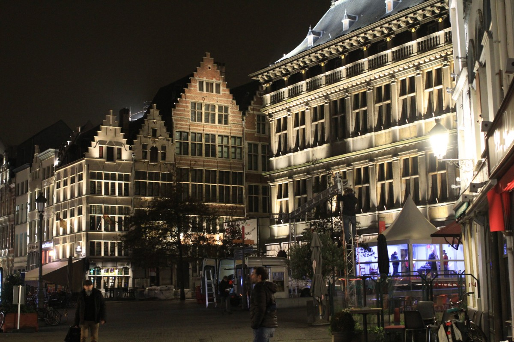
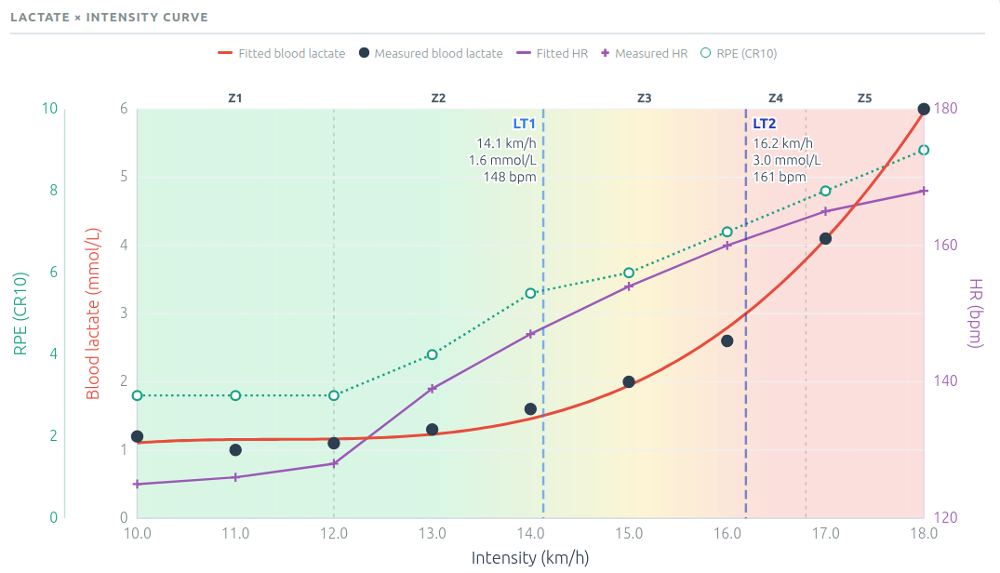

Parfois il y a des surprises dans la vie, et celle-ci en est une: me voilà inscrit à un deuxième marathon cette année: après [Charleroi]( ) en avril, me voici sur la liste des participants au Marathon d'Anvers! Mais qu'est-ce que je vais aller faire là, et surtout pourquoi?

Ce sont des questions que je me pose encore, et auxquelles j'espère pouvoir trouver une réponse. Mais avant ça, j'avais envie d'aborder 3 points:
1. Pourquoi ça peut foirer?
2. Pourquoi ça peut (quand même) passer?
3. Quel temps viser?

## Pourquoi ça peut foirer?

Réponse simple: parce que je n'ai pas fait de prépa marathon. Une vraie prépa, c'est-à-dire 10-12 semaines avec un plan, des séances spécifiques, etc etc. Mais qu'est-ce que j'ai foutu alors?

Depuis le milieu de l'été, avec le groupe `JCPMF` au Sart Tilman, on avait pour objectif que chacun puisse battre son record
sur un 10K. La préparation avec donc été axée là-dessus: beaucoup d'allure spécifique 10K, un peu de VMA, et pour les sorties longues, libre à chacun d'en faire. Perso j'en ai fait quelques unes, ça tournait vraiment bien, mais ce n'était pas non plus des sorties qui faisaient mal.

Dans la prépa il y a un composante physique, tout ce qui est amélioration de la capacité à réaliser un tel effort, et puis aussi uen composante mentale: on a fait la prépa, on se sent légitime pour la course, il y a comme quelque chose qui justifie le fait qu'on soit en confiance. Cette composante je ne l'ai pas: sans me prendre pour un imposteur, je suis convaincu que je n'ai pas fait mes devoirs. 

## Pourquoi ça peut passer (sans casser)?

Plusieurs raisons qui pourraient faire pencher la balance du bon côté:
1. __Le volume:__ paramètre super important pour prédire la performance. Ces temps-ci je tourne en moyenne à 120 km par semaine. De nombreux kilomètres venant de trajet vers/depuis le travail, ces fameux "kilomètres gratuits" comme je les appelle. Gratuits mais malheureusement plutôt lent, surtout les montées depuis Angleur.              
La semaine dernière s'est terminé à 146 km, probablement mon record, et honnêtement ça c'est fait sans forcer.
2. __La vitesse:__ bien qu'on ait quasi pas travaillé à l'allure spéficique marathon, la combinaison des séances au seuil et des sorties longues pourrait quand même aider... (je ne sais pas si je crois à ce que j'écris, mais soit).
3. __L'expérience:__ par là je veux dire, ma participation plus tôt dans l'année au Marathon de Charleroi. Beaucoup moins de stress, mais pas encore l'impression de pouvoir normaliser ce type d'effort. J'espère que ça viendra un jour.

## Quel temps viser?

Ça c'est vraiment LA question. Si je ne prends aucun chiffre en compte, j'ai juste envie de faire un sub-3. Pas trop de quoi discuter. Mais si on utilise les données, les algos etc, c'est différent.

On va voir (pour rigoler) ce que ça peut donner!

### Vdot

`VDOT` est un indice créé par le célèbre Jack Daniels (célèbre non pas pour sa boisson mais pour ses recherches en physiologie) relatif à la de performance et de capacité aérobie. Jack Daniels était en fait un heptathlonien, il a écrit le livre "_Daniels' Running Formula_", considéré par certains comme une référence.

À partir de courses antérieures, on peut estimer son `VDOT` (par exemple sur https://vdoto2.com/), et ensuite déduire son temps au marathon. 
__Exemple:__ j'ai fait un 15K en 55 minutes, mon `VDOT` est de 59.1, et le temps équivalent pour le marathon: `2:45:26`. Totalement impossible.

__Limitations:__ le 15K ça fait déjà longtemps (avril), donc peut-être pas le plus pertinent. D'un autre côté je me sens mieux entrainé qu'à ce moment-là, donc on prendra la valeur avec des pincettes.

### Seuils lactiques LT1 et LT2

Début septembre j'avais fait un [test "lactate"] ( ), qui a permis d'estimer mes seuils lactiques

|  |
|:--:|
| _Résultats du test de lactate, réalisé par [TwinPeakLab](https://www.twinpeaklab.be/)._|

- 14.1 km/h pour le premier seuil lactique (`LT1`)
- 16.2 km/h pour le deuxième seuil (`LT2`).

Que tirez de tout ça? Sans avoir le temps de plonger dans la litérature scientifique, je me suis basé sur quelques recherches rapides, par exemple en utilisant la requête `calculate marathon pace from lactate threshold` dans google.

#### Allure marathon = LT2 + (15'' - 30'' / km)

Si on suit cette formule, ça donne: 
- 3'42''/km + 15''/km = 3'59''/km 
- 3'42''/km + 30''/km = 4'12''/km

Ce qui donne pour le temps marathon une fourchette entre `02:46:40` et `02:57:13`. Honnêtement je signe à deux mains pour le moins bon de ces temps. 

#### Allure marathon = 88% - 92% du LT2

On trouve un intervale de vitesses entre 14.26 km/h et 14.9 km/h, ce qui, converti en temps sur le marathon donne une fouchette entre `2:49:52` et `2:57:35`.

## Conclusions

Ce sera sympa de ne pas faire mentir ces chiffres, mais restons réalistes. Il faudra courir à une allure que je n'ai quasiment pas eue en entrainement. Soit c'était beaucoup plus vite, soit beaucoup plus lentement.

Verdict dans 11 jours.