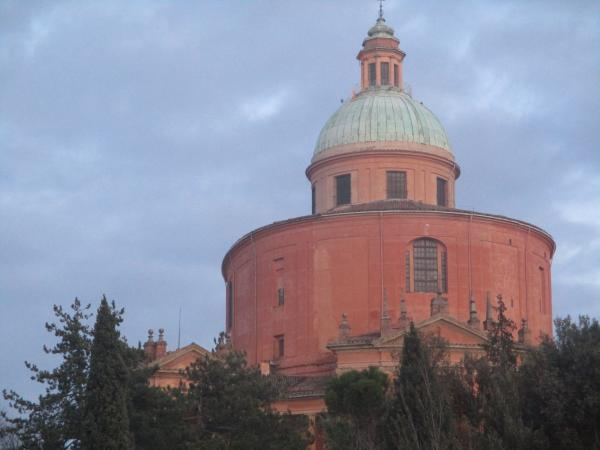

Bologna is one of the largest city in Italy. It's also the capital Emilia-Romagna region, in the north of the country. When you look at the city map, you realize the center is not so extended with a diameter of 2.5 km.

### 👟 Classic

Some locals told us to run following the city walls, a kind of an hexagonal shape (the orange line drawn on the map). There is a bike lane most of the time, but also a lot of traffic lights, noise and ... bikes. I did not try it, surely for a pure, flat session it’s ok.

### 🗺️ Off the beaten track
I experienced several tracks in the southern part of Bologna: first you have to cross the city (if you’re located close to the train station -- red circle), and there are a few, almost straight streets that you can follow to get out of it. Once you’re out of the hexagon, you have many choices, it becomes hilly and the funny part can start.

| | | |
|:-------------------------:|:-------------------------:|:-------------------------:|
|  |   |  |

### ⭐ A few tracks I liked

[🔗 Osservanza – Villa Ghigi](https://www.wikiloc.com/running-trails/bologna-osservanza-parco-villa-ghigi-46043792): the hilly landscape is very nice, hard to think we’re a few kilometers from the center. There is also a 135-km hiking path called the [*Via degli Dei*](http://www.viadeglidei.it/?lang=en) (_Path of Gods_) that you can follow (part of it) if you have time. It goes from Bologna to Florence.     
[🔗 San Luca](https://www.wikiloc.com/running-trails/bologna-san-luca-46043990): the road is rather steep and view at the top is amazing. Many tourists and locals going there during the weekend, not many cars on the road if you prefer to avoid the stairs.