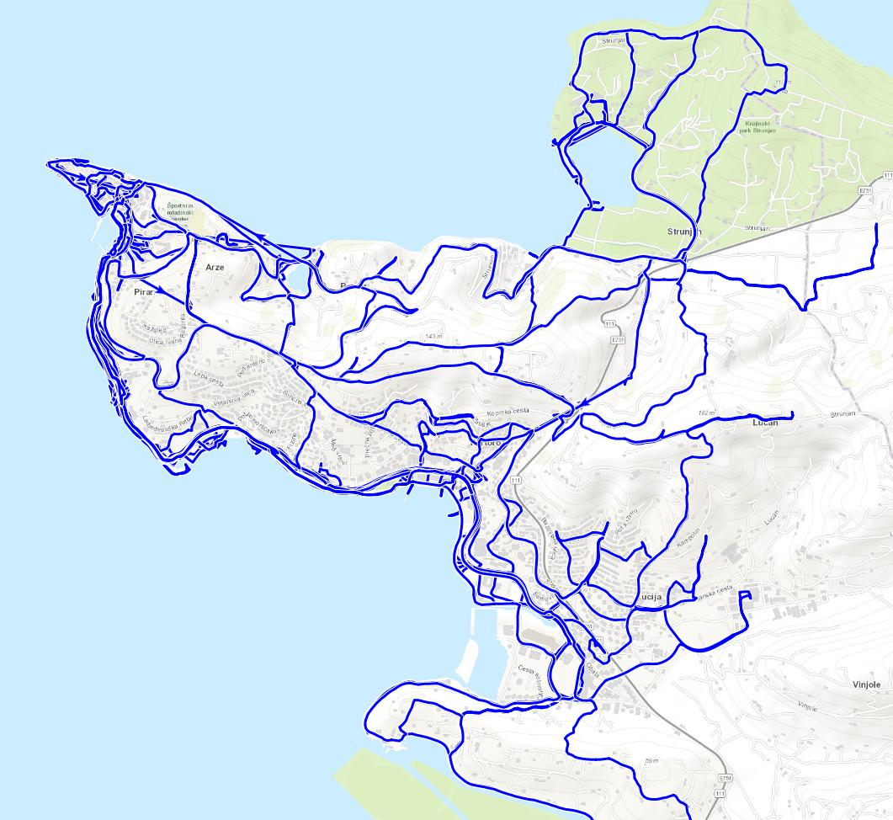
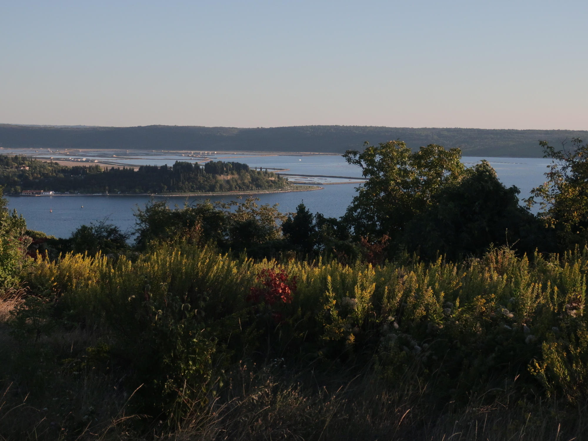
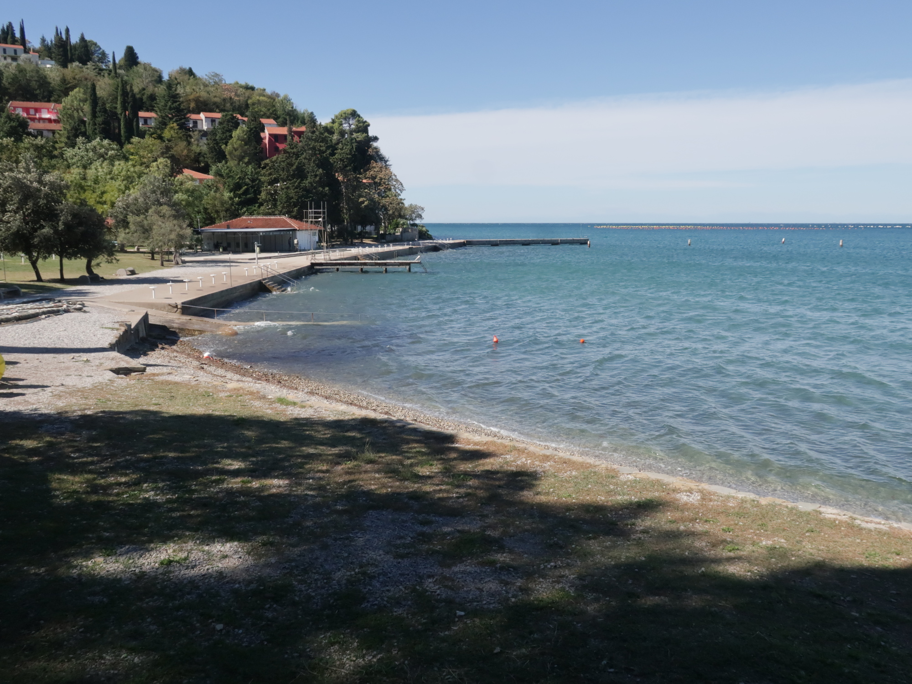
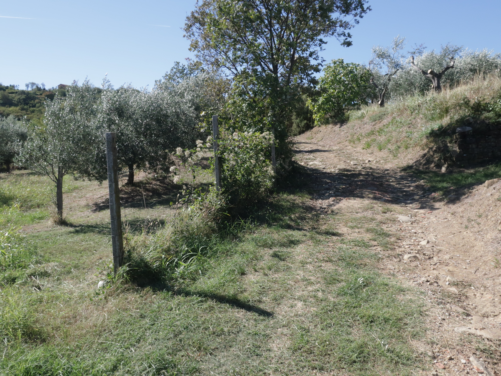
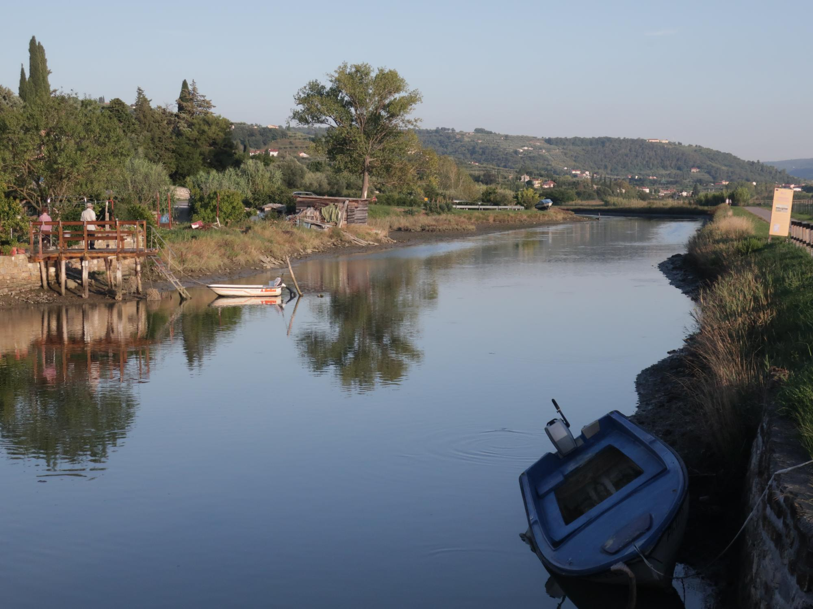
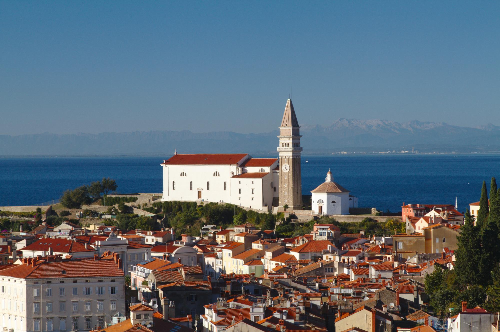
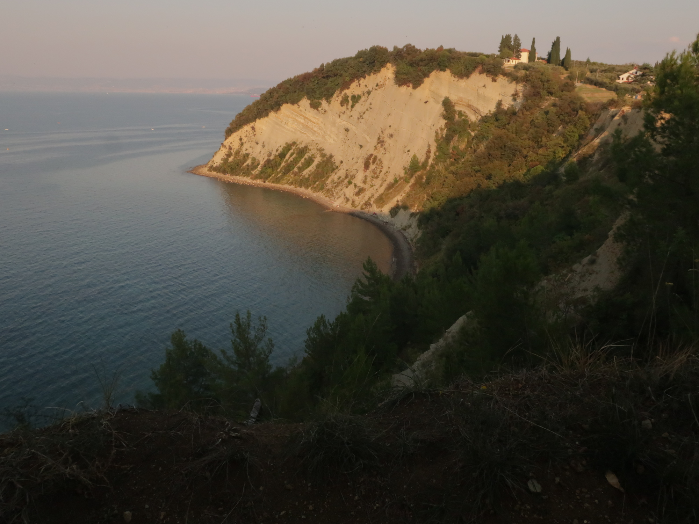

I've been lucky enough to spend about 2 months in [Piran]() in 2018, which explains the
_running coverage_ of the next map. The area is really great because you can easily mix
speed and hilly sessions.  
There is plenty of room to run, even in the most touristic streets, not a lot of traffic, so definitely a great place.

### <i class="fas fa-shoe-prints"></i> Classic
Starting from Piran, you can follow the coastline and go to Fornače, Portorož and Lucija, which is already a good stretch.
If you continue and cross the camp site, you can follow the road along the canal, great landscapes are guaranteed.      
In the other direction, you must first climb to St. George's Parish Church, then follow a path leading to Fiesa lake.

| | | |
|:-------------------------:|:-------------------------:|:-------------------------:|
|  |   |  |
&nbsp;  

### <i class="fas fa-map-signs"></i> _Hors des sentiers battus_

If there is one place I want to repeat, it is the [*Strunjan Landscape Park*](https://www.naravniparkislovenije.si/en/nature-parks/strunjan-landscape-park). There are several ways to go there from Piran, either by road or by trails. Once in the park you can really enjoy yourself, there are very steep roads that bring you to to high cliffs.
I also enjoy exploring the Seča area, with views on the [Sečovlje](https://www.portoroz.si/en/experience/natural-sights-and-attractions/4457-object-secovlje-salina-nature-park) salt evaporation pond.

| | | |
|:-------------------------:|:-------------------------:|:-------------------------:|
|  |   |  |
&nbsp;  

### <i class="fas fa-star"></i> A few tracks I liked

[<i class="fas fa-link"></i> Piran - Santjane - Strunjan - Fiesa](https://www.wikiloc.com/running-trails/piran-santjane-strunjan-fiesa-29981096): 15 km for 400 m of positive elevation, really a good choice to see a lot in one go.

[<i class="fas fa-link"></i> Piran - strunjan - portoroz-strunjan](https://www.wikiloc.com/running-trails/piran-portoroz-strunjan-29901629): a nice loop following the coast for most of the time, it also takes the tunnel (for pedestrians and bikers) from Portorož to Carbonaro.
