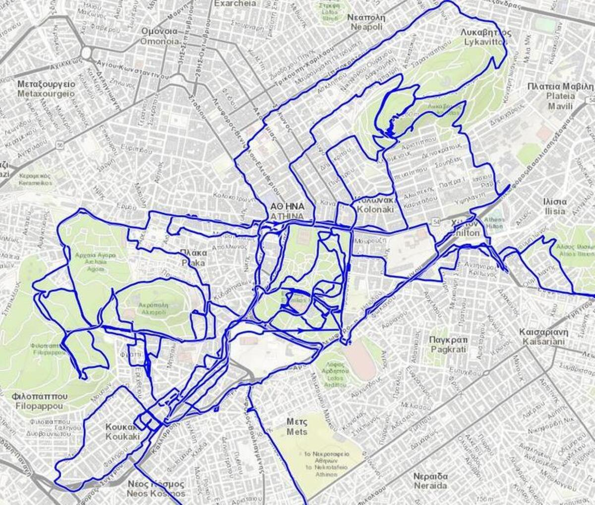
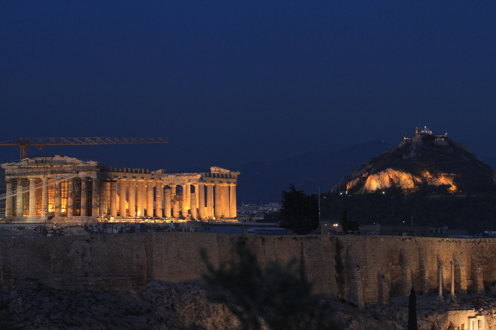
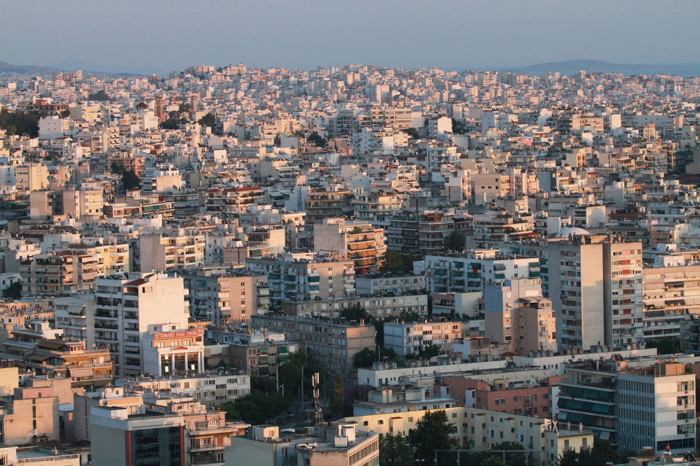

The first time I ran in Athens, I was not too happy: a lot of traffic, a constant noise, and not a lot of fun. The next times I could explore more and more, find places to avoid and places not to miss, it was not so bad.

### <i class="fas fa-shoe-prints"></i> Classic

There are a few squares near the center that you may want to try. However, you need to take into account that there is a lot of traffic around the center, and some of streets in the most touristic districts are busy.

### <i class="fas fa-map-signs"></i> _Hors des sentiers battus_

I've tried several times to find nice places, with many failures. The city is huge so if the start is wrong, the rest of the session can also be unpleasant. However if you stay near G

| | | |
|:-------------------------:|:-------------------------:|:-------------------------:|
|  |   |  |
&nbsp;  

### <i class="fas fa-star"></i> A few tracks I liked

[<i class="fas fa-link"></i> Lycabettus hill](https://www.wikiloc.com/running-trails/athens-lycabettus-20489376): great for sunsets, and also possible to have a drink up there. The views on the Akropolis are amazing!        
[<i class="fas fa-link"></i> Around the Akropolis](https://www.wikiloc.com/running-trails/athens-around-the-acropolis-20489404): classic but some parts may be too crowded to run fluidly. 
: this one is particularly good if you are staying near , which also has a lot of hotelss.
