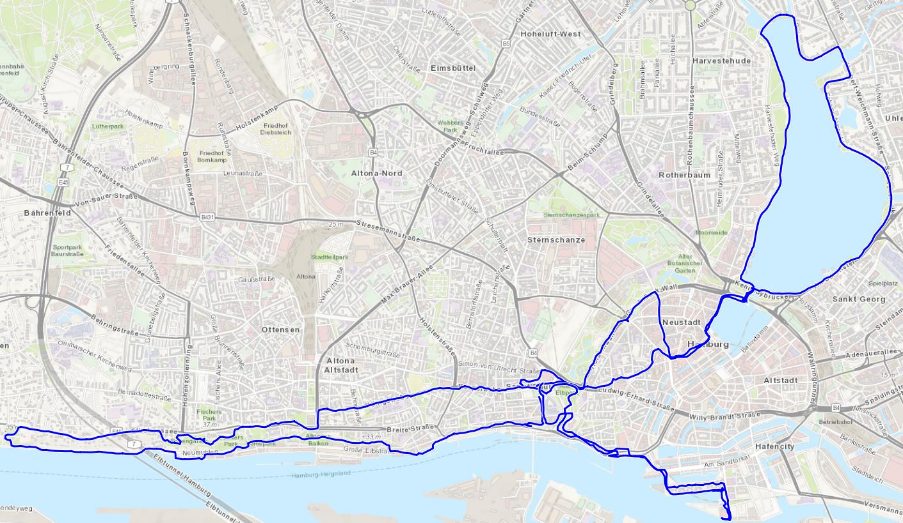
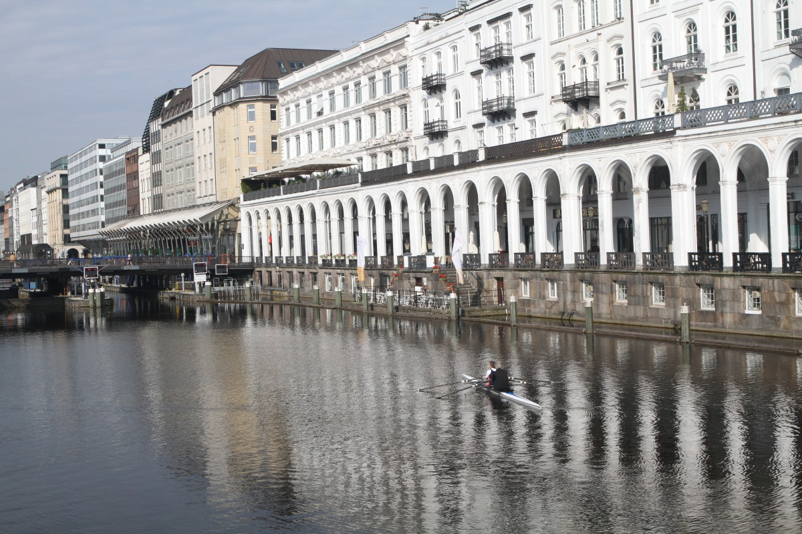
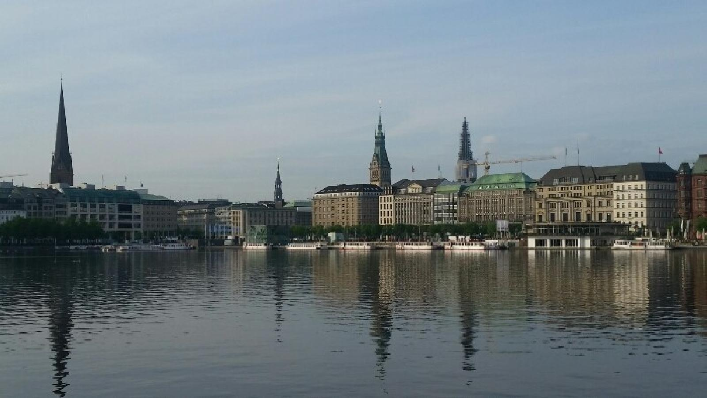
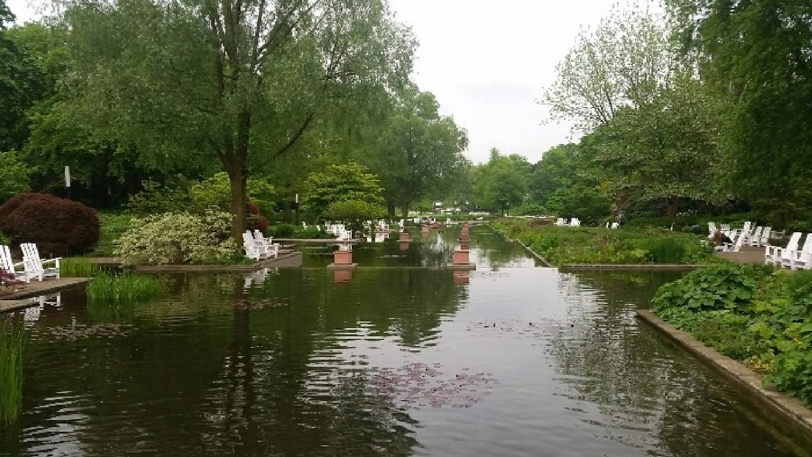

I’ve had the opportunity to visit Hamburg two times, without any prior idea of where to go.

### <i class="fas fa-shoe-prints"></i> Classic
Looking at the map, it is clear that we have easy options: following the Elbe river, the track was nice, with some stairs if I remember well, and at the end a cool beach. The other clear option was the loop around the 2 artificial lakes, _Binnenalster_ (the small one) and _Außenalster_. The loop around the 2nd is more than 7 km long. Perfect place for pace training. From the center to the lakes, you can also cross the park _Planten un Blomen_.

| | |
|:-------------------------:|:-------------------------:|
|  |   |
&nbsp; 

### <i class="fas fa-map-signs"></i> _Hors des sentiers battus_
I could not really find something worth mentioning during these two visits, so it’s added on the task list. I’ve explored the *Hafencity* district a little bit, that was not so fun to run.

| | |
|:-------------------------:|:-------------------------:|
|  |   |
&nbsp; 

### <i class="fas fa-star"></i> A few tracks I liked

[<i class="fas fa-link"></i> Planten un Blumen](https://www.wikiloc.com/running-trails/hamburg-planten-un-blumen-13398245): in the parks and around *Binnenalster*.      
[<i class="fas fa-link"></i> Außenalster](https://www.wikiloc.com/running-trails/hamburg-parks-13359743): around the big lake. Fast and furious!
