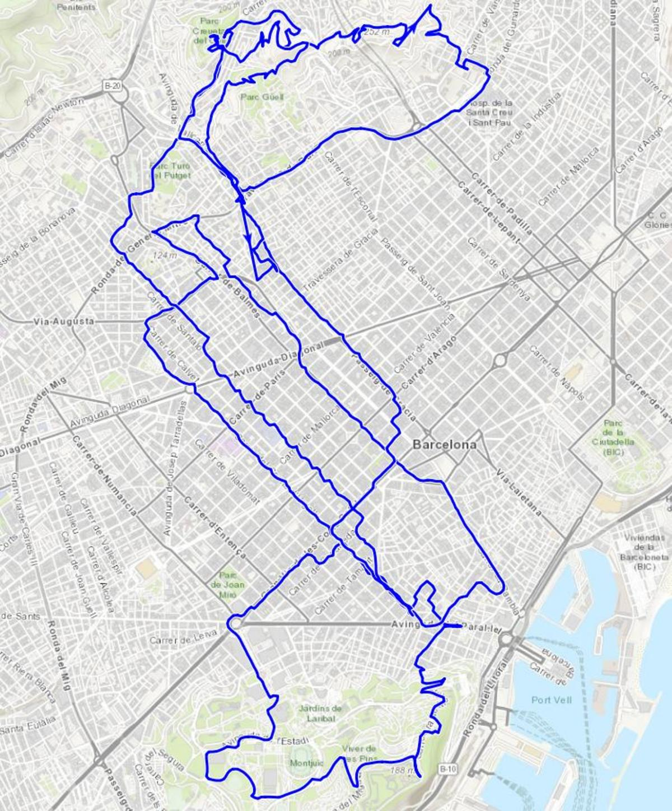
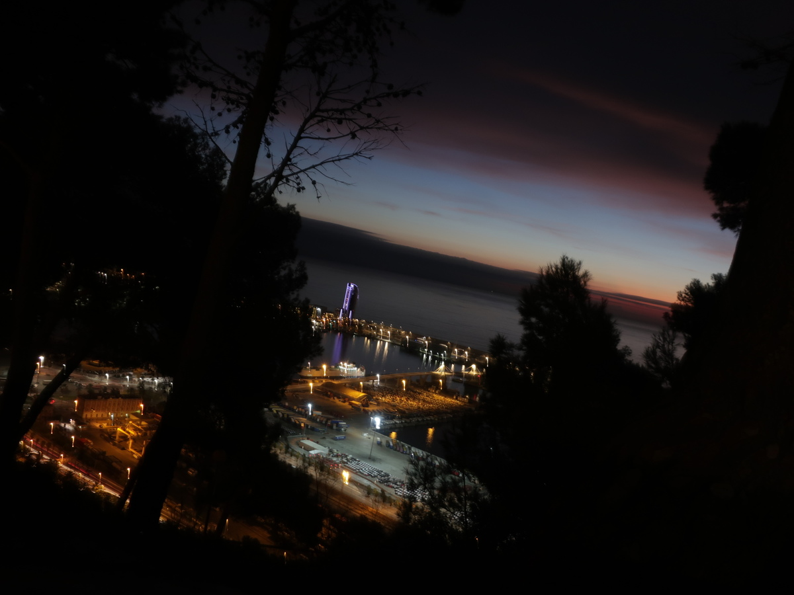
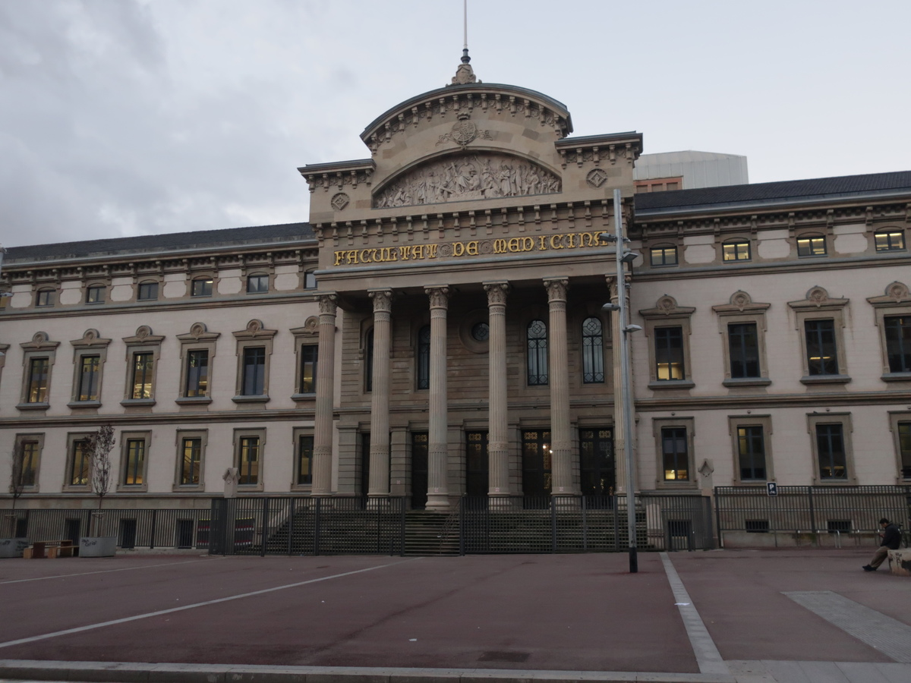
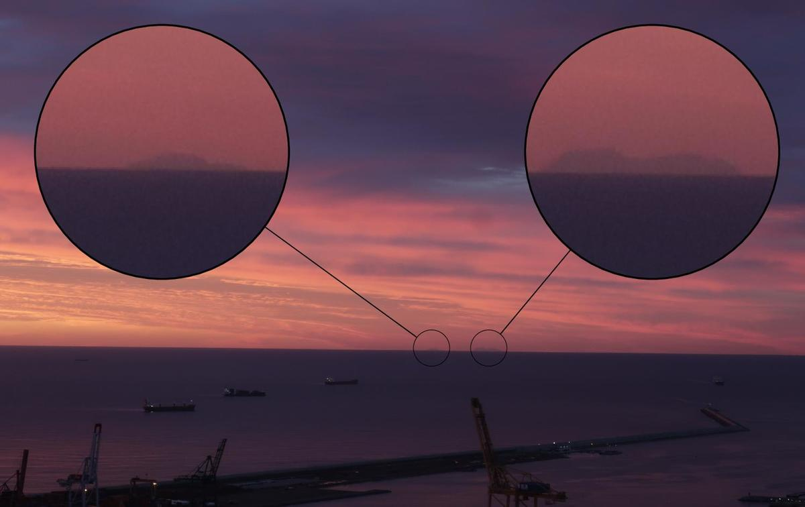
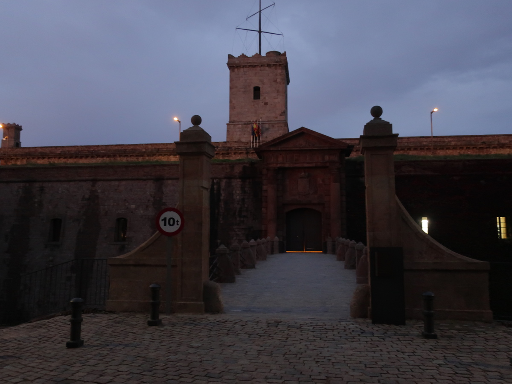
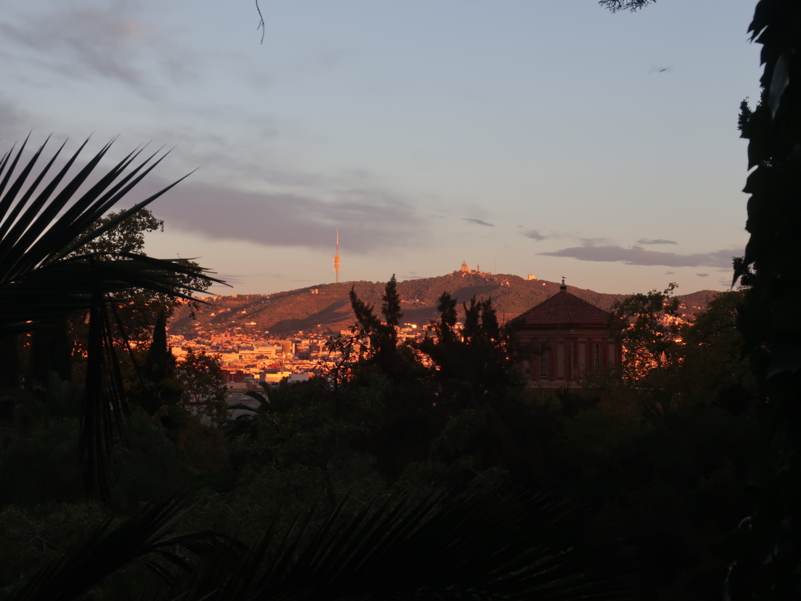

We continue with this series of post, this time in the famous Barcelona. I've been lucky to be there
for work a few times and I always enjoyed the running part.

<i class="fab fa-instagram"></i>

### <i class="fas fa-shoe-prints"></i> Classic

From what I've seen during my visits (5 or 6 times I think), most runners follow the coast from the center toward *La Barceloneta* and sometimes farther, and as you know from this blog, it is not really what we plan to show here.  

| | |
|:-------------------------:|:-------------------------:|
|  |   |
&nbsp; 

Another good option is [*Parc de Montjuïc*](https://www.barcelonaturisme.com/wv3/en/page/396/parc-de-montjuic.html), as you avoid the traffic and can have a nice view on the city. I tried it once early in the morning and could even see Mallorca (picture taken with an ordinary pocket camera). In the park you can easily mix road and hiking paths, I really recommend it.

Running in the center is not so fun, because of the traffic lights, the tourists and the monotony (maybe).

### <i class="fas fa-map-signs"></i> _Hors des sentiers battus_

During another trip in the main city of Catalunya, I could find nice tracks in the higher districts, with amazing views, the problem is that if you have the hotel in the center and at sea level, this means you have to run 4 or 5 km before reaching this nice part.

There is a lot a view points that you cannot miss, for example [_Turó del Carmel_](https://es.wikipedia.org/wiki/Monte_Carmelo_(Barcelona)) (266 m) or the [_Turó de la Rovira_](https://es.wikipedia.org/wiki/Tur%C3%B3_de_la_Rovira) (262 m). What I also noticed (and enjoyed) is all the stairs, you can really go up and down for a while.

| | |
|:-------------------------:|:-------------------------:|
|  |   |
&nbsp; 

Still on my wish-list: _Tibidabo_, which one can see from almost everywhere. It seems clearly feasible, just a matter of time and organisation.

### <i class="fas fa-star"></i> A few tracks I liked

[<i class="fas fa-link"></i> Around Montjuïc](https://www.wikiloc.com/running-trails/barcelona-montjuic-48416352): classic but effective, any time of the day.     
[<i class="fas fa-link"></i> Miradores Barcelona - Parc Güell](https://www.wikiloc.com/running-trails/miradores-barcelona-parc-guell-12461155): 10 km around the Parc Güell, hilly and spectacular.      
[<i class="fas fa-link"></i> Miradores Barcelona](https://www.wikiloc.com/hiking-trails/miradores-barcelona-12479787): 9 km but more than 400 m of positive elevation according to my watch, not bad.
