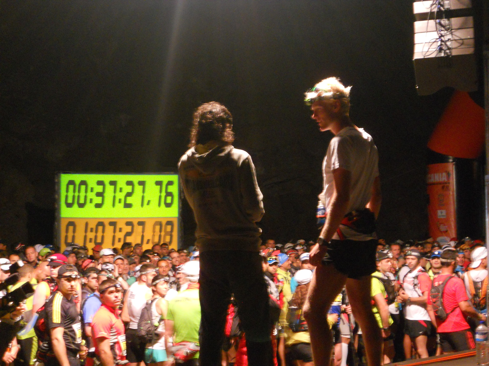
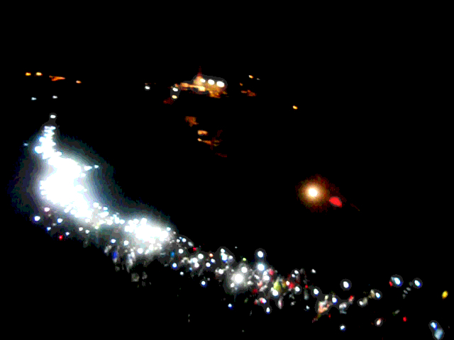
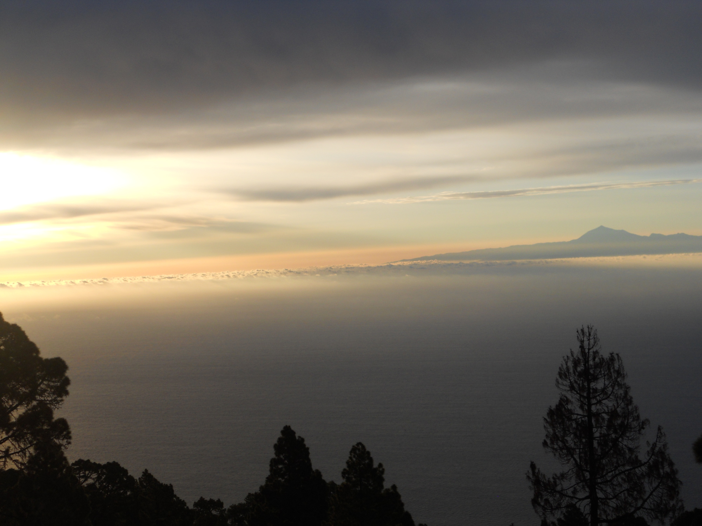
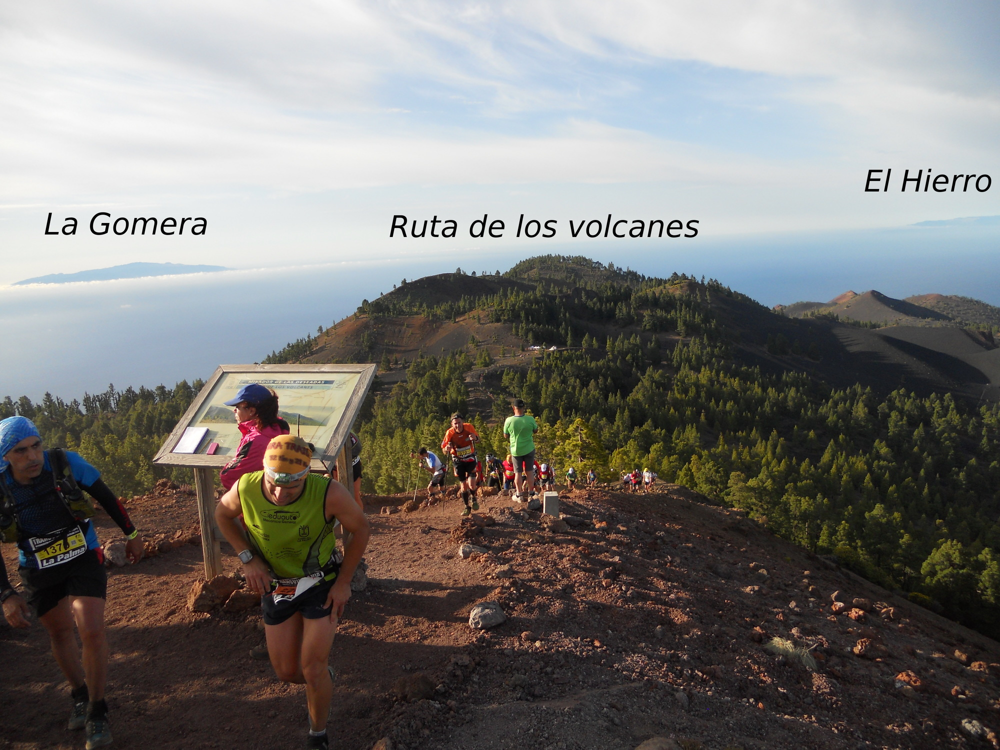
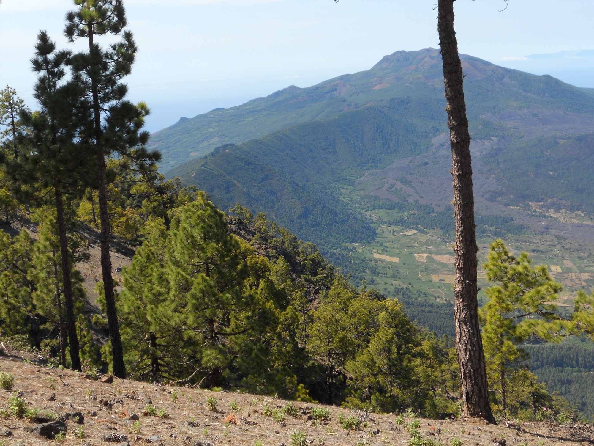
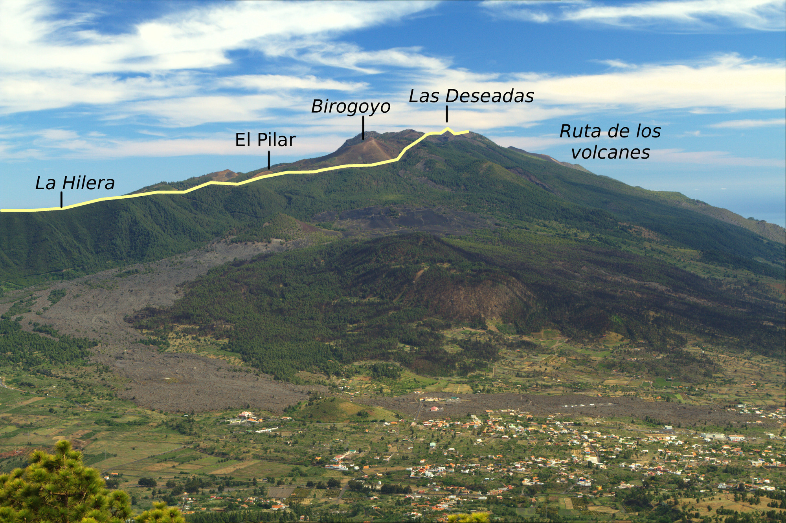

Poursuivant sur ma lancée de publication d’articles sur le blog, je vais essayer de boucler un petit compte-rendu de la Transvulcania 2013. Let’s go!

D’abord, quelques questions:

- la Transvulcania, qu’est-ce? c’est un ultra-trail qui se court sur l’île de La Palma, dans les Canaries.
- Ultra-trail? selon wikipédia, c’est une course en nature plus longue qu’un marathon. Je ne sais pas si on peut se fier à cette définition, en gros c’est une course sur laquelle  on va passer beaucoup de temps et dont les jambes se souviendront 😉
- pourquoi cette course-là? Ayant passé pas mal de temps aux Canaries, j’ai pu connaitre les différentes îles, et La Palma est vraiment l’endroit parfait pour le trail. Le parcours est simple: parcourir l’île entièrement (ou presque). Pas de boucles inutiles, de rallonges artificielles, juste monter, descendre, monter, … Un beau défit. En plus ce trail n’est pas encore victime de la mode trail: l’inscription reste accessible, pas de liste d’attente, pas de conditions d’accès etc.

Le but de cette édition était double:
1. faire mieux qu’en 2010, où j’avais terminé en 14h et quelque, avec une préparation faite maison de 5 semaines.
2. prendre plaisir, comme pour tous les autres trails auxquels j’ai participé.

Il faut remarquer que le but n°2 requiert autant de préparation que le 1: pas de plaisir si on n’est pas prêt!

Comme je savais que j’allais tarder avant d’écrire ce post (la course était début mai) et que ma mémoire est un peu limitée, j’avais pris quelques notes de ce qu’il fallait raconter.

|  |
|:--:|
|_Presentation of runner before starting the race._|

## 1. Le départ - 4h du mat’, phare de Fuencaliente (sud de l’île)

une ambiance incroyable, de la musique à fond, et des centaines de coureurs venus principalement des Canaries, prêts à en découdre avec le relief de La Palma. A 6h, le départ est lancée par la “présidente” de l’île, et c’est alors un énorme cordon de lumières rouges et blanches qui s’élance. Pour moi sans doute la plus belle image de cette course. Quelques photos d’un autre blog.

|  |
|:--:|
|_The “light snake”, a few hundred meters of runners._|

## 2. Premier ravito (7.4 km, los Canarios, 710 m)

Malgré l’heure de passage, le petit village est plein, sur plusieurs centaines de mètres des deux côtés de la route, le public est déchainé. Quand on lit les commentaires du jogg de Verviers, on parle d’une ambiance d’arrivée de tour de France… ici c’est encore différent: on sait qu’il nous reste 75 km, mais ça fait chaud au cœur de voir tout ce monde.

|  |
|:--:|
|_Sunset with Tenerife and mount Teide in the background._|

## 3. Montée à las Deseadas (18 km, 1931 m)

Une montée interminable dans les graviers volcaniques (excellent pour l’amortie, mais hard pour les mollets), et un levé de soleil de toute beauté, avec les silhouettes de Tenerife et la Gomera à l’est, et de El Hierro au sud. Je regrettais de ne pas avoir mon appareil reflex sur moi, car les résultats avec le compact sont un peu pourris. Heureusement on peut compter sur des photographes tels que Saul Santos pour immortaliser ces moments. On s’est déjà tapé 2000 m de dénivelé positif (D+ pour les habitués), et on est loin du compte.

|  |
|:--:|
|_From the top of Las Deseadas, after 18 km of race._|

## 4. Ravito de El Pilar (26.8 km, 1456 m)

Après une superbe descente depuis las Deseadas, nous voici au 3° ravito, également ligne d’arrivée de la “petite” course. Cette descente, je m’étais promis de la faire calme, car il y a 3 ans, je l’avais fait à fond et en avait payé le prix dans les km qui ont suivi. Au final je crois que je l’ai faite encore plus à fond! Les chemins étaient encore couvert de graviers, et avec tous ces coureurs passant par là, il y avait un nuage de poussière le long du GR. Au refuge du Pilar, un monde de dingue. Difficile de dire combien, mais ça devait se compter en centaines! Je pensais m’arrêter assez longtemps afin de bien récupérer… et puis non, 5 minutes et c’est reparti.

## 5. La Hilera

Pour moi une des parties les plus difficiles à gérer: 7-8 km de plat-faux plat sur une piste forestière, avec vue sur la ligne d’arrivée (pour déprimer ou pour se donner du courage, en fonction des sensations), avant une monstrueuse montée. Cette fois-ci ça a été beaucoup mieux qu’il y a 3 ans, j’ai pu continuer à courir. A ce moment-là je me dis: “l’entrainement a peut-être payé ;)”.

|  |
|:--:|
|_During the climbing of el Reventón, with view on la Hilera._|

## 6. El Reventón (34 km, 1415 m)

Autre ravito, en préparation de cette fameuse montée du Reventón. Pour info, Reventón peut se traduire par “éclatement“. La personne qui nous refile de l’eau annonce gentiment: “ça va? parce que c’est maintenant la partie la plus dure.” Oui ça va. Après quelques minutes de montée, les premières ambulances attendent sur le bord du chemin. Et ensuite, espacés de manière régulière, des bénévoles ou secouristes qui surveillent les coureurs. Je crois vraiment qu’à cet endroit, ils avaient peur qu’il y ait des malaises et des abandons.
LPLM9830

|  |
|:--:|
|_First part of the race. Picture taken from el Bejenado._|

La suite bientôt 😉