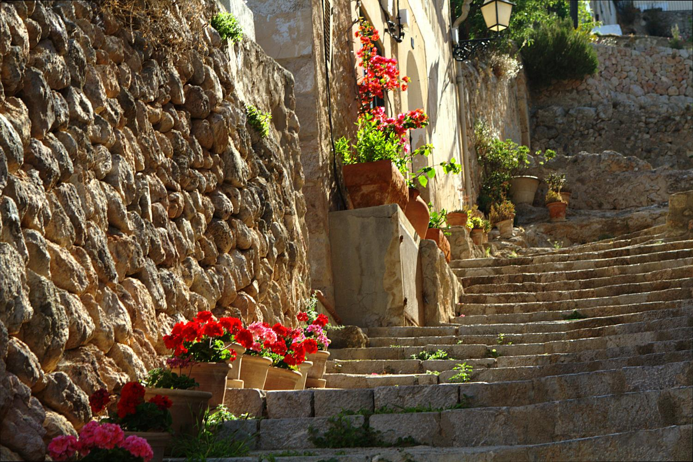
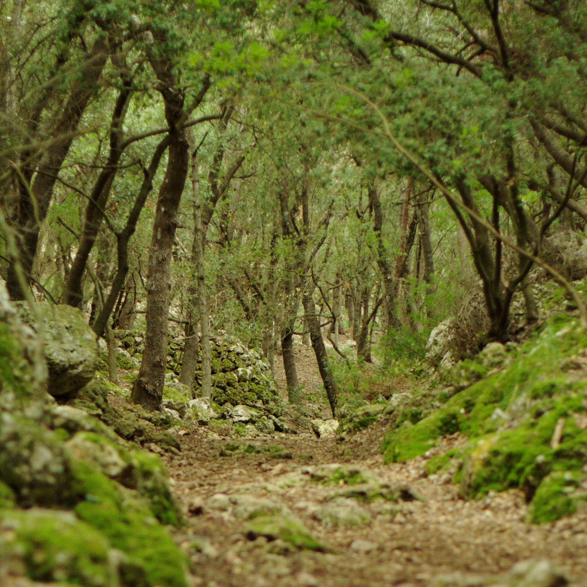
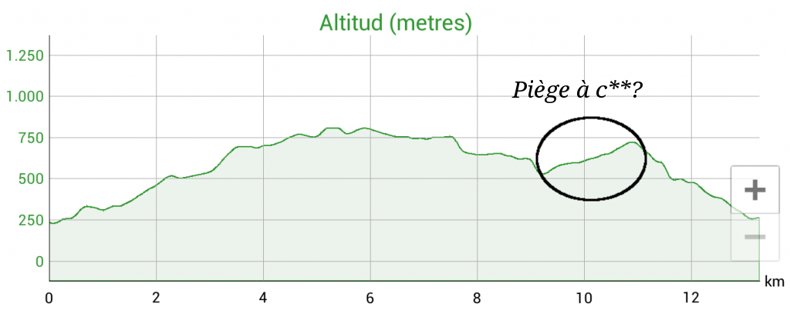
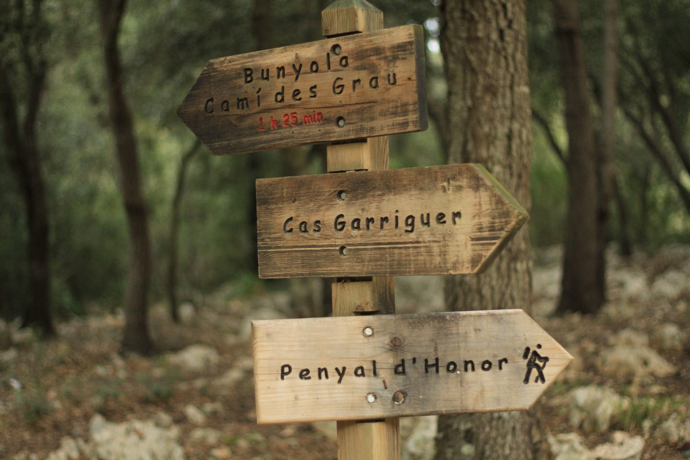
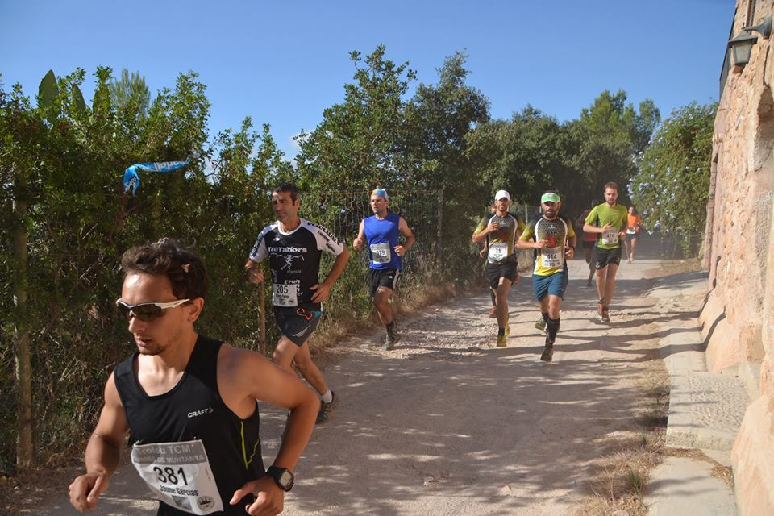
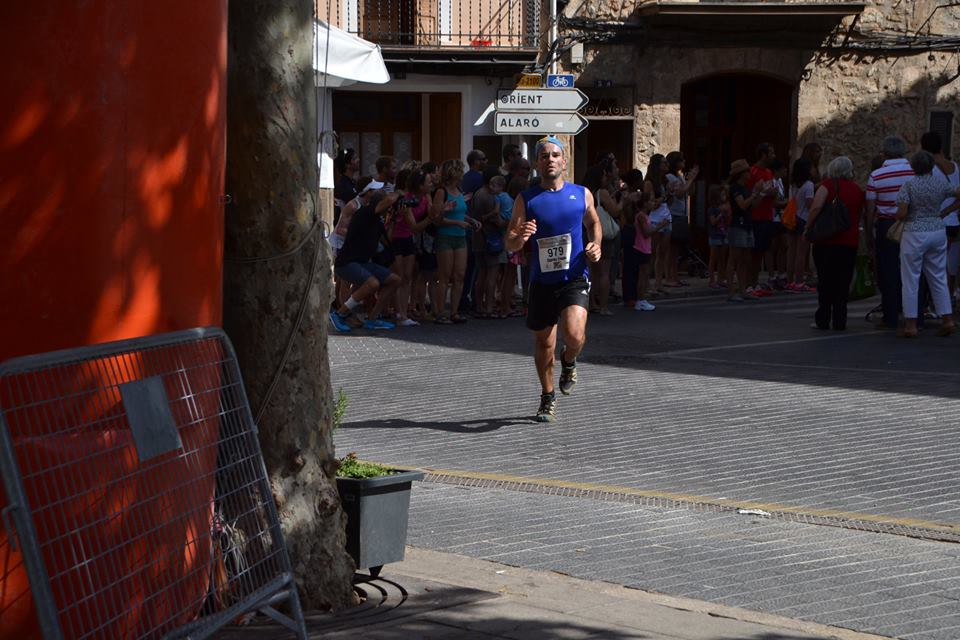

---
title: "Cursa per Muntanya de Bunyola 2014"
publishdate: 2014-09-14
racedate: 2014-09-14T10:00:00
elevation: 2045
distance: 14.
racetime: 1:32:42
location: Bunyola
tags: ["Race", "Bunyola", "Mallorca", "Illes Balears"]
comments: false
draft: false
--- 

Enfin… après plusieurs mois ici (à Majorque), je parviens enfin à participer à une course du championnat de courses de montagnes. C’est souvent difficile de s’inscrire car les places sont limitées, et tout le monde est derrière son écran le jour où les inscriptions sont ouvertes. De plus les places sont souvent réservées aux membres de la Fédération.

| |
| :-------------:   |
| _Une rue à Bunyola._| 

Un jour où on commençait une rando dans une endroit assez perdu de l’île, on tombe sur un parking rempli de voitures: c’était la première manche du championnat. C’est comme ça qu’on a appris son existence. Depuis, l’eau a coulé sous les ponts, et je me suis aussi inscrit à la Fédération.

Première course donc pour moi, la _XII Cursa per Muntanya de Bunyola 2014_, dans le petit village de Bunyola, à 13 km de la maison. 
- __Solution 1:__ prendre le bus de 7h15, le seul qui permet d’arriver à l’heure sur place. Mais faut pas exagérer, personne, ou presque, n’aime de se lever à 6h30 un dimanche. 
- __Solution 2:__ le vélo, qui au final va plus vite que le bus.

| |
| :-------------:   |
| _Photo de la montée, prise lors d’une rando l’année dernière._| 

## Organisation 

Excellente. Tout se met en place rapidement: ligne d’arrivée, police pour bloquer le trafic, ravitaillements… rien à redire. Par contre un certain niveau de catalan est nécessaire, car tout se fait dans cette langue. Donc “gràcies al Club Esportiu Es Pedal de Bunyola per la organització d’aquesta cursa”.

## Ambiance

Sans doute bonne, mais sans connaître personne, ce n’est pas génial. Beaucoup de coureurs portent les couleurs de leur club respectif, et ne se séparent pas. Comme dans toute zone de départ, ça blague pas mal, encore faut-il comprendre quelque chose. À mon côté j’avais Monsieur M (il avait un gros M dans son dos), qui se balançait de gauche à droite comme un gars qui a bu trop de bière. Et à chaque fois en me bousculant (culer). J’hésite à le dégager, mais un comptage rapide des effectifs m’indique que je serai certainement en infériorité numérique en cas d’échauffourée. Donc mieux vaut ne pas bouger, c’est Mr M qui se fera mal contre mes musc’. Une seconde d’inattention, et le voilà passé devant moi. On est à 10 minutes du départ, et je me dis que je suis tombé sur le pénible de service.

Au point culminant, un petit groupe joue de la musique pour nous encourager, un peu comme aux 4 Cîmes de Herve.

Avant le départ, une minute de silence pour un jeune du village et amoureux de la montagne, décédé il y a peu dans un bête accident (électrocuté alors qu’il urinait sur un réverbère). “Aquesta cursa va per tu“.

## Parcours

Avant la course je me suis dit: pas besoin d’étudier le parcours: 14 km, on en monte 7 jusque le Penyal d’Honor puis on en descend 7, y basta.

| |
| :-------------:   |
| _Profile de la course, original sur http://espedalbunyola.com/._| 

Et non, mon ami, il faut bien regarder le profil avant la course, pas après. Heureusement ça n’a pas porté préjudice à ma course, même si il faut avouer que ça coupait bien les jambes. Un gars qui m’avait dépassé dans la descente, juste avant ce petit piège, n’a pas trop apprécié le changement de pente visiblement, car d’un coup il n’avançait plus, et s’est collé à un rocher pour lui susurrer quelques mots.

## Résultat

Content en général, car couru même dans les montées les plus violentes, excepté dans les single tracks on les amis de devant ne voulaient pas se laisser dépasser quand ils marchaient. Temps final: aucune idée, car couru sans montre, et puis comme il fallait se retaper le chemin en vélo jusque l’appart, pas envie de taper discussion en attendant les résultats, bien que ça aurait fait un bon cours de mallorquín. En tout cas loin devant Mr M.

Erreurs? Mis à part la méconnaissance partielle du parcours, et le timing (juste au retour de vacances), plutôt ok. Ah oui, courir dans les descentes pleines de pierres, quand il fait sombre, et sans lunettes… sans doute pas le meilleur plan pour l’intégrité physique de mes genoux (qui heureusement n’ont pas trop touché le sol). Point de vue entraînements, je sais ce qu’il reste à faire.

 