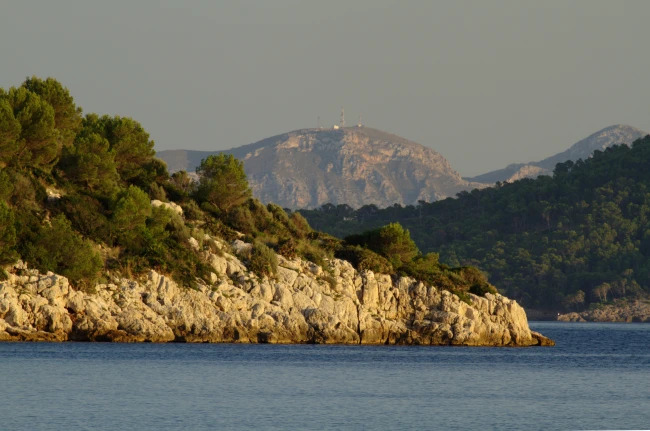
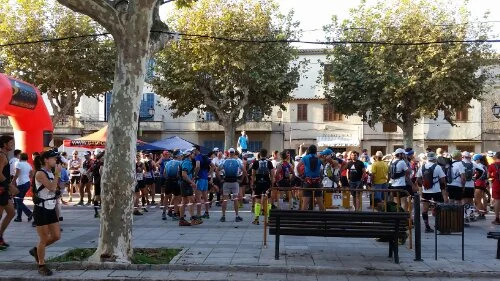
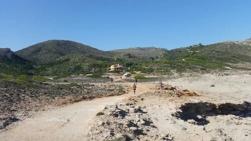
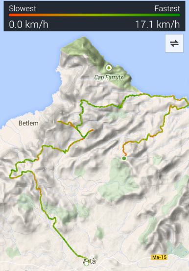
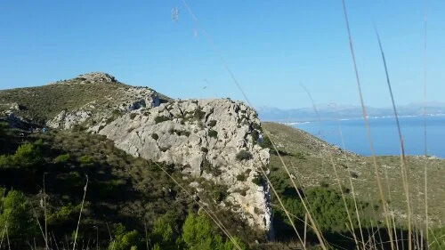
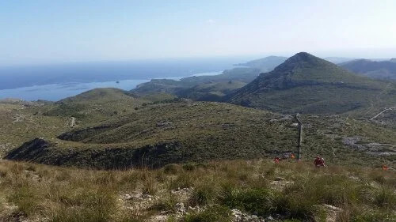
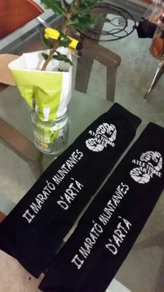

En quelques mots: la plus belle course de l’année, jusqu’à présent. Pour moi bien meilleure que l'_Ultra Trail de la Sierra de Tramuntana_ (voir Article à ce sujet).

1. Première étape de l’article de blog: choisir le thème.
2. Ensuite: choisir la langue, selon le public visé.
3. Et puis écrire, mais sans trop planifier, juste pour voir vers où ça va.

[Artà](http://www.artamallorca.travel/) c’est un village assez loin de Palma, situé dans l'est de l’île. J’en ai déjà parlé il y a quelques mois dans un article sur le [_Parc Natural de la Península de Llevant_](https://www.caib.es/sites/espaisnaturalsprotegits/ca/parc_natural_de_la_peninsula_de_llevant-21675/). C’est justement là que la course à eu lieu.

|  |
|:--:|
|_Illa de Formentor (premier plan), Cap des Pinars (centre) et Cap de Ferrutx (fond). Si vous voyez les antennes... on était pas loin de là une fois au point culminant de la course._|

## En quelques chiffres

- 350 coureurs, en majorité des locaux. Ça veut dire qu’il vaut mieux parler un peu catalan si tu veux communiquer avec d’autres coureurs ou avec l’organisation. Personnellement: rien compris au consignes de départ, sauf si on passe au dessus du mur (?), on est disqualifié.
- 42 km et quelques. Un marathon quoi. Pas vraiment vérifié, c’est pas le but non plus.
- 1300 m de D⁺, pour la partie plaisir. Idem: approximatif.
- 5 km entre les ravitaillements. Donc partir léger n’est pas une mauvaise idée.
- 2 semaines avant la course: l’ouverture des inscriptions! Pas génial pour planifier, mais c’est un peu la norme dans la plupart des courses. De plus, le nombre de coureurs est limité, et en moins de 24h tout peut et être complet. Donc en résumé: il faut être prêt derrière son clavier.

|  |
|:--:|
|_Plaça del Conqueridor, Artà. Pour certains ça sent le stress (pas moi), pour d’autres le réflex spray (pas moi non plus)._|

Des comptes-rendus de course, tout le monde en a déjà lus, ou écrits, perso ça me saoule un peu, surtout quand j’écris dans le bus (horrible, demain je veux mon vélo!). Donc en résumé: plan simple: partir tranquille et ne pas se griller car réunions importantes le lendemain à Lisbonne (article en préparation). Excuse bidon à premier abord, sauf quand parfois un trail peut cramer plus la tête que les jambes.

|  |
|:--:|
|_Ravitaillement, et puis la course se poursuit le long de la place, avant d'amorcer une longue montée._|

## Le parcours



Très varié avec tout ce qu’un coureur de trail peut souhaiter: des monotraces, des descentes techniques dans les pierres, et des montées à l’arrache. Mais ce n’est pas tout. On a aussi eu droit à 3-4 km au bord de la mer, avec traversées de plages, évidemment.

|  |
|:--:|
|_Capture d’écran de l’application S-Health, qui plante assez souvent. Dans ce cas-ci elle a d’ailleurs planté après 34 km (point vers dans la droit de l’image)._|

## Meilleurs passages

- La partie de la plage était vraiment super agréable. Surtout avand d’aborder 8 km de montée.
- Les montée/descentes des sommets étaient excellentes, les vues incroyables.
- Le paysage en général, très varié, un régal pour les 5 sens.

 

## Résultats

5 heures de plaisir et une pas mauvaise place au final. Les premiers km ont été un peu lents à mon goût, ça marchait là où j’aurais voulu courir, mais peut-être que ça m’a permis de rester frais jusque la fin.

Pour les photos de course, mes contributions sont un peu réduites, mais on est repassé sur le parcours plus tard pour des photos un peu meilleures.

Ce devait être la dernière course du championnat de _curses de muntanya_, j’espère vraiment pouvoir en faire plus l’année prochaine.

|  |
