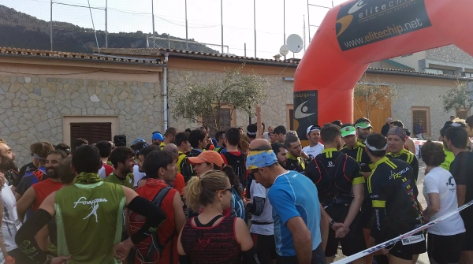

---
title: "Cursa des Teix 2015"
publishdate: 2015-04-12
racedate: 2015-04-12T08:30:00
elevation: 1035
distance: 18.3
racetime: 1:55:19
location: Valldemossa
tags: ["Race", "Valldemossa", "Mallorca", "Illes Balears"]
comments: false
summary: "Valldemossa, petit village typique de Majorque, et accessoirement le lieu de départ du la Course de Montagne du Teix, un sommet de plus de 1000 m situé juste à côté." 
draft: false
--- 

Parfois j’ai l’impression que ce blog est un recueil de comptes-rendus de courses, parsemés d’autres articles sans relation logique. Possible. Disons que dans la vie de tous les jours, il y une tonne de trucs que me semblent plus importants. Toutefois je compte quand même continuer le blog. Donc nous y voilà, Valldemossa, petit village perdu dans les montagnes, ou du moins c’est une manière de le présenter qui pourrait plaire aux touristes et agences de voyage. Perso’ c’est pas trop mon truc ce genre d’endroit, mais pour une course de montagne (_Cursa des Teix_), on peut faire le déplacement.

D’habitude pour une course on essaie de faire le meilleur temps possible, c’est-à-dire courir le plus vite possible, bref, l’esprit de compétition. Ici j’ai pu ajouter une contrainte supplémentaire, un truc en trois lettres: B-U-S. Pour rentrer de Valldemossa à Palma un dimanche, pas trop le choix: 11h, 12h15 ou 15h30. 11h c’est un peu impossible, ou alors il faut gagner la course. 15h30, ça veut dire passer de longues heures dans ce village qui au final n’a pas grand chose à part des trucs à touristes. Donc la voilà cette contrainte: max. 2h45 de course!

  |
|:-----:|
|_Sur la ligne de départ, frais mais bonne ambiance._|

## Parcours

Point de vue parcours, qu’est-ce qu’on nous propose? Environ 18 km avec un bon 1000 m de D⁺, et sommet à plus de 1000 m (_es Teix_). Bref, de la course de montagne mallorquine comme on l’aime.        
Alors ce sera un départ bien à l’arrache, histoire de ne pas se retrouver dans les bouchons, puis le reste assurer une bonne vitesse de croisière. Comme lors de courses précédentes, les fortes montées font mal, mais ça passe quand même mieux, heureusement.           
En descente ça va, bien que les descentes pentues et techniques laissent toujours à désirer. Et sur le plat et en descente light… ça trace! Sur les derniers km, j’ai pu dépasser pas mal de gens, et sur le dernier j’entendais les pas de quelqu’un qui semblait vouloir se rapprocher. Il voulait jouer l’ami. 



Une fois sur l’asphalte pour 300-400 m, un ptit coup de jus, et hop, plus personne. Tout bon pour mon bus, moins de 2h de course, le temps de faire un retour au calme, quelques photos (que je ne retrouve pas), et ciao Valldemossa! Pour les photos pas grave, vous pouvez retrouver celles d’une précédente visite! Pour terminer, un petit mot sur l’organisation, du très haut niveau, aussi bien pour le balisage, les ravitaillements, les contrôles, les encouragements… Ça fait plaisir à voir!
