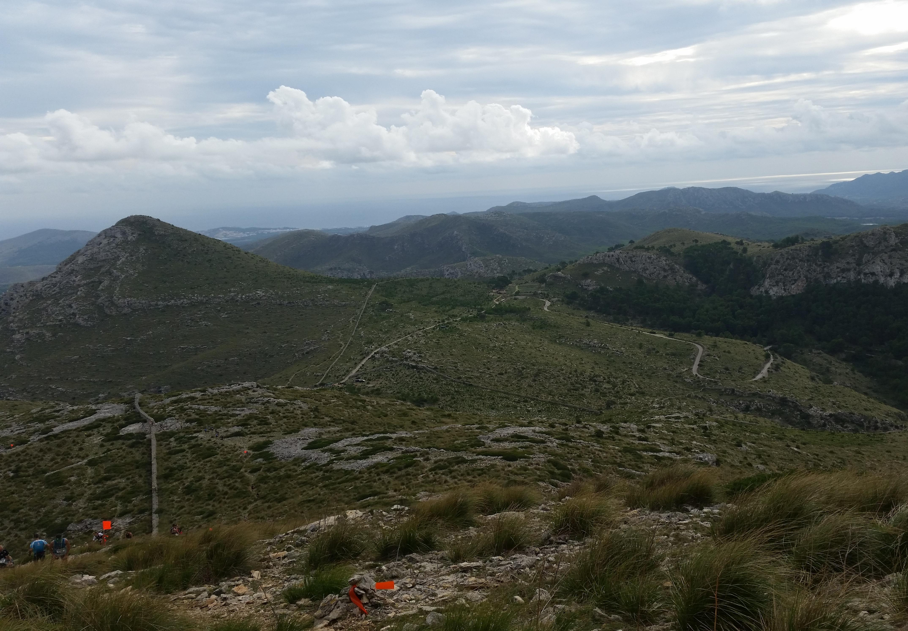
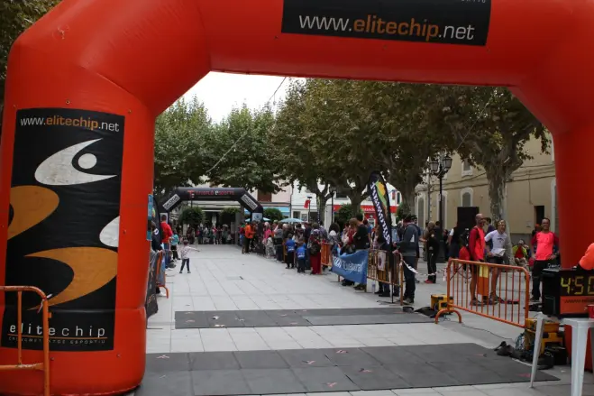
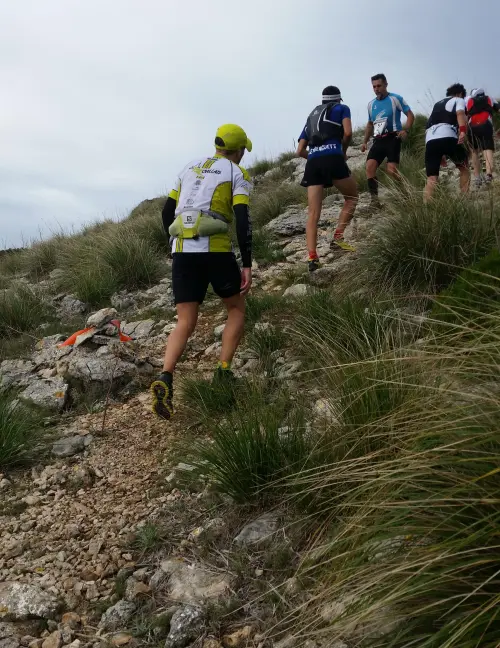

Dimanche dernier j’ai eu la chance de participer pour la 2ème fois à une course splendide au coeur du Parc Natural de la Península de Llevant. Le récit de l’année dernière, agrémenté de quelques belles photos, se trouve [ici](../20141105_MaratoArta/). Cette année j’étais sûrement un peu plus concentré sur mon sujet, d’où un nombre réduit de photos. Par contre le GPS garmin m’a permis d’avoir une meilleure idée du parcours.



Plus besoin de raconter que les paysages sont superbes et variés, entre montagne, zone boisée, plage, …

## Les bons conseils…

Point de vue course, je ne peux m’empêcher de repenser de temps au temps aux conseils qu’on nous donnait souvent il y a quelques années…

1 “Ne pars pas trop vite, tu vas te cramer“: celui-là j’ai dû le suivre très (trop) souvent. Partir pépère, accélérer petit à petit, puis voilà la fin de la course, les jambes tournent bien mais trop tard c’est déjà la fin, ce sprint sur le dernier km ne sert à rien. Dans toutes les courses que j’ai fait, je ne crois pas qu’il y a eu une seule où je me suis “cramé” dès le début, donc maintenant le truc c’est partir presque à fond, et si ça doit péter, ça pétera. Avantage: en allant vite au début, on évite les bouchons dus aux amis qui marchent dès que ça commence à monter. Et ça, oui, c’est pénible.
2. “Echauffe-toi bien avant la course“: le conseil certainement pertinent pour un 10 km ou un vrai marathon, mais pour un sale trail de 40 bornes, je ne suis pas sûr qu’il faille aller dépenser son énergie dans un échauffement élaboré, sachant qu’il faudra de toute façon attendre comme un gland sur la ligne de départ. Donc l’échauffement se fera dans les 2-3 premiers km de course.
3. “Bois beaucoup d’eau“: sans doute le meilleur pour moi. La flotte, ça me donne envie de gerber. Une fois aux Crêtes de Spa j’avais tellement bu avant la course que j’ai dû m’arrêter dans les bois après 10 km. Juste horrible. Ici pendant la course, aux ravitos je me prenais un gobelet d’eau et un demi de isotonique, et après pendant 10-15 minutes j’avais l’impression que ma panse allait exploser. Alors franchement parfois je me demande s’il ne vaut pas être légèrement déshydraté, plutôt que d’être au bord de l’explosion.
4. “Fais bien tes étirements après la course“: celui-là je l’ai suivi assez longtemps… jusqu’au jour où j’ai suivi une formation sur internet sur la récupération. Le gars qui donnait la formation était assez reconnu et avait travaillé avec des équipes participant au Jeux Olympiques, donc ce n’était pas un guignol. Et un truc qu’il disait, c’est qu’aucune étude scientifique de haut niveau n’avait jamais démontré que les étirements avaient un effet positif sur la récupération. Il y a juste un effet de relaxation, qui parfois peut avoir un effet positif. Par contre il conseille un beau dans de l’eau à 18°C je crois (ou moins), et ça c’est démontré que ça fonctionne. J’ai fait le test sur une plage toute proche, mais il m’a fallu 20 minutes pour réussir à entrer dans l’eau (qui devait être vers les 22°C je suppose).

|  |
|:--:|
|_Vue depuis le point culminant de la course, le Puig Morey, 564 m._|

## Le public

Je ne peux m’empêcher de consacrer un petit paragraphe à ce merveilleux public! Car oui, c’est merveilleux de pouvoir passer d’un silence total lorsqu’un inconnu passe en courant (même le regarder semble malvenu) à une super ambiance de fête lorsqu’un ami ou membre du club passe: “vas-y Vitor! Qué tal Vitor? Ánimo Vitor! Venga Vitor“. Puis c’est le silence de nouveau, Vitor est déjà parti. Non, vraiment, ils ont du mérite. Quand je suis allé voir des courses, je sais pas ce qui me passait par la tête, mais j’encourageais tout le monde, homme, femme, enfant, grand, gros, petit, vieux comme celui qui finit dernier à toutes les courses autour de Verviers… je devais vraiment être bête de dépenser de l’énergie pour des gens que je ne connaissais pas, c’est vrai quoi. Applaudir le dossard 064, un certain Jaume, mais vous rigolez ou quoi, fin de course j’aurai mal aux mains.

|  |
|:--:|
|_C’est la folle ambiance sur la ligne d’arrivée. Ou pas._|

## Ma course?

Pour si ça peut intéresser quelqu’un (sinon ce sera toujours bon pour me souvenir): total 4h37 de course (contre 5h05 l’année passée), de très bonnes sensations jusqu’au 27° kilomètre (première fois que j’ai regardé mon GPS durant la course), et un passage difficile entre les km 30 et 35, un peu à cause de la laide pente, aussi un peu à cause de l’ennui, n’ayons pas peur de le dire, par moment, je me faisais un peu chier (essayez toujours de parler avec quelqu’un pendant la course!), et puis à cause d’un ravitaillement sans doute mal géré. Comme ce fut le cas dans d’autres courses: manque d’entraînement dans des montées très très raides, donc les mollets soufrent énormément. Point positif, le plat et les descentes, où en général je dépasse plus que je ne me fais dépasser.

|  |
|:--:|
|_Pendant que certains se crèvent à monter, d’autres prennent leur pied en descente._|

## Aftermath

Après la course j’ai dit à ma copine que sans doute je ne la referai pas… vraiment parfois ça me broute de courir, ou plutôt de faire des compétitions. Les résultats, sans être exceptionnels, sont plutôt satisfaisants, les efforts paient relativement bien, même si je me demande si c’est vraiment le sport qui me convient. Time will tell.

__Day+1:__ pas trop crevé, le trajet en vélo pour aller en bosser c’est bien passé, les 40′ de décrassage ont paru longues.        
__Day+2:__ jambes plus lourdes que le lendemain, et au boulot je me sens très (trop) calme.          
__Day+3:__ les jambes tournent beaucoup mieux, par contre à la salle de muscu, c’est pas trop ça.            
__Day+4:__ bonnes jambes en vélo, record pour aller au boulot battu! Jogg 40′, à 12 km/h j’ai l’impression de faire du sur-place.         

Cette semaine after-marathon s’est plutôt bien passée physiquement, par contre je me sentais en manque d’inspiration au boulot, et aussi un peu plus calme et moins enclin à la contestation que d’habitude. Effets secondaires je suppose.