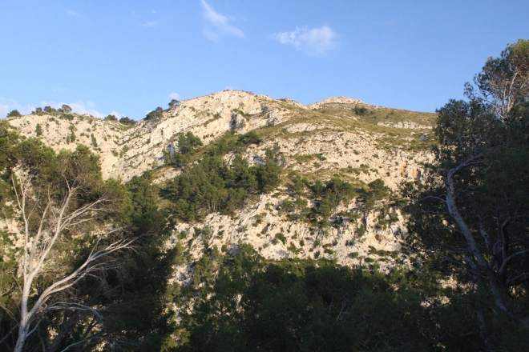
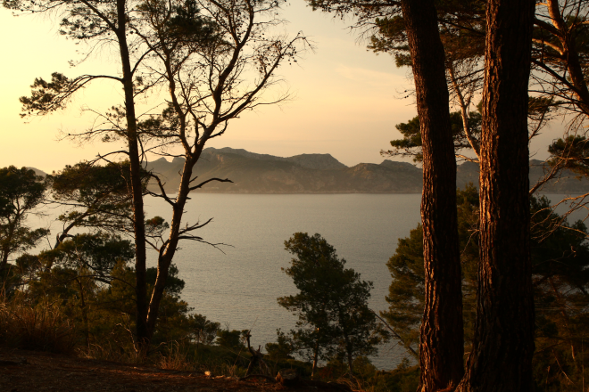
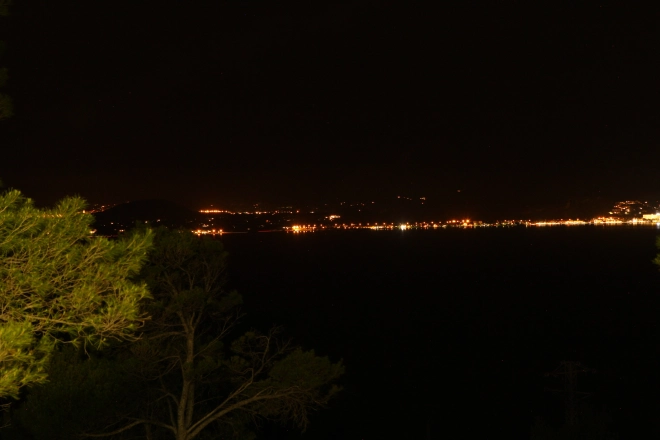
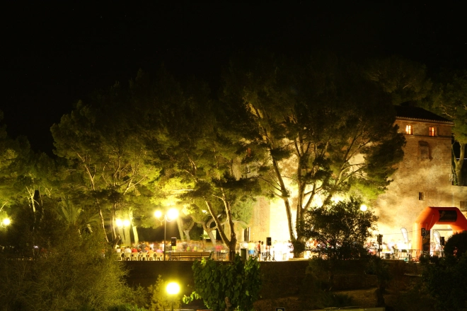

Il est parfois plus facile de terminer une course qu’un article de blog. Celui-ci en est la preuve.

Il y a des jours où on se dit, en faisant quelque chose, que ce sera sans doute la dernière fois: dernière cigarette, dernière fois qu’on regarde cette débile série de télé-réalité… que sais-je. C’était samedi il y a quelques semaines (edit: mois), je m’étais inscrit à cette petit course nocturne de 11 km, et en m’échauffant je me suis dis: cette compèt, c’est la dernière à Mallorca. Courir reste un plaisir mais les circonstances rendent ces courses un peu bizarre.

Je crois que ça reflète assez bien la vie en générale ici: plein de règles pour tout et partout, pas grand monde qui les respectent, et surtout plein de temps et d’efforts pour rien. Un article qui semble partir un peu négativement mais ne jamais oublier: on a la chance de faire ce sport et de découvrir des nouveaux trucs presque tous les jours, ne l’oublions pas.

## Inscriptions

Donc la course comme toujours commence bien avant la course: il s’agit de voir sur internet quand se fera l’ouverture des inscriptions, sachant que les places seront dans tous les cas toutes prises le même jour. J’en ai déjà parlé dans d’autres articles, c’est lourd mais c’est comme pour les festivals de musique en fait.
Matériel

Après un bon échauffement je m’approche de la ligne de départ pour voir s’il y a déjà du monde. Là un gars m’arrête et me dit 

> “gel!?” 

sans un “Hola” ou tout autre mot qui aurait permis de comprendre. WTF? En fait le gars contrôlait si on avait des gels et des barres énergétiques sur nous, auquel cas il fait qu’elles soient marquées de notre nom. Assez marrant quand même:
- plein de personnes ne sont pas contrôlées;
- il n’est pas fort difficile de se procurer des aliments non marqués (aide du public, cachette…)
- il est facile d’effacer son nom inscrit et de balancer ses crasses n’importe où.

En tout cas pas de doute, l’accueil local est bien là et on ne s’y trompe pas.

## Le parcours

La course est prévue depuis belle lurette, des sponsors en veux-tu en voilà, puis vient le moment fatidique du briefing en mallorquín. Magnifique moment qui ne sert à rien vu que ce n’est qu’une suite de noms d’endroits par lesquels on va passer, mais qui n’aident en rien aux forrasters (étrangers).

Précision: non, on ne passera par le sommet local, la Talaia d’Alcudia, parce que “le sommet n’est pas catalogué officiellement”. Et oui, ici on ne rigole pas avec ça hein. Deux mois après la course j’essaie toujours de comprendre. Peut-être parce qu’on risque de détériorer l’endroit, pourquoi pas. Mais si on parle de détérioration, je crois qu’on aura bien senti notre passage dans tous ces chemins pierreux.

Au final, comme toujours: suivre les flèches. Mais j’oubliais: quelques heures avant la course, ils avaient aussi changer le lieu de départ, et visiblement tout le monde était au courant.

## L’after-course

Pour moi, juste le meilleur de tout point de vue cohérence: on fait un trail en nature, zone plus ou moins protégée, pas de déchet etc etc, mais par contre mettre les hauts-parleurs à fond pour diffuser la musique aussi bien au départ qu’à l’arrivée (~22h) et crier le nom de tous les coureurs qui arrivent.
Conclusions (en mode ralage, mais la course était super!)

Non vraiment, chapeau pour la cohérence, et comme dit dans l’intro, ça traduit bien les conditions générales à Mallorca: il faut des papiers, licences, autorisation pour tout, mais finalement ça ne sert à rien. Exemple: un ami veut une licence pour faire du canyoning: pas de problème, attends 6 mois et tu l’auras, et début janvier 2017 rebelote.