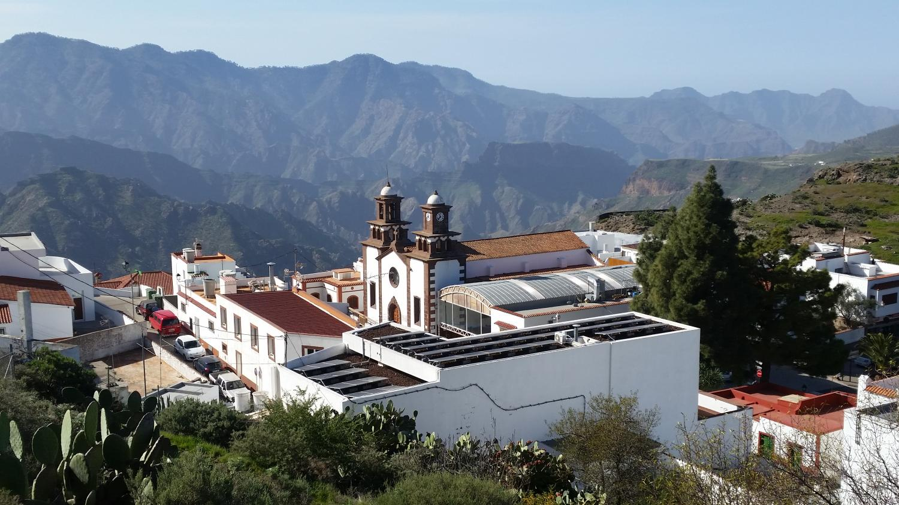
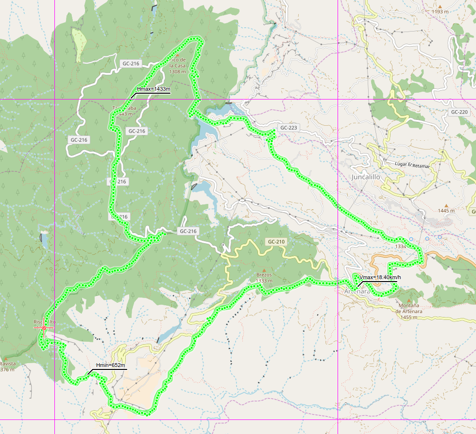
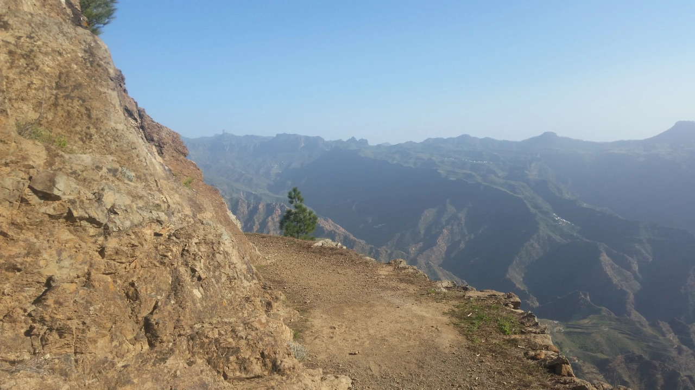
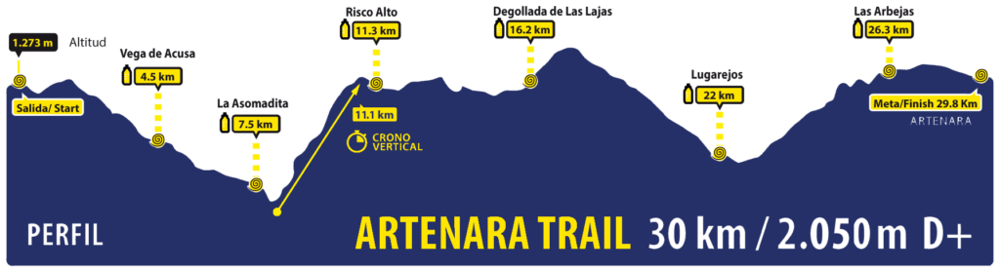

Après une course, on peut toujours interpréter les résultats de différentes façons, c'est encore le cas ici. Si on suit le classement et mes sensations, pas de doute, une contre-performance, aussi appelée "course de merde" en langage courant. Si je considère les difficultés en course et la proximité de l'abandon, je considère cette course comme une belle (mais petite) victoire.

## Artenara

|  |
|:--:|
|_Artenara, le plus haut village de Gran Canaria._|

Le Trail d'Artenera en est à sa 9° édition environ, cette année encore elle compte comme championnat de course de montagne des îles Canaries, ce qui me faisait penser que le niveau allait être relevé. Organisation “à la Canario” j'ai envie de dire, c'est-à-dire parfait jusque dans les détails (ravitaillements, marquage, parcours) et surtout beaucoup de sécurité (police, ambulance, protection civile, croix rouge). Tout ça pour une course d'à peine 30 km.

## Le parcours

|  |
|:--:|
| _Le parcours._|

Ces dernières semaines les sensations étaient vraiment bonnes donc je misais sur un temps de 4h, assez réaliste et accessible. Au final, 5h25, donc il y a eu de la casse 😉 On commence par une longue descente d'environ 8 km, pas trop cassante mais où il ne vaut mieux pas trébucher sous peine de chute dans un ravin, puis une montée qui compte comme championnat de course verticale: environ 3.5 km de chemins en zig-zag qui nous emmènent de 650 m d'altitude à près de 1300 m. Là je dois avouer que j'ai bien souffert musculairement, car c'était vraiment un type d'effort et de pente pour lequel je ne m'étais plus entraîné depuis 6 mois.

|  |
|:--:|
| _Le genre de chemin qu'on trouve à Artenara (photos prise hors course)._|

Après cette horrible montée on se retrouve sur une crête où courir est encore possible, pour atteindre le sommet de la course, à Tamadaba (1430 m). Jusque là et malgré la sale montée ça va encore bien, sachant qu'il y a maintenant une longue descente vers le barrage de Lugarejos et un ravitaillement. Si il y a un moment où j'ai pensé que ça a foiré, c'est là: après la descente, presqu'impossible de manger et la dernière montée qui restait, a priori ok sur papier, me laissait un sale goût dans la bouche. Mes arrêts sont de plus en plus fréquents, parfois je m'assois, parfois même je me couche à l'ombre (quand il y en a) à cause d'une sale envie de gerber. Sur le profil de la course imprimé sur le dossard je vois 2 ptites bosses, un truc qu'en temps normal on fait en 5 minutes, et là non, pas possible.

|  |
|:--:|
| _Le profil officiel de la course, où on peut voir le "Crono vertical"._|

## Le début de la fin

Après le dernier ravitaillement auquel je m'arrête au moins 10 minutes, il ne reste que 3-4 kilomètres. Après 5 minutes de marche, je m'assoie à nouveau en pensant que cette fois-ci c'est la fin, je vais devoir jeter l'éponge. Juste au moment où je pense faire demi-tour pour descendre signaler l'abandon au poste de ravitaillement que je viens de passer, mon cerveau décide de passer en mode automatique et prend la pente ascendante. À ce moment-là je sais que c'est bon et que j'arriverai au bout, les jambes recommencent à tourner, ça fait du bien de recourir. Quand je passe la ligne, j'entends que le commentateur dit qu'il manque juste 50 participants, là je me dis: “p** tu as bien foiré”. Finalement une milieu de classement (90/180 inscrits), pas fier mais vu la préparation spécifique (nulle) pour ce type d'épreuve, je me dis que ça aurait pu être pire.

Pour revenir sur le thème de l'abandon, j'avais lu quelques trucs intéressant sur tout le mécanisme qui finit par mener au moment où on dit: j'arrête. Rarement par coup de tête, c'est plutôt une petite pensée qui devient de plus en plus importante, un truc qui grossit au fur et à mesure de la course, sous l'effet de justifications que l'on peut trouver. Un début de solution peut être de discuter avec d'autres personnes pendant la course, coureurs ou bien personnes au ravito, ou alors changer d'état d'esprit, penser que c'est plus une course sinon une sortie longue pour le plaisir. Moi pour la suite le plan ce sera surtout de mieux cibler les entraînements en fonction de la compèt, dans ce cas-ci des montées  impossibles à courir, en y repensant il y a 3 mois tout le monde me disait que j'allais arrêter le sport...

Ma course sur Strava: https://www.strava.com/activities/1643957590