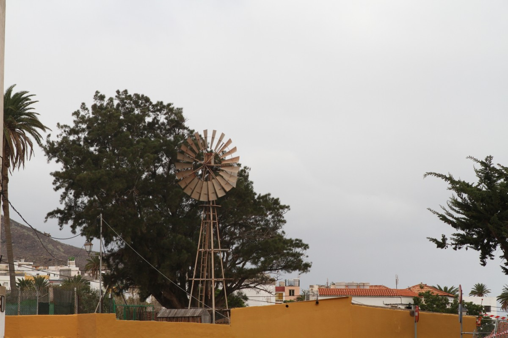
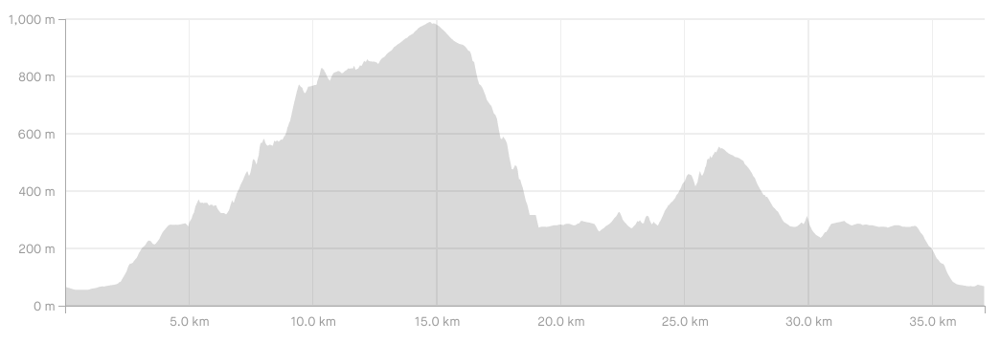
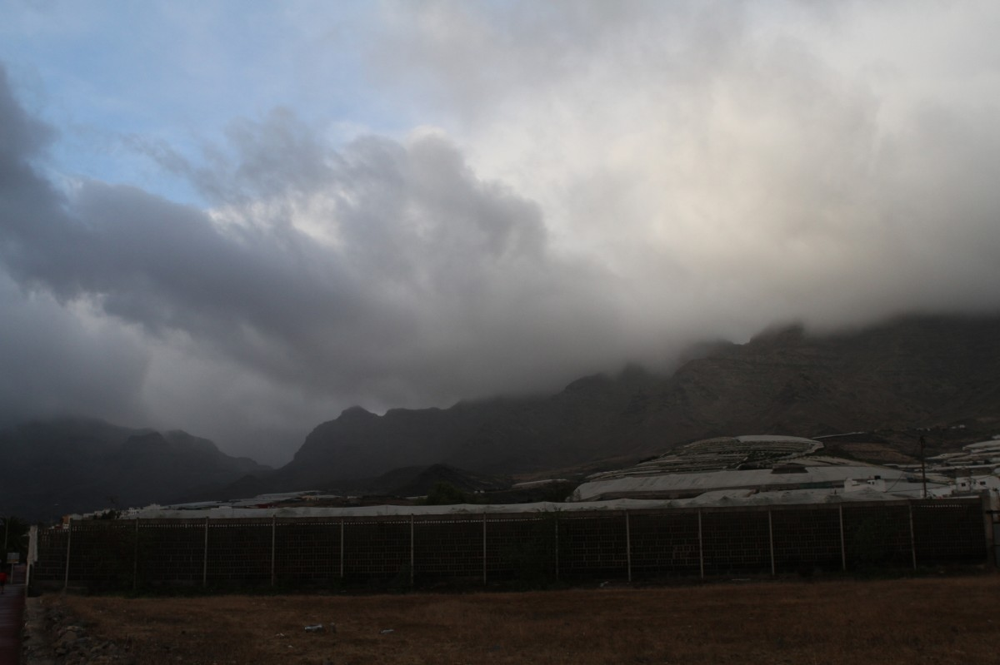
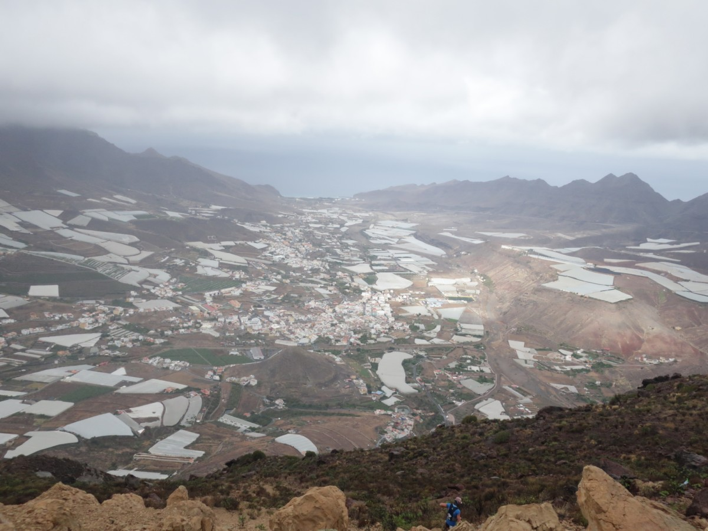
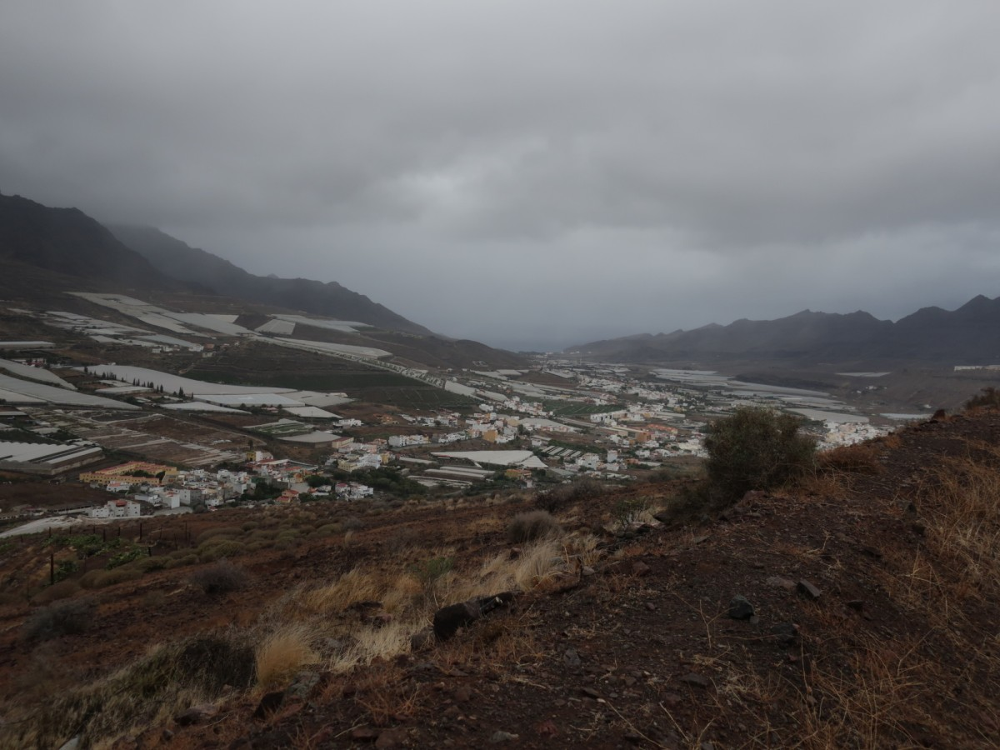
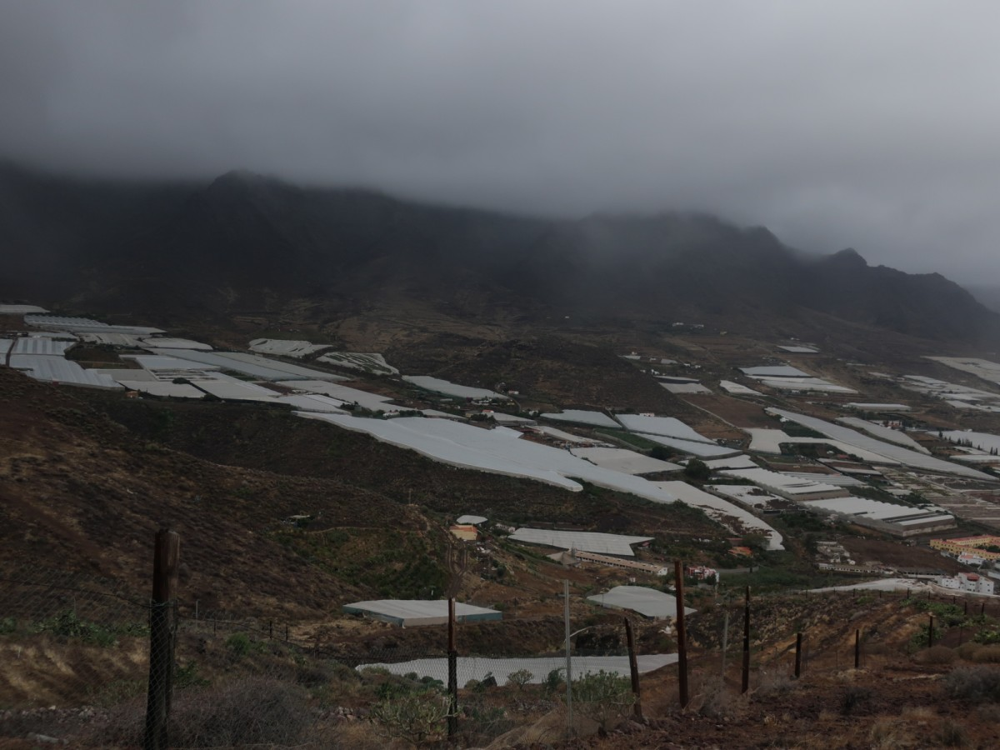

Quiconque a déjà mis les pieds à la Aldea de San Nicolas sait que ce n’est pas un endroit habituel. Déjà pour y arriver, il faut se farcir des dizaines de virages serrés sur des routes en bonne état mais vertigineuses. Je connais peu de gens qui y soient déjà allés, souvent c’était pour la Fiesta del Charco ou alors pour une randonnée à Guigui. Je me souviens aussi d’une visite avec un ami là-bas il y a 10 ans, en quittant le village et en prenant un peu de hauteur avec la voiture, il m’avait demandé qu’on s’arrête pour qu’ils puisse prendre une photo, en disant qu’il n’avait jamais vu ça de sa vie.

## La Aldea

Personnellement j’ai toujours aimé à la Aldea, un endroit décalé et différent, pas vraiment beau si on compare avec Tejeda par exemple, mais avec du caractère. Les bâches de plastiques couvrant les plantations de tomates sont certainement ce qui attire le plus l’attention. Pour les coureurs, c’est surtout les montagnes avoisinantes. Lors de cette visite d’ailleurs, pour une fois l’objectif n’était pas le détente, mais la course “Paralelo 28, entre Montañas“, pas besoin de traduire. Arriver sur place à l’heure constitue déjà un bon échauffement (1h15 de route de montagne) qui, combinée à la pluie, m’avait même fait un peu douter de ma participation. Mais voilà, j’étais inscrit, ça aurait été bête de ne pas venir.

## Le parcours

Comme à chaque course, je me dis que ce sera une des dernières: ça me saoule d’entre cette musique à fond alors qu’il est 8h du matin dans un petit village, le trail n’est-il pas une sorte de “communion avec la nature”, éternel débat que je n’aborderai pas ou plus dans ce blog. Le DJ fait péter la sono, ça crie qu’on est contents d’être là, et c’est vrai, mais pu*** les gars, calmez-vous un peu.



Le parcours, tradition oblige, je le découvre totalement, j’ai un peu vérifié leur site web, en gros:
1. grosse montée,
2. grosse descente,
3. une montée moyenne,
4. descente jusque l’arrivée.

L’annonceur ou le _Master of Ceremony_, appelons-le MC, répète: “attention, à partir du kilomètre 14, soyez prudents”. Le départ est lancé, nous voici à l’assaut del Viso, une montagne d’environ 1000 m d’altitude. Rapidement je me demande si j’ai bien fermé la voiture, un peu trop tard certes, et 2 heures plus tard j’apprendrai que j’ai perdu les clés... Peu importe, on se concentre sur la course. Les premiers km se passent bien, ni trop lent ni trop rapide, le temps décide de se gâter: pluie parfois drache, vent frais, mais comme le dit très bien un autre coureur: “s’il avait fait chaud, on aurait eu des problèmes”.

Le paysage a l’air beau, sauf qu’on ne voit pas grand chose. Parfois le sentier passe à côté d’une habitation, et on se demande qui habite là, dans un trou aussi perdu. Par moment ça drache bien, et une fois sur la crête, le vent souffle tellement fort qu’il est impossible de courir droit. Déjà le fameux km 14, le soucis mentionné par le MC, c’est des pierres glissantes (lajas), rien d’effrayant vu qu’on est presque sur du plat. Après, une descente très raide et technique, j’entends qu’un gars me suit de près mais ne veut pas me dépasser, disant “vas de puta madre!“, qui n’est pas une insulte à ma maman mais un compliment sur ma descente. On dépasse pas mal de monde, ça fait du bien même si c’est chaud dans les tournants.

Des volontaires indiquent le chemin en bas, ça veut dire qu’on arrive sûrement sur du plat. Effectivement, à gauche c’est la longue distance, à droite la moyenne (22 km). Mon poursuivant s’en va vers la ligne d’arrivée, tandis que je me dirige vers ce que j’avais appelé la “montée moyenne”. Avant ça il faut se taper la piste des 300 m, non pas que sa longueur soit de 300 m (sinon ça serait un jeu d’enfant), sinon que son altitude est tout le temps de 300 m. Bref, une piste monotone, large, avec plein de tournants qui se ressemblent, et qui plus est, qu’il faudra parcourir en sens opposé.

Il drache et les vieux sortent de chez eux pour nous encourager ou se moquer de nous, le chemin monte enfin, et on arrive à un ravito, celui du 20° kilomètre, tandis que mon dispositif indique 23 km, mais bon en trail c’est habituel. Chaque fois c’est pareil, ça me rappelle Olne-Spa-Olne, quand l’ami Florentin sortait du dernier ravito super énervé, parce que selon son GPS la course était terminée mais qu’en réalité il restait 5 km.

Ça monte, ça monte, on ne voit pas trop où ça nous mène, genre un sommet ou un col, jusqu’à ce qu’au dessus de nous, quelques dizaines de mètres au dessus, on voit des coureurs en direction opposée. Pas de somment donc, juste une montée partielle contre le flanc d’une montagne, puis une descente sans trop d’intérêt.

Coup de fil de ma maman, elle pensait peut-être que quelqu’un l’avait insultée, bref, je décroche et continue la descente au bout du fil. Peu après, message de ma copine: 

> Quelqu’un a trouvé tes clés, elles sont au commissariat. 

Bon au pire on a piqué: mon porte-feuille, mes papiers, pas mon argent vu que le porte-feuille est tout le temps vide, mon appareil photo et les objectifs. De toute façon pas le temps de penser à ça, sinon je vais me péter la gueule. Surprise du chef, nous voici dans un jardin de cactus, attraction connue de la Aldea – on n’avait jamais pensé à y aller et c’est marrant de penser que c’est grâce à une course que je l’ai découvert. J’hésite à prendre des photos, pas le temps pour ça. Encore quelques talus et nous revoilà sur la _piste 300_, plus que 4 km et c’est bon. J’en ai un peu marre donc commence à marcher, un peu contradictoire vu qu’en marchant j’allonge le temps de course, mais essaie de m’expliquer ça en pleine course avec les jambes qui commencent à sentir les sollicitations mécaniques. Enfin terminé avec cette piste, place à la vitesse et la descente vers la place du village, il m’en reste pour sprinter mais ça ne sert à rien, j’ai couru à l’économe vu l’absence de sorties longues dans mes entraînements récents.

## Conclusions

Un peu moins de 5 heures d’effort pour boucler ces 37 km, pas de regrets car une blessure ou un abandon n’était pas dans les options, et puis il fallait retrouver ces pu*** des clés de voiture. Alors, à conseiller cette course? Je trouve que le 22 km était plus sympa, car il évitait cette montée un peu tirée par les cheveux, et surtout l’aller-retour sur la même piste.

Pour n’importe quelle des modalités, il faut aussi aimer conduire sur des routes étroites et vertigineuses, de nuit et sous la pluie, ou bien venir le jour avant et passer la nuit dans le village, option rapidement oubliée justement à cause de cette pluie.

Personnellement il me reste beaucoup à découvrir de la Aldea, son relief est un terrain de jeu plutôt exceptionnel, donc on essaiera ça pour le prochain trip à Gran Canaria: une belle sortie longue dans les environs.

Ma course sur Strava: https://www.strava.com/activities/1978259460
