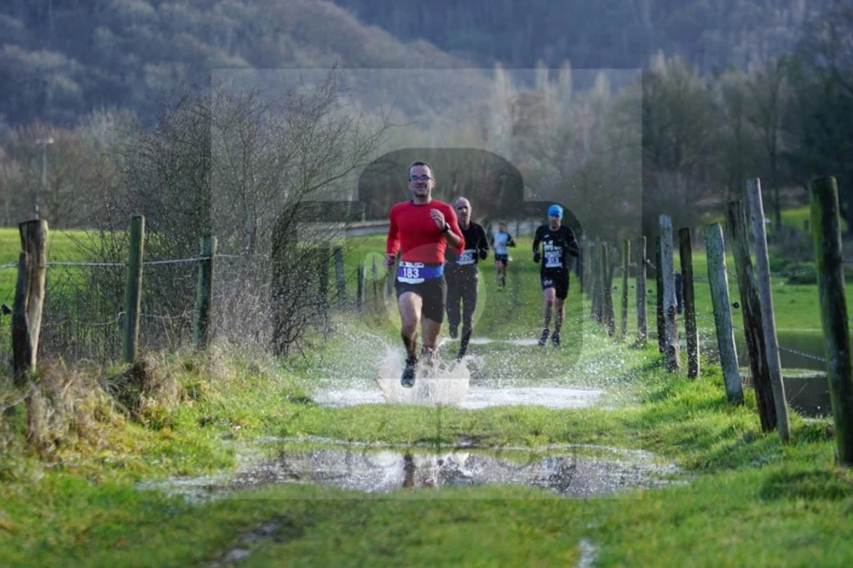

Cela fait des années que l’on me parle de la Belle Hivernoise. Probablement aux alentours de 10 ans. Et chaque année, j’ai une excuse pour ne pas la faire. La meilleure excuse étant que j’étais en voyage, généralement aux Canaries. Cette année, pas de réveillon aux Canaries, donc pas d’excuse.

Surtout que les jambes tournent bien, les entraînements ont bien fonctionné. Bref, c’est le moment idéal. Et enfin, j’ai reçu un petit email de provocation (amicale bien sûr) d’un collègue, genre:

> Je te lance un défis, on se retrouve sur la ligne d’arrivée, on verra qui y est le premier.

|  |
|:--:|
| _Guillaume et moi, tout en finesse. Photo by Jo Defrère: https://fr-fr.facebook.com/defrere.athletics.fotos/. J’ai quand même des sales quadriceps sur cette photo._|

## Le parcours

J’ai envie de dire qu’avec cette course on est comme des locaux:
- départ de Angleur jusque le domain du Sart Tilman,
- descente jusqu’au Castors, via le Chateau de Colonster,
- remontée assez hard jusque l’ULiège,
- descente via la Lande de Streupas jusque Angleur.



Le parcours 2019 est aussi disponible sur Wikiloc: https://www.wikiloc.com/trail-running-trails/la-belle-hivernoise-2019-45159718.

## La course

Comme annoncé: départ à fond, puis après on verra. Je pense n’avoir pas craqué, sauf un petit peu dans la boucle dans la Lande de Streupas, vers le 20ème km. Je n’ai fait que dépasser des gens pendant la course, et puis là sur quelques hectomètres je me suis fait reprendre par 2 missiles. Même dans la descente je n’ai pas réussi à m’en rapprocher, donc c’était bien mérité.

Sur l’ensemble du parcours j’ai vraiment eu l’impression de planer, tout allait bien et j’arrivais à relancer après les montées. Je crois que je n’ai pas regardé ma montre avant le 20° km. En général on peut dire que la fréquence avec laquelle on regarde sa montre augmente avec la fatigue.

|  |
|:--:|
| _En jaune: le parcours de la course; en orange, les traces des entrainements dans la zone du Sart Tilman._|

### En résumé

Beaucoup de plaisir, et une bonne 8° place qui fait plaisir. Parfois on se dit que courir sur des endroits connus peut être ennuyeux, d’autres fois j’ai l’impression que justement ça aide: on sait où on va, on peut se laisser aller à penser autre chose que la course.

Près des homes du Sart Tilman. Photo by Jo Defrère: https://fr-fr.facebook.com/defrere.athletics.fotos/
Les photos

Bon j’avoue, cette fois-là j’avais laissé l’appareil dans le sac, parce que:
1. on connaissait le parcours donc je ne m’attendais à rien d’exceptionnel.
2. étant donnée la provoc mentionnée au début, je ne voulais pas perdre du temps à m’arrêter.

Heureusement qu’il y a souvent de bons photographes sur les parcours et qui mettent souvent à disposition leurs clichés. Ici en particulier on remerciera Gédéon Baltazard et Jo Defrère. Je dois dire qu’il m’arrive souvent de participer aux courses en tant que photographe et le but est évidemment qu’un max de coureurs trouvent un cliché souvenir qui leur plait. Malgré cela il y a aussi de plus en plus de course où les photos sont payantes, ce qui est aussi compréhensible, vu l’investissement en temps.

|  |
|:--:|
| _Près du l'endroit qu'on appelle "Les Castors". Photo by Gédéon._|

## Petit mot pour la fin...

Enfin participé à cette course, ça restera un bon souvenir, d’abord parce qu’on était nombreux du groupe de midi à y participer, ensuite pour les bonnes sensations et la place qui en a découlé. En 2021 a priori on pensait ne pas la refaire, car un autre trail intéressant a lieu en même temps, mais c’est trop tôt pour le dire.