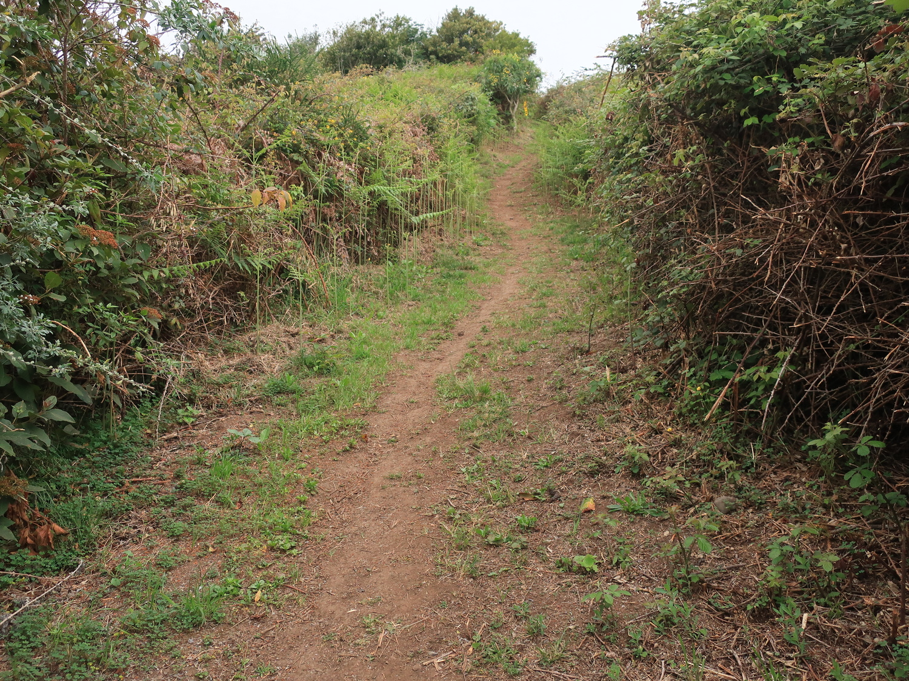
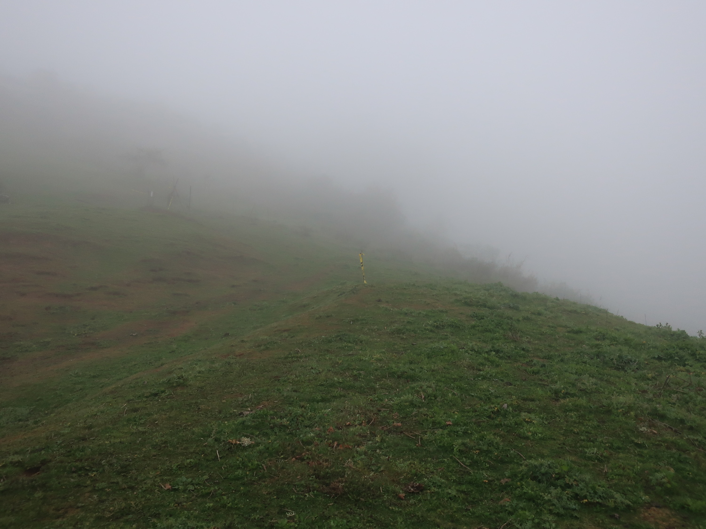
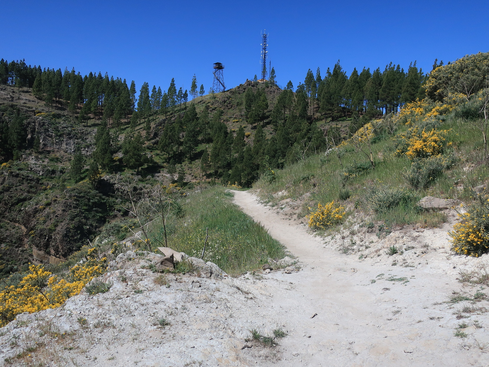
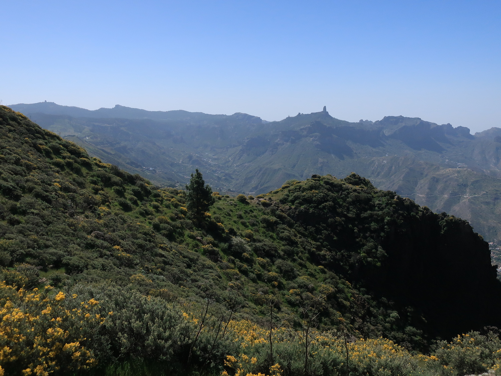
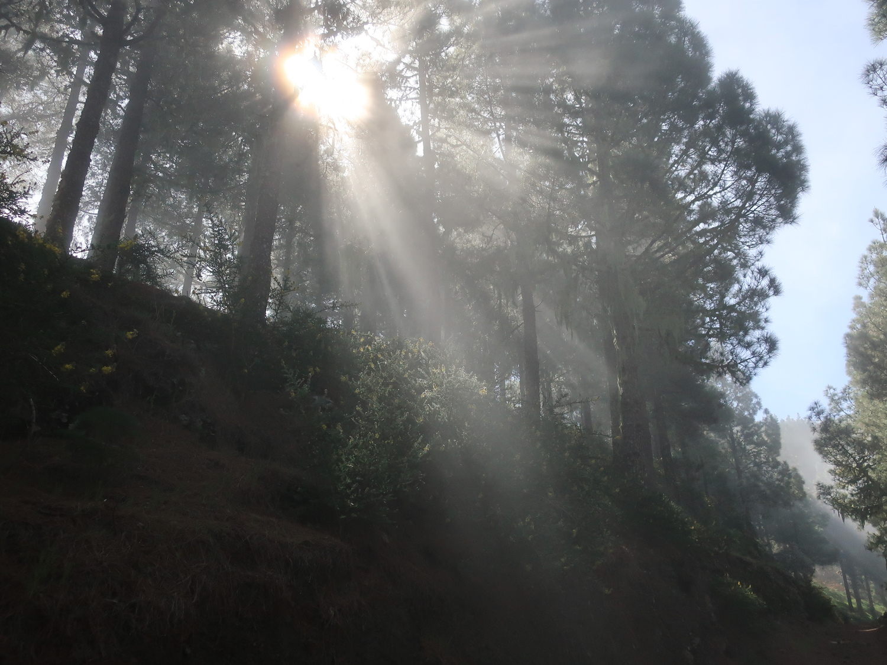
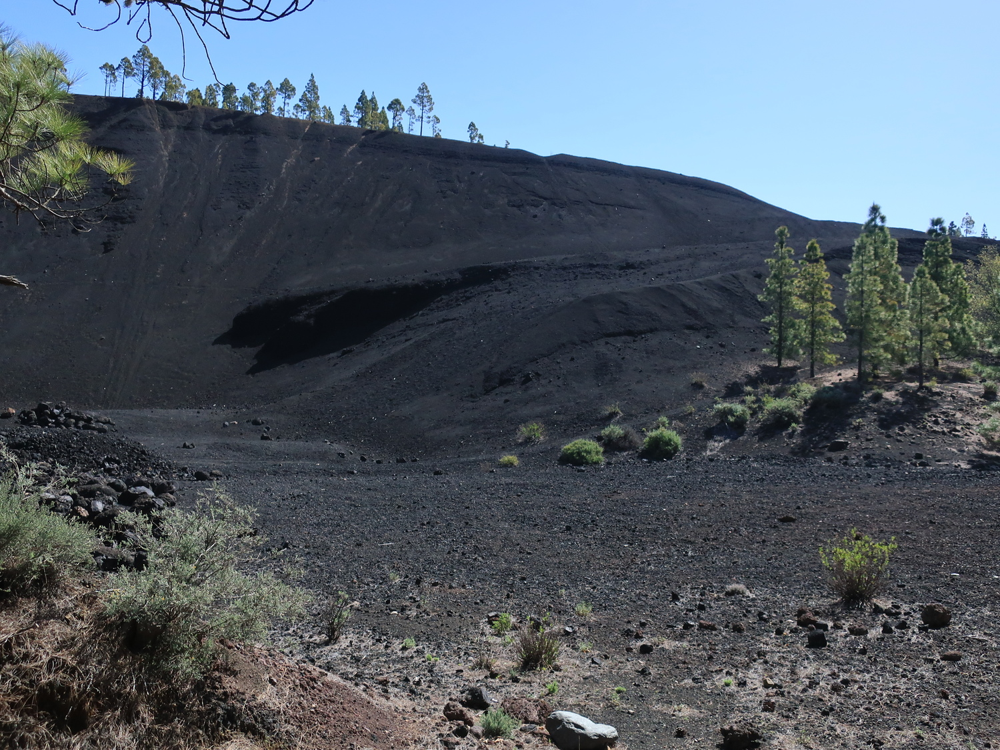

Ils ont toujours le tact pour trouver un nom de course qui fait peur ces Canariens.
Moya est un petit village du nord de l’île, connu pour ses desserts (Suspiros de Moya, qui est en fait de la meringue) ainsi que pour le poête Tomas Morales, dont j’inclus ici quelques vers, culture oblige:

> Vamos llegando en medio de un poniente dorado;
> el Océano brilla como una intensa llama;
> y poco á poco, lenta la noche se derrama
> en la paz infinita del puerto abandonado…

Enfin, c’est aussi un des derniers endroit où l’on trouve la “Laurisilva“, qui est le type de forêt sub-tropicale qui couvrait l’île avant que l’on décide de déboiser sauvagement il y a plusieurs siècles. La zone appelée Los Tilos de Moya est idéal pour s’en faire une idée et voyager dans le temps.

La course est assez connue à Gran Canaria, vu que la distance et le parcours sont accessibles, avec 3 distances proposées: 42, 24 et je ne sais plus combien.

## Avant-course

Comme pour le Trail de la Aldea, arriver au départ peut être une belle aventure. Ici 2 routes: par la côte ou par la montagne. Je choisis évidemment la 2°, en préparant tout le matériel photo pour prendre quelques photos du lever de soleil. Raté: le temps, annoncé ensoleillé, est une purée de pois: mer de nuage jusqu’à plus de 1500 m d’altitude (avec 4°C!!), bref pas de photos de lever de soleil.

Je trace un peu sur la route pour arriver avant le départ, et puis voilà: route fermée (pour la course), déjà 45 minutes avant le départ. Et oui, on ne rigole pas avant la sécurité ici (comme d’hab: policiers + protection civile + ambulances + volontaires). Enfin peu importe, j’ai déjà le dossard donc no stress.

## Parcours



En simplifiant beaucoup: 2000 m de montée, depuis Moya à _Los Moriscos_ (le plus haut sommet de l’ouest de l’île, voir photo ci-dessous), puis redescendre par un autre chemin.
Mais il ne fallait pas trop simplifier car la montée était parsemée de petites descentes techniques qui finalement ne faisaient pas de tort, mais qu’il fallait gérer en relançant bien.

Comme il était impossible (pour quelqu’un de ma condition) de courir durant toute la montée, j’ai pris la liberté de prendre quelques photos, qui ne rivaliseront pas avec celles des 10-15 photographes présents sur le parcours. Une fois sorti de la mer de nuage, vers 1400 m (et oui, la mer monte et descend pendant la journée), plein soleil et ciel bleu. J’espérais secrètement avoir une belle photo de Tenerife et du Teide depuis le sommet de Moriscos, mais ce sera pour une autre fois, faute de visibilité suffisante.

La descente présentait certaines parties bien pentues, l’altimètre ne pouvait que le confirmer et c’est tant mieux, car des descentes trop longues pour moi c’est vraiment lourd. On terminait par une jolie côte avant le retour à Moya, et ça m’a bien plu, avant de relancer une accélération finale.

## Après-course

Tout s’est bien passé donc content. Au téléphone je disais à ma copine:

> Bien passé, normal, sans problème, enfin beaucoup de montées, mais ce ne sont pas des problèmes”.

42 km ne m’effraient pas en général, mais depuis pas mal de temps je ne fais quasi plus de sorties longues, donc c’était un peu un test ici, voir si ça passe ou ça casse. La gestion des ravitos était aussi bonne, j’avais embarqué pas mal d’eau dès le départ et m’étais obligé à manger à intervalle régulier, ce que je ne fais jamais en entraînement.

Petit bémol à 5 km de la fin: mal de ventre (digestion) qui m’a probablement coûté 2-3 minutes, mais rien de bien méchant. J’ai vraiment apprécié l’effort dans les montées, sans me brûler mais en gardant du rythme.

Maintenant évidemment la question est de savoir si je m’inscris à quelque chose de plus long. D’un côté les jambes et la tête sont ok, d’un autre j’ai une grande peur: m’ennuyer sur une course. Par moment ça m’arrive, et si c’est le cas, si je n’ai pas une bonne raison de courir, ça pourrait mener à l’abandon. Et puis les jours avant la course, ça m’énerve, je me dis que je ne peux pas courir, et parfois j’ai juste envie de sortir et laisser tourner les jambes.

À réfléchir, et de toute façon, on continue à s’entraîner!

Sinon, commentaires sans rapport:
- j’ai salué toutes les personnes croisées sur le parcours. Taux de réponse proche des 100%, ça fait plaisir.
- montre GPS sur mode “altitude” plutôt que distance, c’est plus motivant je trouve. Juste regardé une fois la distance, à quasi 3 km de l’arrivée.
- Le D⁺ mesuré par la montre semble foirer, j’ai noté qu’il restait bloqué à 1822 m pendant de nombreux km alors qu’il y avait bien des montées sérieuses (pas des petites bosses de me**) durant ces km.