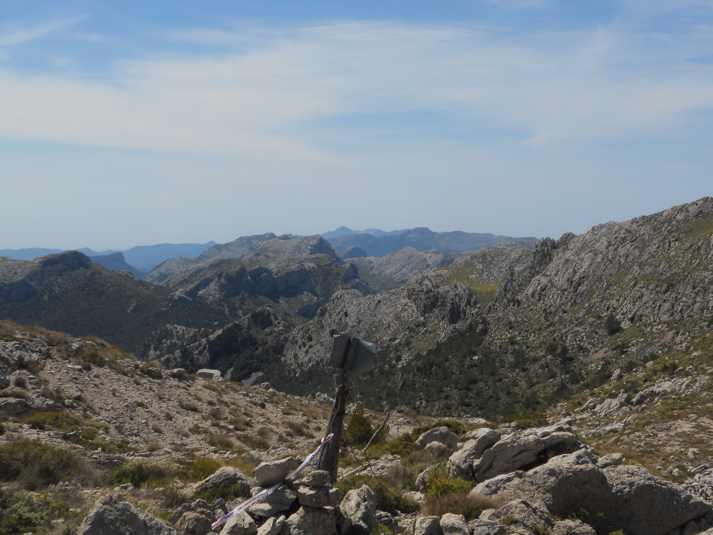

Bonsoir, essayons d’écrire ce compte rendu vite fait, tant que la mémoire (et les jambes) sont encore chaud(e)s. Le [_Trail des 600 Boitheux_](https://www.traildes600boitheux.be/2019-fr/), comme son nom l’indique, est organisé à Theux, et dans les bois. Cette année on nous propose 4 distances: 11, 22, 33 et ... 66 km, ou plutôt 67.9 selon l’organisation.

Tout se termine bien pour moi puisque je finis l’épreuve en un peu plus de 8 heures et dans un état assez frais, ce qui donne une 11° place. J’ai envie de dire: peu importe le résultat, 
> it’s about the journey.

Pendant la course, on pense beaucoup, en fait on n’a pas beaucoup d’autres choses à faire, pendant de très nombreux kilomètres on est seul, puis tous les 16-17 km, un ravitaillement où on peut discuter quelques minutes avec les volontaires. Donc on pense, au début, les premières heures, c’est facile de penser à plein de truc sans relation avec le fait de courir, et c’est plutôt une bonne chose car comme ça le temps et les kilomètres passent vit. Ici je dirais que les 5 premières heures sont passées très vite, environ un marathon dans les jambes quoi. 

Au fur et à mesure, la fatigue mentale s’installe et c’est plus difficile de s’échapper: on pense seulement à la course, aux jambes, aux petites douleurs, au kilomètres qu’il reste jusqu’au prochain ravitaillement. Je dis souvent: en trail, quand tu commences à calculer (par exemple: si je termine à du 6 km/h les 15 derniers km, je finirai en...), ça veut dire que l’esprit commence à fatiguer. Pareil si tu regardes la montre GPS toutes les 30 secondes pour voir si les kilomètres passent: ça veut dire que ça sent le roussi.

|:--:|
|_Salomon Speed Cross 4. Une photo pour remplir l’espace._|

Aussi un autre truc que beaucoup de gens font, c’est courir avec de la musique. Perso je n’ai jamais voulu le faire, faut pas déconner, on court dans les bois pour profiter de la nature et de ses sons, pas pour faire gueuler Scorpions tellement fort que les autres coureurs l’entendent aussi. En fait pas besoin de walkman ou lecteur MP3 pour écouter de la musique: la musique elle est dans la tête. Souvent c’est la dernière chanson écoutée avant de courir qui peut revenir en boucle, mais heureusement il y a moyen de se raccrocher sur un autre morceau. Hier, j’ai entendu “_Don’t Call Me Up_” de Mabel (qui ça?) pendant assez longtemps, tout ça parce que les organisateurs avaient mis ça juste avant le départ. Sinon je me souviens d’une Transvulcania sous le son de “_Meet me halfway_” (Blacked Eye Peas). Sinon, chaque fois que j’écoute “_Summer_” de Calvin Harris, je me revoie en train de monter vers le Coll des Prat pendant la traversée de la Tramuntana (Mallorca).

|:--:|
|_Traversée de Mallorca (2014), avec "Summer" de Calvin Harris dans la tête._|

Pour revenir à la course: le parcours était superbe, beaucoup de chemins empruntés ces semaines-ci lors d’autres courses, une ambiance vraiment amicale et des jambes qui ont bien tourné. Cette fois-ci par contre, je n’ai pas pris de photos car j’ai préféré me concentrer sur la course. Quand même une partie assez pénible: une énorme ligne droite dans les Fagnes, sur les hauteurs de Spa. A priori, une ligne droite ça ne faut pas mal, mais là c’était en plein soleil, sur des graviers, et c’était monotone. 

D’ailleurs c’était vraiment surprenant de voir autant de coureur marcher alors que ça descendait. Je ne sais pas comment mais j’ai réussi à courir tout le temps et donc dépasser plein de concurrents, et je me souviens que l’un d’eux m’a regardé en riant et en disant: “c’est atroce”. Je dis “concurrent” mais dans ce genre de course et avec ces distances, ce ne sont pas des concurrents mais des collègues, des compagnons de course. Le concurrent, ce n’est pas les autres ni même le chrono, c’est soi-même (je ne veux pas faire de la philo-sportive, mais c’est vraiment ça).



A partir d’un moment, genre 45-50 bornes (ça dépend des coureurs), marcher devient un confort, donc si ça monte on dit: 
> Oh génial, ça monte, je peux me permettre de marcher.

puis quand ça devient plat, on tarde de plus en plus à recourir. Surtout, il ne faut pas chercher de la logique dans l’évolution de la performance après autant de kilomètres: vous pouvez être mort à 50 km et ne plus savoir courir, puis vous retrouver en train de trottiner en montée 10 km plus tard, comme si de rien n’était. Une fois que l’on sait ça, ça aide à relativiser dans les moments délicats.

Concernant l’entraînement, je suis content de voir que même sans faire de sorties longues (2-3 heures), mon programme actuel (beaucoup de séances et assez bien de vitesse) m’a permis de terminer frais mentalement en physiquement. Pour le moment ce qui me fait le plus mal c’est le coude gauche, je suppose que ça vient d’avoir pris le petit un peu trop. Et puis aussi justement, en parlant du petit, arriver comme un déchet à la ligne et ne pas être capable d’aller me balader avec lui après serait plutôt mal vu. La course à pied est un sport mais n’est pas tout.

|:--:|
|_Les pieds pas trop détruits, ça fait plaisir._|

Je crois qu’on arrive à la fin du compte-rendu, au final ça fait plaisir de boucler un parcours de cette distance, la dernière fois que j’avais passer les 42 km, c’était en février ou mars 2017 (125 km), et dans ces distances il ne faut pas oublier que tout peut arriver, on n’est jamais sûr d’arriver au bout.

P.S. désolé pour le manque de photos de course, la prochaine fois je ferai mieux.