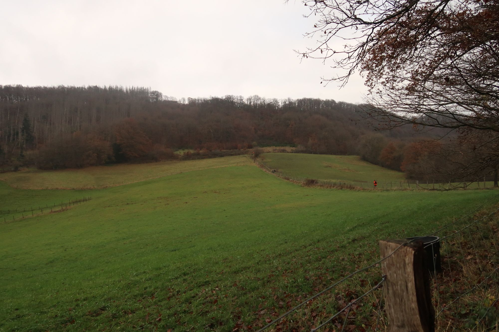

Just one week after the race, I find the time to write the conclusions. There are 2 versions of the post:
1. The short one: we did it!
2. The long one: we did it, but... it was maybe not as expected. Well, let’s try to sum up here.

## The feeling after the race

If I had to chose one word, it would be: _mixed_ (in French I would have said "_mitigé_"). Mixed feelings about everything: the race, my legs, the weather, the finish...

## Happy / unhappy

Yes of course one has to feel happy after finishing such long race, especially with the bad conditions we had, weather I mean. Personally I did not feel happy, at least until a few days after the race. I think I mostly felt bored. I almost don’t remember anything about the first half of the race. Just fragments, for example when a guy asked me about my son, because he often sees us running after school, well, my son on his bike and me running. 

It was cold, windy sometimes, but the usual technique, consisting in wearing many layers, worked perfectly. So yes, I felt unhappy, because I did not enjoy the race. It’s not easy to know why, but after a few days of perspective I have a few ideas:

- the race itself: when I did it 10 years ago, I remember I thought 
> I won’t run it again. 

It’s nice, tough, close to home, but just not my kind of race.
- the weather: ok, we were mentally prepared to run during a shitty day, but at some point it would have been nice to see the sun for a few minutes.
- the atmosphere: in general it’s cool when you can chat with other runners, even for a couple of minutes. Here I had the feeling it was not the case, like a very serious atmosphere... Maybe I’m wrong, yet a feeling is a feeling.

## Proud /not proud

Again the same story: yes I’m proud to finish it. At the same time I’m not, because... I could have done better. I was still relatively fresh at the finish line, which is good, because it means I was not destroyed, but also bad, because it means I did not give it all. I must say it’s often a decision I make before a race: I have to finish, but I try not to be a wreck. I don’t think it’s what the sport is about, arriving at the finishing line crawling, throwing up or almost unconscious... This means that suffering a little bit more, I could certainly improve my final time.

But come on, right after the race, there is a family to take care of, a kid you need to play with, then the day after, going to buy something (hiking or running, since we have no car)... I prefer not to arrive home and say: 

> Sorry, I’m now a piece of shit and cannot do anything today (or this week).

I think this sport (and many other activities) require us to be egoist, for example adding to time to get the bib number go to the race slightly in advance, run it, go back home (without having beers or any celebration), we are probably over half a day... These days, for me, this is really a lot of time. Not to mention the time for training.

And yes, I’m proud. Proud to have finished it in slightly more than 8 hours, without destroying my legs, and above all, without having done any long session of training (the only long runs this year were 26 and 28 km I think). And also proud to have conserved a good health / work / family balance (even if that looks cliché). Those awful nights, there are not yet behind us, and just making sure I can train 4-5 times a week requires a lot of organization and sometimes even shorten nights.

## Things went wrong and things went fine

In the previous post I mentioned the fears... and how to get rid of (at least) some of them. Hence many things went well, thanks to the preparation. But I also had issues that I hadn’t forecast:

- That fu*** running backpack: I must admit it is not the best item I’ve got, it is the same since 2013 I think, it normally works fine. But after a few kilometers I started to notice a pain in the shoulders. What? The shoulders? Yes sir! After so many years going and training at the gym, having a pain in the shoulder while running seem totally weird (ok, I’m not training in the gym anymore). So yes, clearly a lesson to learn here: always train with the material you’re going to use in the race (I was training a lot with the backpack), but more importantly: train with the material and in conditions similar to the race, i.e., with a comparable weight in it.
- Shoes: I really like these _Salomon S-Lab_, probably the most comfortable I’ve worn. But in very cold conditions and very technical terrain, I think it was pretty tough to continue with them. I had the feeling I was running without any shock absorption.
- Mind: I started quietly, certainly because of the fear to get injured. Hence I did not push too hard. But I got really bored after a while. It’s not really clear why, but the lack of long training session certainly played a role.



## Conclusions

It becomes necessary to finished this post, that I started around one month ago. It’s difficult to find time to train, and even more difficult to write something more or less consistent about a race or something else. This is what it is.

Recently I thought about the race, especially about the runners who are continuously helped by somebody that takes their food, beverage, follow them with a bike... I think they are a bunch of [***] (cannot find the good word). I mean: OK, you finish before me but hey, that’s a race where we’re supposed to compete in almost similar conditions. Why shall I run with water on my back when your father is going to give you a small bottle every time you need it? 

Strava activity: https://www.strava.com/activities/6324421111 