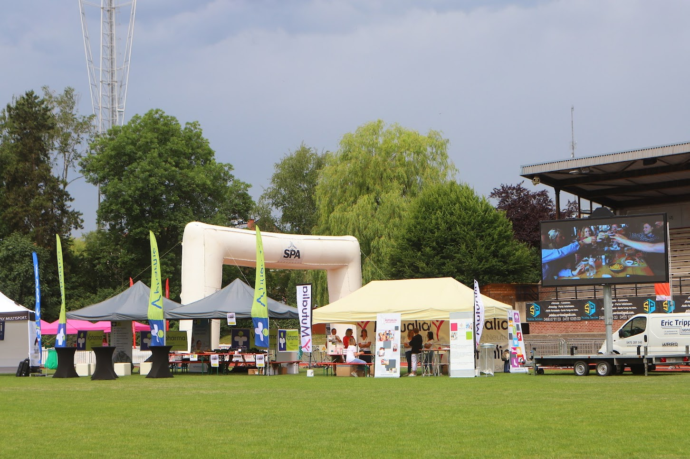

Le fameux jogging de Verviers... je n'ai jamais écrit dessus mais j'ai bien en tête ce que je veux raconter, et pourquoi. Ce jogging c'est le parfait exemple de course foirée (par moi) de nombreuses fois. Des bonnes jambes et des temps de merde en gros.

## In the beginning...

J'ai toujours ce souvenir de Bernie qui disait qui appelait cette course le _championnat du monde de Verviers_, ou un truc dans le genre. Une manière un peu péjorative de parler des coureurs qui prennent cette course très au sérieux.

D'un autre côté il faut admettre que la course est plutôt chouette: le public est très présent du début à la fin, et le parcours est varié et très agréable dans son ensembsle (je sais, ça ne veut rien dire). Enfin, j'habite dans la première avenue de la course alors ne pas participer ce serait un peu dommage. 



Mes premières tentatives avaient été plutôt mitigées: parfois des temps sous l'heure (pas difficile en soi, mais il faut un minimum de vitesse), d'autres fois bien au dessus, alors que j'étais bien entrainé.
En 2017 si je ne me trompe, j'avais suivi le meneur d'allure des 55 minutes (merci Sébastien E.), pour (enfin) réaliser un temps acceptable de 55'15''. En 2019 sans aucun véritable objectif (autre que celui d'améliorer mon temps), je termine (si mes souvenirs sont bons) en 52'50. Donc en 2022, après 2 années sans jogging, pendant la prépa de la _Transvulcania_, je me dis que m'approcher des 52 minutes serait cool.

## La prépa

Rien à signaler à part le volume croissant les derniers mois, avec comme but semi-avoué de tourner à 100 km la semaine. Et aussi les premiers tests avec 2 séances dans une journée (matin et soir), en suivant les conseils de _Runwise_ sur Youtube. J'arrive donc à la course avec les jambes pas spécialement légères mais on s'en fout un peu j'ai envie de dire.

Comme d'habitude je ne fais pas la reconnaissance du parcours, ça me saoule un peu de faire 2 fois la même chose en peu de temps, même si ça peut probablement aider. La stratégie de course il n'y en a pas: ça partira vite et puis vers Ensival ça aura décanté.

## La course

Pas très bien placé au départ, sans doute la partie la plus pénible de la course. N'oublions pas que ce sont des championnats du monde, donc tout le monde se place en première ligne (peu importe le temps visé). Le respect quoi. Je suppose que le but était de ne pas être pris dans une chute.

Départ explosif et sans chute, je slalome entre les gens dans la descente de ma rue, sans oublie de saluer la petite famille. Le petit prend même peur à cause des gens qui le frôlent en courant sur le trottoir. Après quelque minutes je me rends compte que mon chrono ne s'est pas déclenché. Ça va être moins facile pour savoir le temps, pas grave. Je ne sais pas trop comment mais on se retrouve vite à Ensival. Déjà plus trop de monde parmi les coureurs. Je vois pas trop devant moi, un kiné qui est normalement plutôt bon pour la course. Tout le monde l'encourage, je le dépasse et fait de même.

La montée à partir d'Ensival elle est plutôt longue mais ne me fait pas peut: les jambes vont ralentir et ça ira. Je dépasse malgré tout, sans me faire dépasser. Près du parcours Vita ça va bien, il ne reste plus beaucoup de montée. Je vois les kilomètres défiler et me dis: "ah on est déjà ici?!". Drôle de sensation. À la sortie du parcours Vita il faut relancer pour la descente, cette fois ce n'est pas un kiné mais un célèbre nutricioniste que je poursuis. Tout le monde l'encourage, c'est cool, et une fois passée la bosse en bas de la rue de l'Usine, je le dépasse tranquilement.  

On arrive dans le _tunnel_ près du tennis de Heusy, ambiance de fou, je tire un peu plus vu la fin approche. Aucune idée du temps que je ferai mais je m'amuse bien car ça va beaucoup plus vite que je ne le pensais. Les gens en bord de route sont vraiment motivés et ça fait plaisir. Près de la Plaine de Rouheid je sais qu'il ne reste plus qu'une sâle petite montée, après c'est juste descendre jusque la piste. Je vois Arnaud et sa famille au dessus de cette côte, dernière dose de motivation pour bien terminer ces 13 km.

Je termine en 49'30'', tellement loin de ce que j'avais souhaité (vers 52') que je n'y comprends rien. Je vois les gens cracher leurs poumons sur le stade de Biélmont, moi ça va plutôt bien, donc je repars chercher le petit à la maison pour profiter du beau temps. Allure moyenne: 3'50''/ km, ça me perturbe un peu car je faisais mes séances souvent à 3'45''/km pour les séances à allure 10 km et j'avais l'impression que c'était limite, ici avec les montées etc ça passe super bien. Bref, 2022 aura été une année où je n'aurai pas foiré ce jogging.

## Les photos

J'en profite pour re-partager cette album de photos du jogging de 5 km:
https://photos.app.goo.gl/zmAkGoyDsDAaqYQE8