Voilà comme plusieurs personnes ont demandé, voici un compte-rendu, ou quelque chose qui y ressemble, de l'Ultramarathon de La Palma. Commençons par la fin: un peu plus de 13 heures pour terminer la course. Ni fier, ni déçu, ça reste super de pouvoir terminer une telle course sans avoir fait d'entraînements spécifiques (montagne, altitude, sorties longues, ...) mais d'un autre côté l'objectif initial, à savoir terminer en moins de 12 heures, était totalement accessible s'il n'y avait pas eu... vous allez la savoir plus loin.

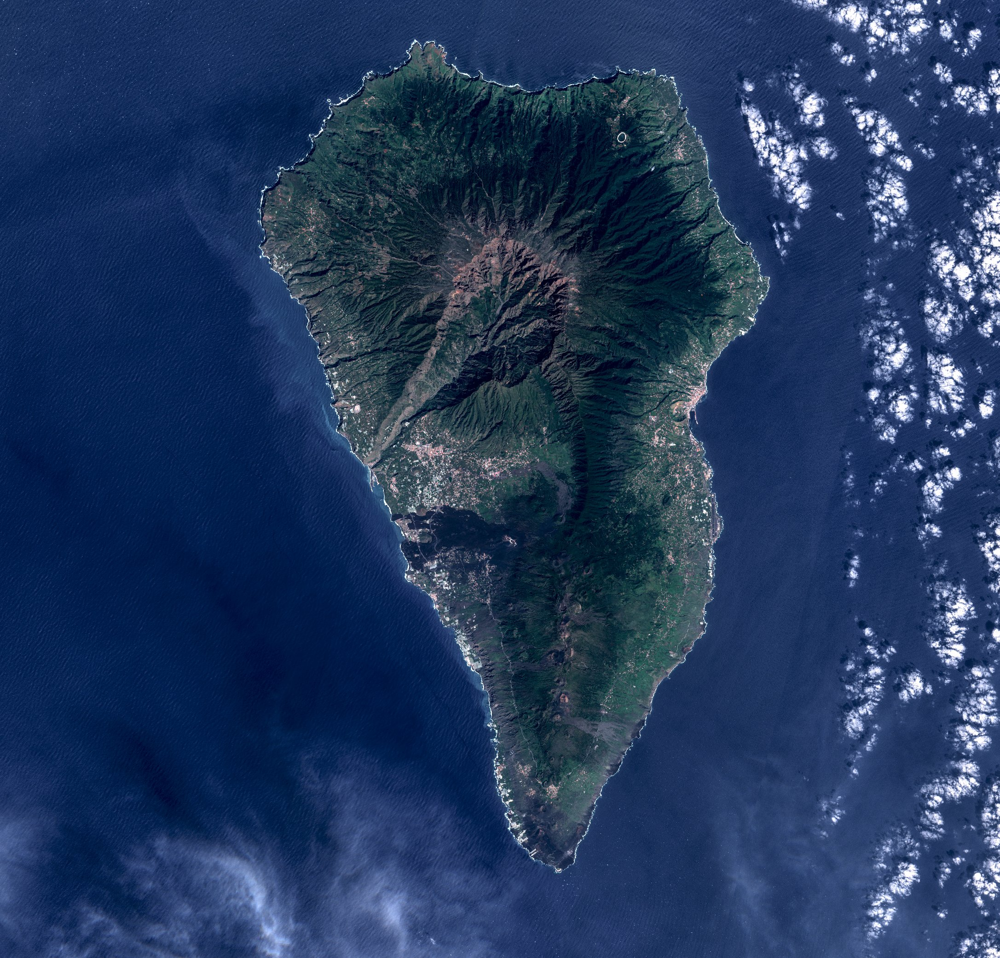

Pour essayer de structurer un peu l'histoire je vais reprendre la course par tronçons comme sur leur site web. Enfin, juste pour avoir un peu de contexte sur la course et pourquoi je la refaisais, j'ai écrit quelques lignes ici: https://ctroupin.wordpress.com/2022/10/21/transvulcania-4episode/.

| 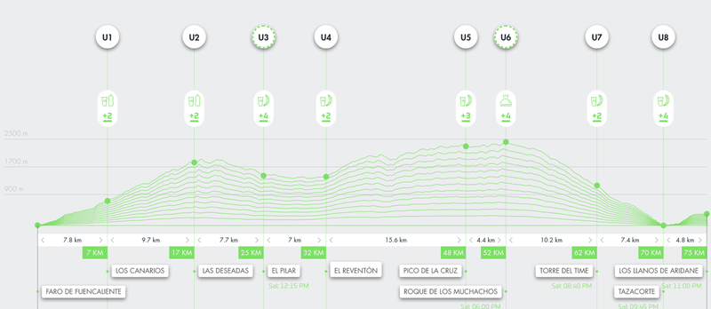 |
|:--:|
| _Le profil de la course et les zones de ravitaillement._|

La stratégie de course elle est simple: ne pas se cramer sur les 50 premiers kilomètres, afin de pouvoir bien faire les 17 km de descente depuis le sommet de l'île. Et pour la bouffe: boire fréquemment, bien mangé entre les ravitos, et éviter si possible les gels et l'excès de boisson isotonique. Et petit détail: la montre ne m'affiche ni le temps, ni les km, juste la fréquence cardiaque et l'altitude. Par expérience je sais que tant que je ne regarde pas les km, c'est que tout va bien.

## Avant la course

La question habituelle c'est: "alors, tu stresses?” Personnellement avant une course comme ça je ne me sens pas hyper bien. Pas à cause de la course mais parce qu'on est censé se reposer, ne pas courir, et ça c'est pénible. Là en plus j'étais seul (sans les enfants), donc pas spécialement de quoi me distraire. Heureusement en allant faire les courses j'ai quand même profité pour faire un petit détour avec quelques escaliers.

| 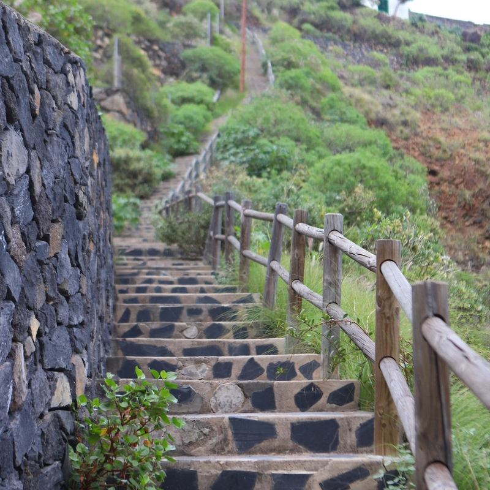 |
|:--:|
| _Quelques escaliers ne font jamais de tort._|

## Le départ

Départ vers 4h30 de la maison pour prendre le bus à 5h, personne dans les rues, sauf des coureurs. Environ une heure de trajet en bus, que beaucoup avait pensé utiliser pour dormir, c'était sans compter sur 2 coureurs qui parlaient bien fort en racontant leurs "aventures”, genre: "hier on a mangé plein de viande, et on était six au restau!”. Moi ça m'a fait rire ce qu'ils racontaient, de toute façon j'avais assez dormi les jours avant pour ne pas en avoir besoin à ce moment-là.

| 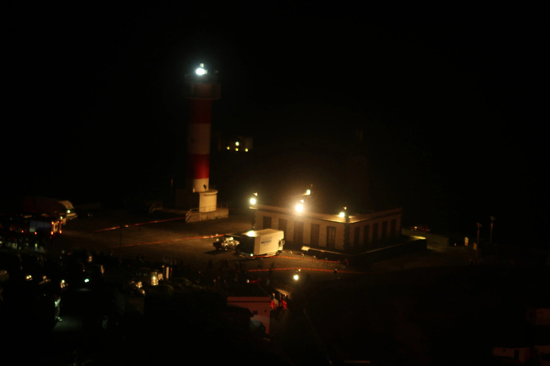 |
|:--:|
| _Phare de Fuencaliente, à l'extrême sud de La Palma._|

Le car arrive quand même fort juste au lieu de départ, il y a tellement de trafic (alors que les voitures ne sont pas autorisées) que le bus nous lâche bien avant, donc on doit descendre un chemin en mode "trail”, à la frontale. Dans le sas de départ c'est un peu la fête, moi là ça me saoule déjà, l'organisation a été merdique depuis le début, donc les "_toutes les mains en l'air_” c'est sans moi.

| 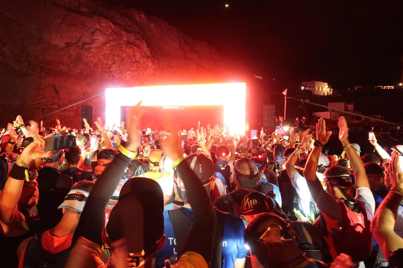 |
|:--:|
| _Quelques minutes avant le départ._|

## Faro de Fuencaliente – Los Canarios

Départ donné à 7h10 au lieu de 7h car tout le monde n'était pas là... ça montre déjà le niveau. Au programme: 7 km de montée dans des chemins couverts de pierres volcaniques, pas de quoi s'exploser. Normalement la course prend directement des petits chemins, mais vu que les autres années les coureurs dépassaient n'importe comment dans cette zone protégée, on a eu droit à 2 km d'asphalte pour commencer!Il faut noir, il faut frais, presque tout le monde discute de la pluie et du beau temps. Moi je suis le plan et reste dans le vert, même si j'ai envie de laisser tourner les jambes.

On arrive au village, comme d'hab il y a des gens dehors, certain(e)s en pyjama, mais on dirait quand même que ce n'est pas le même engouement que lors des premières éditions, où c'était réellement la folie (on comparait ça à une arrivée de Tour de France 😉).

| 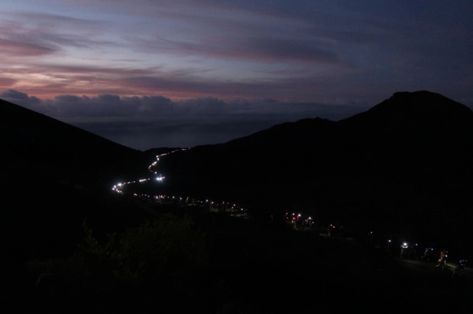 |
|:--:|
| _Ligne de coureurs juste avant lever de soleil. Ça c'est de la photo de course!._|

## Fuencaliente – Las Deseadas

Rien à se mettre sous la dent au ravito, là c'est moi qui était trop optimiste (et mal informé), pas grave j'ai de quoi tenir. On part maintenant pour une bonne montée jusqu'à quasi 2000 m d'altitude à travers les volcans et les forêts de pins canariens (Pinus canariensis pour les spécialistes). Jamais eu de problèmes dans cette partie donc ça se passe bien, j'en profite pour prendre quelques photos.
Normalement on peut sortie les bâtons de rando (avant le ravito c'était interdit), mais je préfère continuer sans eux encore quelques kilomètres. Il faut savoir que beaucoup de coureurs sont dangereux avec des bâtons donc je vais attention aux autres et à moi.

| 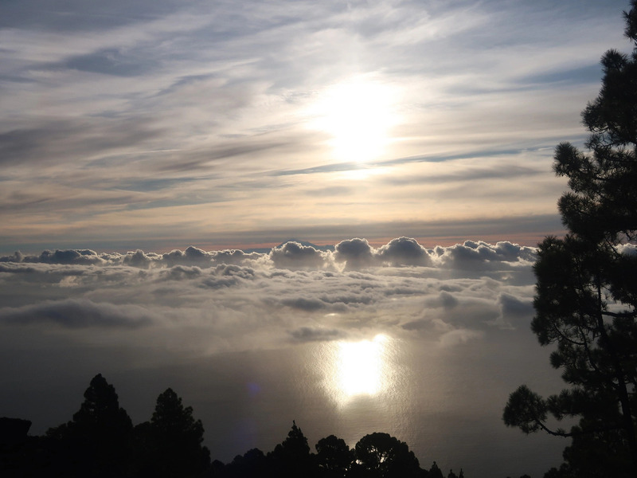 |
|:--:|
| _Vue vers l'est avec Tenerife derrière les nuages_|

Une fois au ravito, je suis surpris de ne toujours rien voir à manger (bande de radins), ça m'oblige juste à ouvrir le sac et prendre l'une ou l'autre barre. Certaines années on avait eu des bananes je pense, mais bon faut pas trop demander à l'organisation UTMB...

### Las Deseadas – Refugio del Pilar

Ici on repart pour une longue descente, elle peut être casse-gueule par endroit mais comme on court sur du gravier de roche volcanique (_lapilli_ est le terme correct; _picón_ aux Canaries) les chocs sont amortis et les jambes ne souffrent pas. Je fais quand même attention de ne pas exagérer en vitesse car ça se paierait vite.

## Descente vers le Pilar.

On voit au loin la Caldera de Taburiente, dont on va suivre la crête une grosse partie de la course. Au ravito j'en profite pour remplir mon sac de bouffe et surtout bien boire. Tout est (encore) sous contrôle et je profite bien. Mal nul part, respiration lente, bonnes sensations... juste un peu faim mais ce sera vite résolu.

| 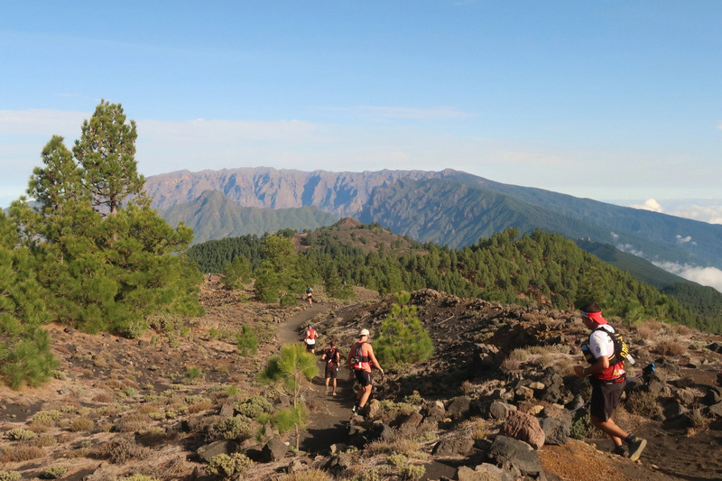 |
|:--:|
| _La Caldera de Taburiente en arrière-plan, une vue impresionnante de ce qui nous attend pour le reste de la course._|

## Refuge du Pilar – El Reventón

Pas grand monde au Refuge du Pilar, peu importe, j'en profite pour bien manger et boire. Puis repars assez vite vers la suite. Je me souviens bien de cette partie car en 2015 j'avais commencé à sentir un peu de fatigue et avait arrêté de courir, car le trajet suivait une longue piste forestière hyper chiante. Cette année, changement, on nous envoie sur un chemin quasi parallèle à la fameuse piste, cette fois dans une zone boisée et mon monotone.

|  |
|:--:|
| _Vue depuis la piste de la Hilera._|

Les jambes tournent bien et j'anticipe un peu le prochain ravitaillement, car après celui-ci, on sera sans assistance durant 16 km, dans une zone complexe avec plus de 1400 m de D⁺. Bref, je recharge le sac d'eau à fond (2 litres) et prend une bouteille flask de 500 ml et la remplis d‘isostar (peut-être une erreur). Avec ça, ça devrait aller!

## El Reventón – Pico de la Cruz

Et c'est parti pour ces 16 longs kilomètres. Dans ma tête ça peut prendre 3 heures, le truc est juste de ne pas lâcher et de garder un bon rythme de montée, et puis de relancer la course à chaque descente, même si elle est courte. On commence à sentir l'altitude et à tomber sur des coureurs assis en bord de chemin, téléphone à la main, ... des abandons. Parfois on veut leur dire: "allez, lâche pas, viens avec nous", mais presque personne ne le fait: s'ils sont assis là, c'est qu'ils sont passés par quelque chose de très difficile et donc ce n'est pas un inconnu qui va relancer leur course. Malheureusement.

J'ai l'impression que mes mollets veulent me parler, pour me dire que j'ai de la chance d'utiliser les bâtons, sinon ils m'auraient bien fait souffrir!

Après quelques kilomètres on arrive à un point de contrôle qui n'est toutefois pas une zone de ravito: le Refuge de la Punta de los Roques. On y sert de l'eau (je suppose qu'elle a été amenée par hélicoptère, sinon???). Juste après cette montée, une vertigineuse descente qui n'aide pas vraiment, vu que de toute façon il faudra continuer de monter encore et toujours, jusqu'à atteindre le somment de l'île.

| 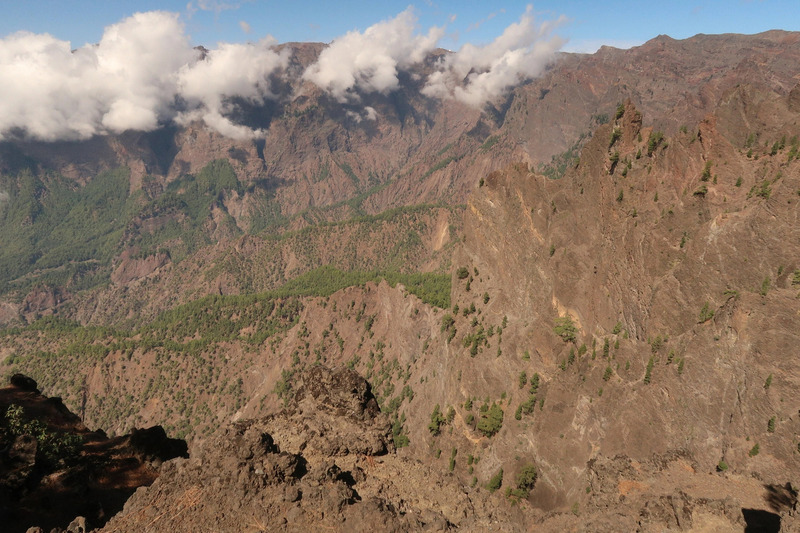 |
|:--:|
| _L'intérieur de la Caldera de Taburiente._|

Je perds un peu la notion du temps mais ça va globalement bien. Avec du recul je pense que le tipping point est survenu dans cette zone-là: j'ai l'impression d'avoir le mal d'altitude, la tête qui tourne un peu, les jambes OK, et bizarrement le nez qui coule en quasi continu. L'altitude du GPS n'est pas correcte, on doit être vers les 2300 m et la végétation change: pratiquement plus de pins canariens, sinon des plantes basses (Adenocarpus viscosus, Genista benehoavensis, ...). Il fait limite froid (si on s'en tient aux vêtements des spectateurs et photographes), mais pour les coureurs ça va, c'est-à-dire que les gants (!), la deuxième couche et la veste (indiqués comme matériel obligatoire) resteront au fond du sac.

## Pico de la Cruz – Roque de los Muchachos

J'arrive au ravitaillement un peu limite, donc je m'asseois et prends le temps. Je pense qu'à ce moment-là si quelqu'un m'avait examiné, il m'aurait peut-être dit d'arrêter. Enfin voilà, je repars pour les 4 kilomètres jusqu'au sommet. Ça monte et ça descend, on en a l'habitude, et pour agrémenter le tout, une dame (pas très gentille) nous dit "bâtons interdits jusqu'au sommet". Je pense que je n'en ai rien à f**, je les plie et range dans le sac, les mollets vont encore vouloir me parler mais je ferai la sourde oreille.

| 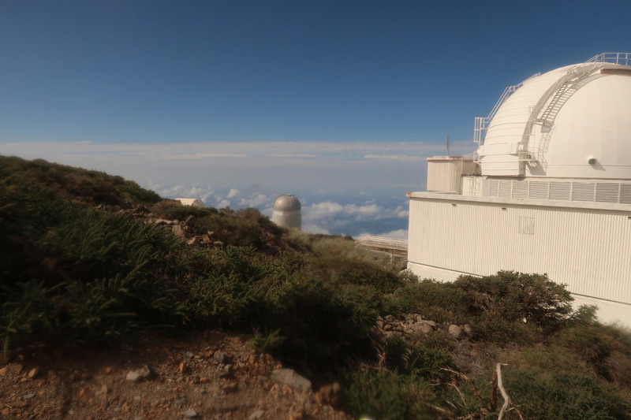 |
|:--:|
| _De nombreux téléscopes se trouvent près du sommet de l'île_.|

J'arrive péniblement au Roque de los Muchachos (2426 m) mais pour être honnête, personne n'arrive vraiment frais ici. L'altitude et les 50 km précédents font leurs effets. Ce c**ard de GPS me dit que je ne suis qu'à 2200 m d'altitude, ça ne change rien à ma situation mais il pourrait au moins collaborer.

## Roque de los Muchachos – Torre del Time

| 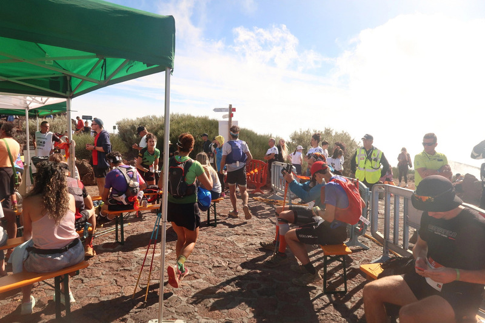 |
|:--:|
| _La zone de ravitaillement du Roque de los Muchachos_.|

J'ai souvent fait l'erreur de repartir trop vite de la zone de ravitaillement alors ici je prends mon temps. Comme disent certains: c'est ici que la course commence vraiment. Il reste 17 km de descente, puis 6 de montée, ça veut dire qu'il faut encore pouvoir courir, sinon c'est le carnage (17 km en marchant, ça peut vite tourner vers les 4 heures!).

Ce dont je ne me souvenais pas, c'est que la descente est entrecoupée de petites montées bien raides, heureusement le plan fonctionne bien et je cours sans problème quasi tout le temps (en dehors des photos). Pour la première fois depuis le départ, je décide d'afficher la distance parcourue sur la montre, afin de voir combien il reste jusqu'au prochaine ravitaillement (10 km au total). Le paysage est spectaculaire et surtout, j'ai l'impression que le mal d'altitude disparaît (par contre le nez coule toujours).

| 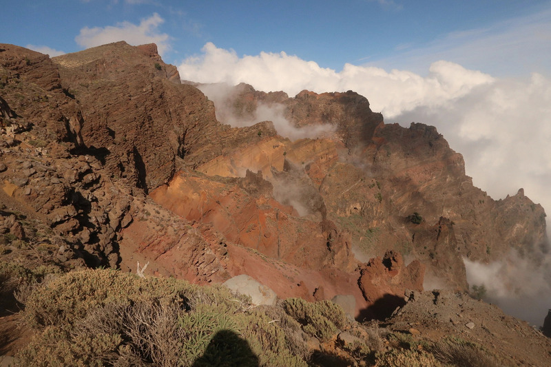 |
|:--:|
| _Vue de la Caldera de Taburiente_.|

La descente se déroule plutôt bien et le moral remonte quand je compare avec la descente des autres éditions. Je regarde la montre toutes les 5 minutes (jamais un bon signe), les kilomètres défilent et nous voici à quelques hectomètres de la Tour del Time, 1000 m d'altitude. All good.

| 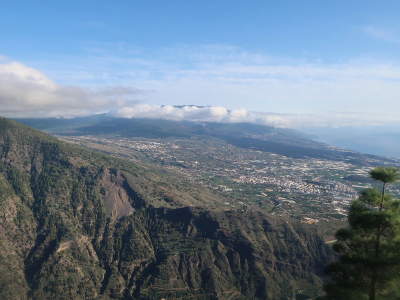 |
|:--:|
| _Depuis la Torre del Time_.|

Au ravitaillement je bois beaucoup (trop?), je mange, discute avec les bénévoles... et là... crac. Douleur dans le ventre. Survenue d'un coup, comme si j'avais mangé quelque chose de pas frais. Fait ch***. Je reste quelques minutes assis, car oui, ça va vite passer. Ça ne passera pas avant 11 du soir (donc bien après la course)!

## Torre del Time – Tazacorte

Bon faut continuer, mais ce genre de douleur prend tout l'attention, je n'ai plus envie de courir et surtout, le sentier devient réellement difficile, le parfait endroit pour s'exploser une cheville et abandonner. Le calvaire peut commencer! Quand je parviens à courir je dépasse des gens, puis après je dois m'arrêter, plié en 2. À ce moment-là je comprends que l'objectif de passer sous les 12 heures je peux l'oublier. Dans ma tête je sais que je vais arriver, mais pu***, de nouveau dans le gouffre alors que tout allait bien.

| 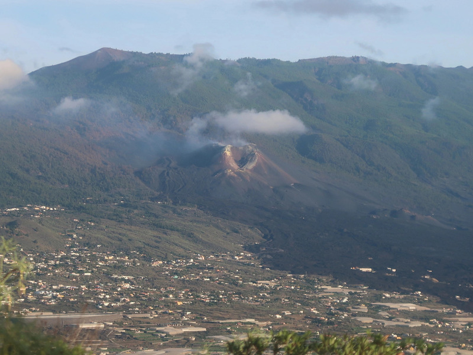 |
|:--:|
| _Le nouveau volcan, né en 2021._|

Pour me consoler je prends des photos du volcan _Tajogaite_, entré en eruption il y a un peu plus d'un an. Parfois il y a des bénévoles sur le bord du chemin, quand je m'arrête ils demandent "tu veux arrêter?", je leur réponds que non, que j'ai juste envie de vomir. Une fois sur la grand route je discute un peu avec la Croix Rouge, en me disant qu'ils auront peut-être un truc à me proposer, n'importe quel médoc, vu que je ne prends jamais rien, m'aurait probablement sauvé, mais non, le seul truc qu'ils me disent c'est que si j'ai encore mal au prochaine ravitaillement (3 km plus bas) je n'ai qu'à demander qu'on me ramène (i.e.: abandon). Super plan!

Comment je suis sorti de cette impasse? Un gars qui avait appelé les gens de la Croix Rouge me demande si ça va mieux (réponse évidente: non), mais bon, on se fait un check 👊, et il me dit: "tu vas finir alors?” et je lui dis que oui. C'était suffisant pour le faire. Les 3 derniers km de descente se passe quasi comme sur des roulettes, je redépasse plein de gens même si la douleur est exactement la même.

| 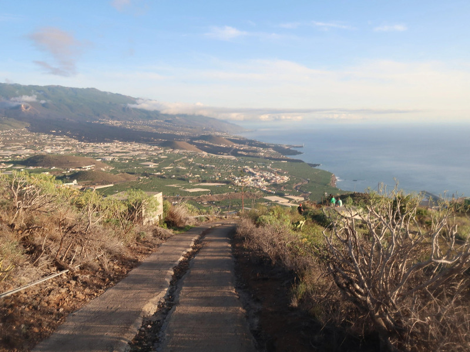 |
|:--:|
| _Descente vers Tazacorte._|

Sur le bord du chemin, on tombe sur un coureur couché et tremblant, entouré de pompiers. Là on se dit: l'air de rien cette course elle peut faire très, très mal. Une fois à la plage de Tazacorte, je mange une pomme et bois un peu d'eau, puis c'est reparti pour la montée finale.

## Tazacorte – Ligne d'arrivée

La montée ne comporte que 300 m de D⁺, sur des chemins de pierres hyper durs, avec plusieurs traversées de routes. Je ne prends même pas la peine de sortir les bâtons, ça fera mal et tant pis. Le soleil se couche, ça sent fort les 13 heures de course et je me dis que ça aurait pu être pire.

Une fois à 300 m d'altitude, il reste une longue avenue à parcourir. Tout le monde marche, normal, mais mes jambes sont plutôt contents d'être là donc autant courir. Il y a pas mal de monde sur les bords de la route, visiblement contents que je cours, donc ça déroule, ça se termine à du 3'45 / km.

Après la ligne d'arrivée je vois plein de coureurs bien à la ramasse, ça me fait penser que c'est un beau gâchis ce que j'ai fait, mais en même temps en considérant tout ce qu'i y a autour, les entraînements (limités), le boulot, les enfants... ça reste une solide perf'.

## Conclusions

Certains diront que c'est un exploit, mais ce n'est pas le cas. C'est juste une course et comme on dit, il faut pouvoir aller au charbon. Dans ma tête j'avais envie de montrer que même avec des enfants très jeunes, un boulot qui prend du temps, et surtout un terrain d'entraînement relativement plat, il y avait moyen de s'en sortir en un morceau.

## Remerciements

Je ne pensais pas écrire cette partie, maintenant ça fait un peu comme une thèse de doctorat, ça me fait rire: je tiens à remercier en premier lieux mes enfants et ma compagne, ils ont été, sans le savoir, une source d'inspiration et de motivation. J'ai appris ce que voulait dire "s'entraîner en étant fatiguer” et "trouver du temps là où il n'y en a pas”, ce qui est toujours utile dans la vie.

Merci aux collègues du Sart Tilman, c'est toujours un plaisir de courir avec vous tous ces temps de midi, et ça doit justement rester un plaisir! Merci à Arnaud pour ces séances "tranquilles” où au final on était plus proche du 4 min/km que du 5 min/km. Merci à Jordi pour tout ce qui est prépa physique, je crois que ça a porté ses fruits, et merci à Alberto C. qui a eu cette riche idée de me proposer de faire cette course l'année dernière quand on s'entraînait tranquillement à Gran Canaria.

Mes excuses si j'ai oublié quelqu'un (il n'est jamais trop tard pour éditer ).
