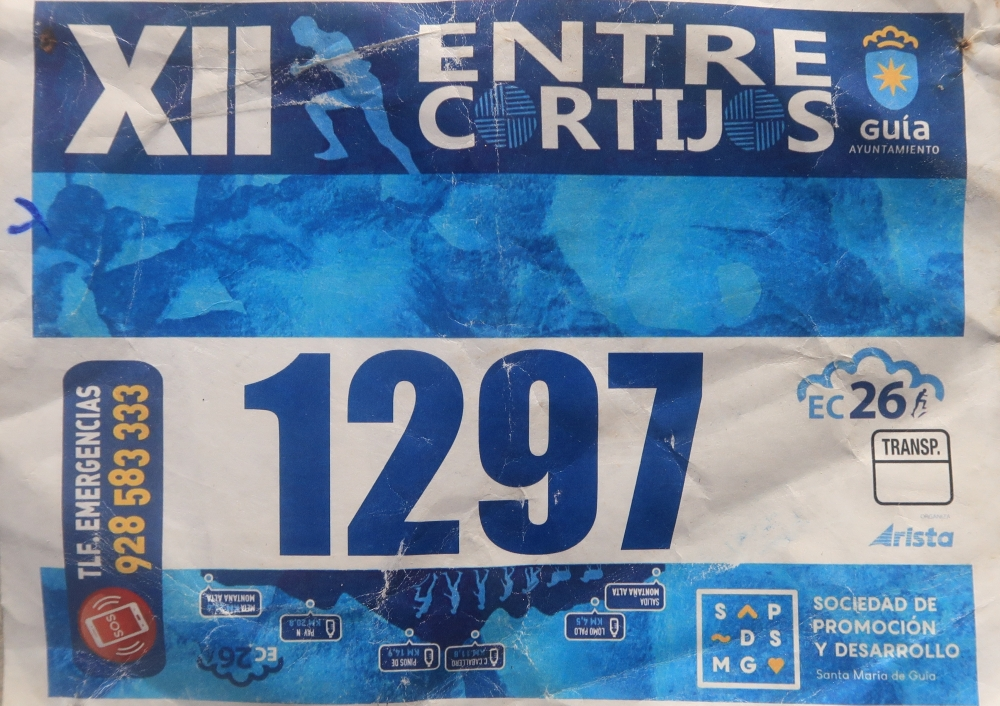
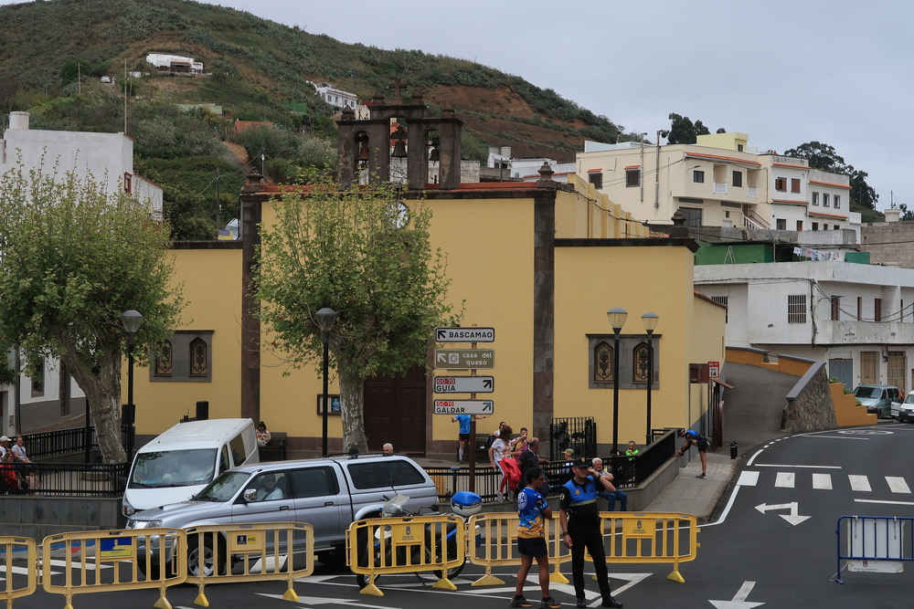
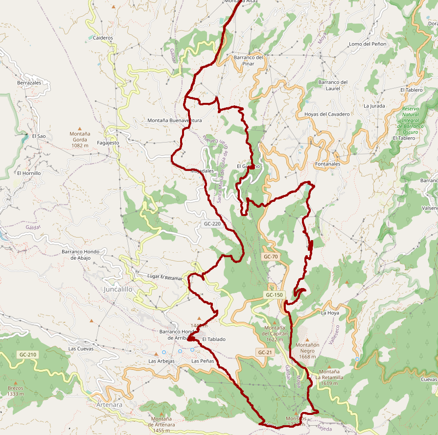
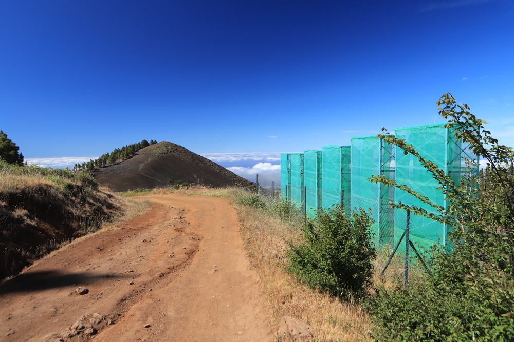
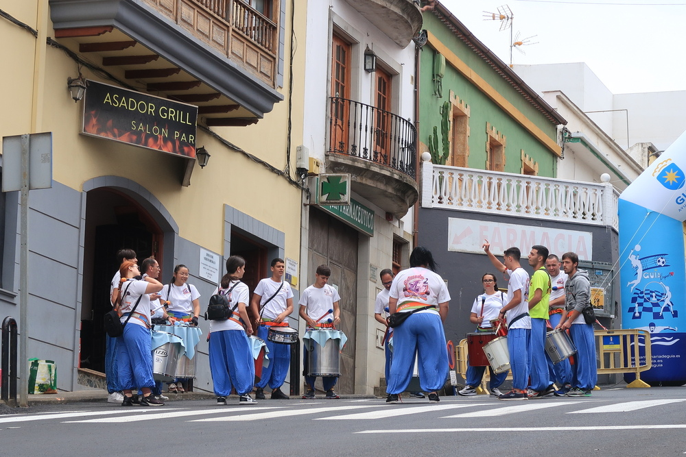

20th kilometer: I see Alberto taking pictures. He asks me how I'm feeling.
> I'm good, but the climb near Fontanales was tought.

Then he replies that there is another one which is also tough (_durilla_ is the word that he used). 
I think I misunderstood: there cannot be another climb. No. I quickly check the race profile printed on our bib, and I don't see anything suspicious.

|:--:|
|_The race bib with the profile printed on the lower part._|

We continue to go downhill, close to 4'/km, at that rhythm the end is close. Except that I start to recognize the track we're running... I did it in October last year. And yes, there is an horrible climb at some point. But no, they cannot do that to us. Not now. I'm with a couple of other runners, one of them tells me:
> This is the last joke they've prepared for us.           

Or something like that. It becomes increasingly obvious that I'm going to suffer. But how the f** did I end up there?

## The race

_Entre Cortijos_ is a rather famous race that is organised in Gran Canaria. I knew about it because of the numerous pictures where we see the runners in the middle of greed meadows, sometimes surrounded by sheeps. Everytime I visit Gran Canaria I try to run a local race, especially one that I don't know (in fact among those I'm completed, there is not really one I would really like to repeat!). This time as we planned our trip quite late, the registration was closed (they frequently limit the number of runners). Fortunately a friend managed to get me a race number, and I obviously decided to enroll myself to the 26K race.

|:--:|
| _Montaña Alta, a small hamlet located in the north of Gran Canaria._|

I knew the race was hard but let's be honest: I didn't give a f** about that. During most of the year I'm well trained, and I was ready to suffer. As usual I didn't study in details the profile, for me the summary was: 
1. First half the race going uphill (with a few minor interruptions).
2. Second half the race going downhill with one major interruption.       
(I was not totally right).

## My plan

You have to know that in Gran Canaria there is no really _easy_ race: the landscape is rough, there are mountains, volcanos, valleys, cliffs... the organisers just have to pick up nice trails and combine them into a consistent ensemble, and they get an amazing race. I had arrived only a few days ago so for sure my legs were not ready to deal with the reliefs. The solution? Using hiking polls! 
That should preserve my calves so I could run decently when the terrain allows us.

## When the plan meets the race

I don't really want to explain everything in details because that's boring. Just before the start I thought:
> Now I understand why I'm not so keen about participating to races.

Of course I love to run but for the races, one needs to be there in advance, have mandatory material etc. Sometimes it goes against my conception of the sport. 

I started _low profile_, not fast but fast enough to overtake many runners. After 2 kilometers I took the polls out of the bag and yeah, the helped a lot! The landscapes were spectacular and I though I should take some pictures. However with the good rhythm I thought it was better to continue.

|:--:|
|_The race track._|

After several kilometers uphill we got the first descent. Not extremely technical, but enough to make you slow down if you're not used to this type of terrain (stones, rocks, dust). And directly after that descent: we got back to the climbing. Zero transition, not even one meter of flat terrain. Eat that!

I felt we quickly reached the highest point of the race (near _Moriscos_, at almost 1800 m above sea level). I remembered that another friend had told me:
> After the Tablado climb (approx. KM 10), this is "pan comido" for you"

(I guess "pan comido" can be translated to "piece of cake"). Going downhill was fun, we were going fast, overtaking from time to time and enjoying the race and the landscape.

|:--:|
|_Going downhill with the Montañon Negro in the background._|

At some point I realised we were very close to Fontanales, a village where I've been running several times times. And I knew there was a rather difficult climb just before reaching the village. Was that the _bump_ I had noted in my mind, the _interruption_ in the descent? My legs maybe understood before my brain. We went from full-speed, enjoying the race mode to the slow-motion, bit-by-bit climb. I quickly understood this was going to be tough. I took again the poles but damned, my shoulders were painful! During the first part of the race I probably put too much force into them in order to relieve my legs. That worked. Except that I didn't want to use them anymore!

I must admit I had to stop a couple of times, for 10-15 seconds, just to recover. Once this _last_ climb was over, it was cool to be able to run (fast) again. We arrived at the last aid station, the rest should be _pan comido_. Then I saw Alberto taking pictures. He asked me how I was feeling...

## This is how the race ends

Here we go: last, unforeseen (by me) climb, the shoulders are even more destroyed, I feel dizzy, like a piece of sh** instead of a piece of cake but hey, let's finish that one! Montaña Alta was very near, and the last kilometers were the same as the first, going downhill on the road. 

|:--:|
|_A local band playing music before the start._|

I speed up a bit to finish in a decent time: 3 hours 19 minutes. There was no planning about the race time: somebody from my partner's family had done it in 3 hours 47 minutes, he was better trained than me for that kind of even so doing a similar time was a good first-guess. Usually after a race I'm fine, I ran a bit more to cool down. Not this time. I'm feeling really cold, probably it's better to get into the car and go back home.

## Conclusions and stuff to improve

As usual: running a new is always a great experience, especially with this type of landscape. It was obvious I would have to go through a lot of pain, I was not disappointed.

Concerning the training, the conclusions are the same as for the [_Transvulcania_](../20221022_transvulcania/):          
❌ longer sessions,         
❌ strength training for the legs,          
❌ optimising the food and beverages.           
What worked well was the rather big volume of training, allowing me to survive.

I know many local runners came the week before to look the route over. This is not my cup of tea: if I have to run a race on a given day, the last thing I want to do is to train at the same place a few days before.
