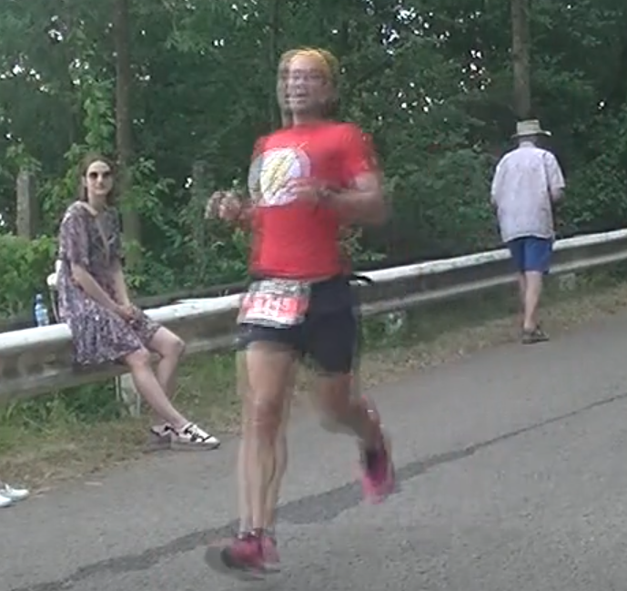
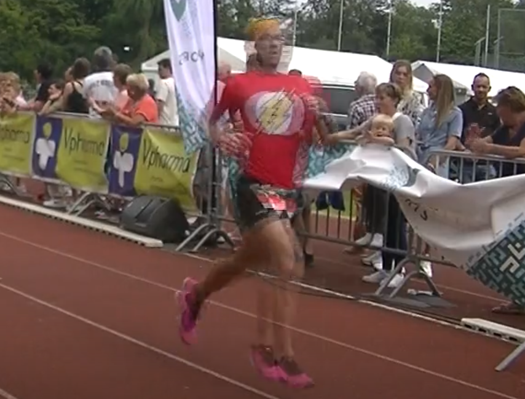

Pourquoi encore écrire sur cette course?    
Deux bonnes raisons:
1. Ce n'est que ma deuxième course cette année (la première étant [Entre Cortijo](../20230422_entrecortijos/))
2. Comme j'ai déjà écrit sur d'autres éditions, c'est toujours possible de comparer.

## La préparation

Comme d'habitude, pas de préparation spécifique à la course. Par contre, pas mal de volume:
- 100 km de course à pied par semaine
- 50 km de vélo de route
- 2 séances de muscu

On a quand même fait un mésocycle d'entrainement centré sur l'allure spécifique 10 km au Sart Tilman, je pense que ça a porté ses fruits pour tout le monde. Aussi, la veille de la course, j'ai décidé de ne juste rien faire: pas de muscu, pas de _petite_ sortie jogging, rien. Et ça faisait bizarre. Dans le passé j'ai fait des courses le lendemain d'une séance de muscu assez dure, même si ça ne fait rien au cardio, c'est parfois pénible de courir avec une douleur dans les épaules ou les pecs par exemple.

## L'état esprit

Pour cette édition je n'ai jamais été aussi peu stressé. Pourquoi?
1. Les entrainements ont été vraiment bons, normalement je sais ce que je vaux et à quelle vitesse je dois courir.
2. L'année dernière ça s'était super bien déroulé.
3. Le parcours est légèrement plus long (600 m environ) que les années précédentes, donc je sais que faire un meilleur temps que l'année dernière est hors de portée.

## La course



### Le départ

Plus j'y pense et plus je me rends compte que je déteste les départs: trop de monde, ça pousse (parfois), puis il y a de temps en temps des gens qui ne devraient pas être aux avants-postes. Cette fois-ci je discutais avec des amis donc on n'était clairement mal placés. Donc à moi d'assumer. On commence en montée, je dépasse calmement mais sûrement, sans me cramer.

### Début de course

Beaucoup de gens sur les bords des routes, ça fait plaisir! La descente par la chaussée de Heusy (nouveauté) est évidemment super rapide, de quoi dérouler et dépasser autant que possible. Petit changement au niveau de la place Verte: on continue sur la rue Xhavée, en très légère montée, pour ensuite tourner sur la rue Jardon. Une fois arrivé devant l'Harmonie, le reste du parcours est identique aux autres années.

Gérarchamps, Ensival, ... tout s'enchaine vite, c'est plus ou moins plat et ça doit aller vite, avant d'aborder le montée vers Piedvache.

### Milieu de course

Boum, Ensival, gros ralentissement avec le début de la montée, néanmoins ça tourne toujours pas mal et j'arrive à dépasser des coureurs. Dans cette partie là j'ai toujours l'impression qu'il faut limiter la casse, même si on est tous dans les mêmes draps et que tout le monde ralentit. 

Le début de Piedvache (petit bosse) fait vraiment mal, mais après ça ira. Pas de trop de coureurs autour de moi, ça me fait toujours rite quand je compare avec d'autres éditions où j'allais moins vite et était dans un peloton. On peut presque penser qu'une fois Piedvache terminé, il ne reste plus rien point de vue montées, ce n'est pas vraiment le cas: il restera la rue de l'Usine et enfin le chemin de Rouheid.

|:--:|
|_Fin de la montée de Piedvache._|

Toujours autant de monde sur les routes, j'essaie toujours de retrouver les gens que je connais car ils sont aux mêmes endroits d'année en année. Je suis d'ailleurs un peu triste de ne pas croiser ma tante et mon oncle vers Maraifosse... 

L'endroit avec la plus grosse concentration de monde restera le Tennis de Heusy et son _tunnel_, là par contre c'est très difficile de pouvoir identifier quelqu'un parmis la foule, ça va trop vite.

### La fin...

Que dire, si ce n'est que ça continue sur la même rythme que le départ. On est due des Prés et un coureur me demande s'il reste des montées... Une petite, oui, ça ira. Je n'ai pas trop regardé le chrono depuis le début, ce sera clairement un moins bon temps que l'année dernière, bien que je pense que j'étais plus en forme. Le changement de parcours n'y est pas pour rien.

Dans la dernière descente j'essaie d'emmener un coureur en difficulté (toute relative) sur la fin, en pensant que ça allait aller. Mais visiblement il était bien bien crâmé, donc voilà, _ciao ciao_, le demi-tour de piste se fera tout seul. 

Derrière la ligne ça sent la destruction massive, normal, moi j'essaie de repartir afin de retrouver Fred qui tente se passer sous l'heure, une performance qui n'est pas de plus simple, surtout avec ce nouveau parcours. Je le retrouve pour les derniers hectomètres, accompagné de Yohan Zaradski (qui a fini 2ème!), on l'encourage non-stop, au final il ne lui manquera que 3 petites minutes pour réaliser son défi.

Un bon ptit jogging de Verviers, certains _crachent_ un peu dessus alors que c'est une course bien sympa avec vraiment beaucoup de gens sur le parcours, donc on espère qu'elle continuera encore pendant longtemps.

|:--:|
|_Sur la ligne d'arrivée._|