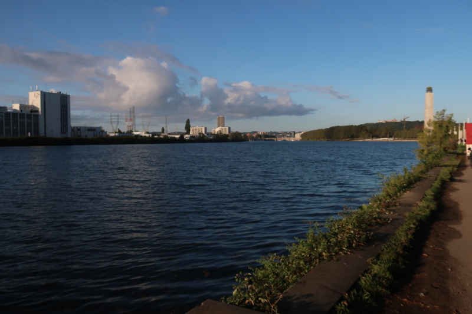
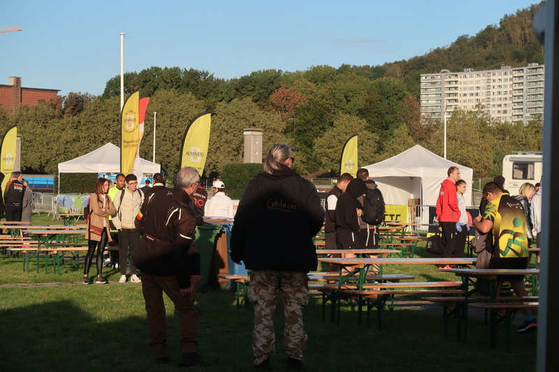
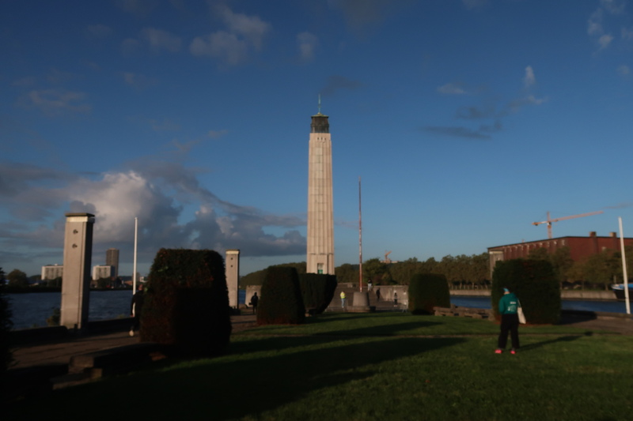

> Hey, un article sur un semi? Mais t'es fou, on s'en tape! C'est rien un semi, et tu as déjà couru cette distance plein de fois!?

Tout à fait, et je pourrais arrêter l'article ici. Juste envie d'écrire un peu, d'abord parce que ça fait longtemps, ensuite parce que c'est mon premier _vrai_ semi-marathon. 

## L'avant-course

Voici ce que j'avais pensé écrire avant la course, malheureusement je n'en n'avais pas eu le temps (par contre j'avais pas mal réfléchi au texte). 

### Préparation

Rien à redire sur la prépa: beaucoup de volume, des séances à allure spécifique, en veux-tu en voilà, de la muscu, du gainage, des grosses journées, bref, tout va bien de côté-là. J'avais même pris des gels pendant les entrainements, juste pour tester (vraiment pas mon genre!).

Seul bémol dans le programme, si on veut être pointilleux, c'est justement l'_allure spécifique_ (ou les allures spécifiques): dans ma tête mon **AS10** (allure spécifique sur 10 km) ça doit être vers 3'45''/km. Sauf que ça fait déjà pas mal de temps que c'est comme ça, et probablement que ça a fini par s'améliorer. Parfois dans certaines séances je suis paumé: ça va beaucoup plus vite que prévu, mais ça tourne bien, pas trop durement, donc je continue. 

### Le scénario pré-course

Le plan était le suivant: partir à du 4'/km (15 km/h) en essayant d'être constant, puis après j'imaginais que ça allait exploser vers 3/4 de la course, car je n'avais jamais couru cette distance à cette vitesse.

Mentalement par contre, aucun stress et aucune pression: si je fais 1h30: super. Si c'est 1h24: encore mieux. Et si moins d'1h24: inespéré. Ah, et si je jamais je termine en 1h40? OK, il faudra appeler un chat un chat, ça serait un échec, mais pareil, ce ne serait pas vraiment grave. Ça reste une course comme une autre et un moyen d'apprendre et de progresser.

|:--:|
|_Depuis l'Île Monsin._|

### Les semi antérieurs

Quand je dis que c'est mon premier _vrai_ semi, ça veut dire que, bien sûr, j'ai déjà couru de telles distances maintes fois, par contre c'était souvent sur des parcours plus wallonés, genre _les Crètes de Spa_ ou _la Belle Hivernoise_. J'allais oublier le Semi-marathon de Soumagne, course que j'ai dû faire il y a 15 ans, à une époque où je ne cherchais pas vraiment la vitesse.

D'ailleurs ça me fait penser: mon meilleur temps, d'après Strava, ça doit être 1h34, justement lors de [_la Belle Hivernoise_](https://www.strava.com/activities/2936140059) en 2018. 

|:--:|
|_L'ami [Gédéon Baltazard](http://www.gedeonbaltazard.be/), photographe de toutes les courses de la région depuis des années._|

## La course

### Le départ

Le départ étant un peu... merdique (entonoir, tournants, pavés etc), et dans ma tête il fallait sortir (trop) vite de ce merdier, genre 3'30''/km, puis reprendre l'allure de croisière. Une fois les premiers hectomètres derrière nous, on s'est vite rendu compte qu'aller dans le sas "départ rapide" (1h30 sur la course) n'était pas une mauvaise idée du tout.

Assez vite je suis dans le rythme, jambes légères, et comme un débutant je regarde tout le temps ma montre pour avoir l'allure: 3'50/km, 4'05/km, 3'55/km... ça change tout le temps même si j'ai l'impression d'être constant dans l'effort. Ça m'ennuie un peu, tant pis, en même temps on n'est pas sur la piste du Blanc Gravier ici! Rapidement je vois Arnaud revenir à ma hauteur, je ne sais pas si c'est moi qui vais plus lentement qu'initialement prévu, ou lui qui va plus vite, ou un mélange des 2... en tout cas on restera assez proches pendant une grosse partie de la course.

### Mi-course
Alors ici je vais dire un truc débile, mais les courses rapides, ça passe vachement plus vite: par là je veux dire: OK, forcément le temps de course est inférieur (la physique ne ment pas), mais juste le fait de voir passer les kilomètres aussi vite ça fait plaisir! 38 minutes, nous voici déjà au 10ème KM, alors que le coup de départ vient d'être donné, quasi mi-course quoi, il ne peut rien nous arriver.

Justement, nous y voici à la mi-course, avec une petite montée sur un pont pour traverser le Canal Albert: le gars devant moi à une foulée qui fait un de ces boucans!, et comme je n'aime pas le bruit ça me motive pour donner un coup d'accélérateur totalement inutile (sauf pour mes oreilles), et voilà comment on part pour la 2° partie et le retour vers l'Île Monsin.



On m'avait bien prévenu: le parcours n'est pas des plus beaux, surtout pour ceux habitués aux parcours trails. Personnelement aucun problème avec ça, dans ma tête je n'en n'avais rien à faire du décort, tant qu'il y avait de l'asphalte, pas trop de tournants ni de montées. La deuxième partie n'était effectivement pas une des plus jolies, justement avec pas mal de virages un peu bizarres par moment, et d'autres trucs pour casser le rythme. Peu importe, les KM passent encore à toute vitesse et à l'heure de course on est pas loin des 16 km, ce qui veut dire qu'il ne reste plus qu'un petit 5K, qui ne devraient pas prendre plus de 20 minutes. 

Les ravitos sont catastrophiques: manque de pratique pour attraper le goblet à cette vitesse et surtout vider un peu du liquide dans la bouche, quasi tout vole à côté. Heureusement qu'il ne faisait pas très chaud.

### Derniers kilomètres

On retrouve les participants du 10 km, partis un peu après nous, ça motive de voir plus de monde, et en même temps devoir slalomer (beaucoup) et crier (un peu) pour dépasser fait perdrer un peu de temps. Le panneau affiche 2 km, j'hésite à remettre une touche d'accélération, sans être convaincu que ça en vaille la peine. Nous voici de retour sur l'Île Monsin, environ 1 heure et 20 minutes de course qui seront passées comme une lettre à la poste.

Record perso au semi évidemment explosé, beaucoup de plaisir sur tout le parcours, et surtout l'envie de continuer avec les entrainements et sans doute une préparation marathon digne de ce nom.

|:--:|
|_Le Mémorial Albert Ier._|

## L'après course

Pas grand chose à ajouter, si ce n'est la question: 
> Était-ce possible d'aller plus vite?

Ça prendrait un peu trop de temps pour bien y répondre, mais je vais quand même essayer rapidement. En gros je n'ai pas envie de rentrer détruit à la maison parce que j'ai trop forcé à un semi. Quand la course s'arrête la vie _normale_ reprend, il faut ranger, nettoyer, etc.

Donc oui, probablement il y a moyen d'aller un peu plus vite en se faisant plus mal; chacun décide de comment il aborde une compétition. En avril par exemple, j'ai couru en donnant tout, ou presque, le résultat n'a pas été à la hauteur et puis après le retour en voiture n'a pas été facile (autrement dit: j'étais explosé et avais pensé dormir un peu sur place).

Voilà qui termine ce petit _report_ sur ce qui a été le 4° course de l'année, et probablement l'anté-pénultième.

### Remerciements

Merci à Arnaud pour m'avoir aidé à me bouger le c** et à (enfin) m'inscrire à une course. Et aussi à tous les coureurs du Sart Tilman, pour avoir supporté toutes ces séances de piste les derniers mois.

