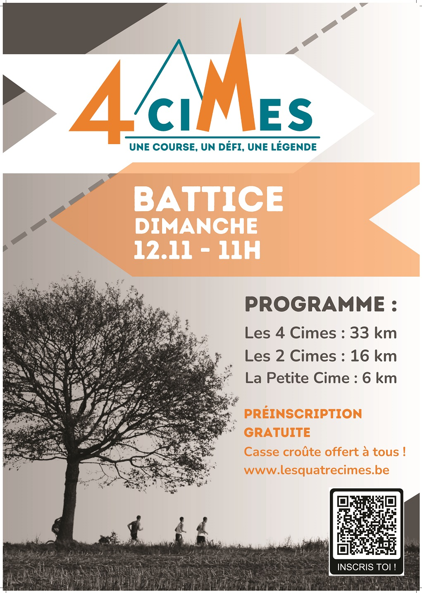
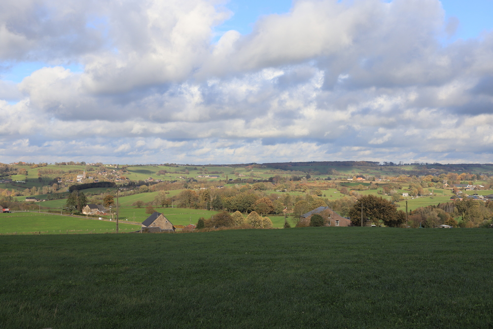
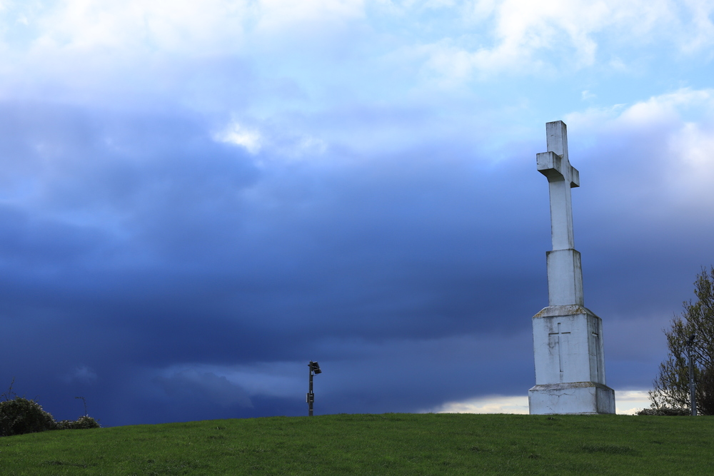
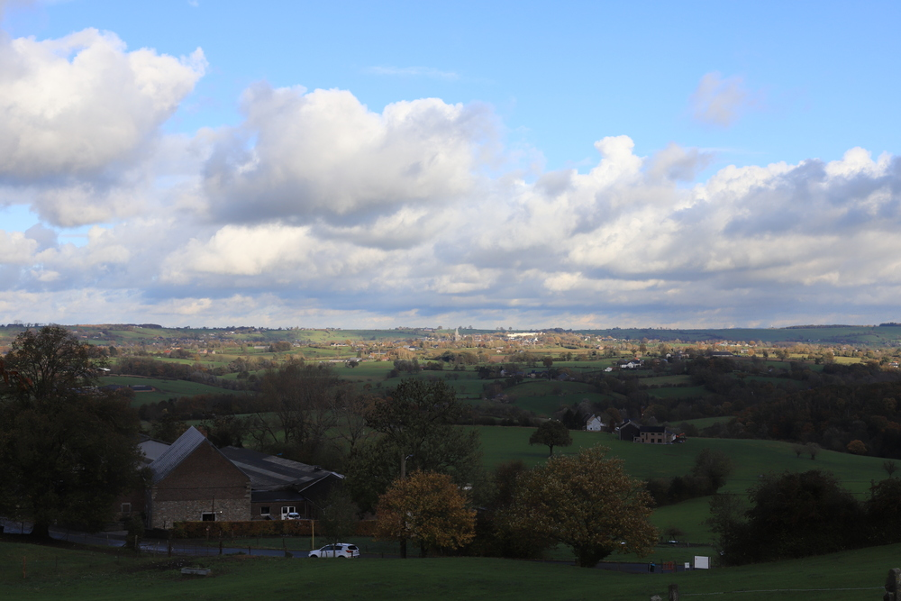
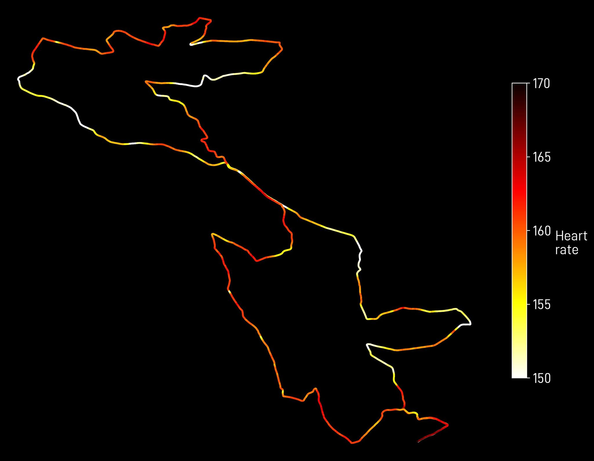

> Une course, un défi, une légende.

C'est avec ces mots qu'est décrite la course, "_Les 4 Cimes_", ou si on veut être complet: "_Les 4 Cimes du Pays du Herve_". Pour l'avoir courue pour la première fois il y a de nombreuses années, je pense que la description est juste.

## In the beginning...

Pour moi les 4 Cimes c'est déjà une vieille histoire. Sans refaire toute mon histoire de coureur, je peux dire que c'est une des premières grosses courses à laquelle j'ai participé, ça devait être en 2007. Je revenais de mon séjour Erasmus à Gran Canaria et commençais à travailler à Liège. Mon collègue Marc m'avait parlé régulièrement de cette course, et un jour de novembre je me suis dit:

> Let's do it. 

Mais les inscriptions étant cloturée, il fallait la faire de manière officieuse. Je ne sais plus en combien de temps j'avais fini (plus de 3 heures à coup sûr), mais en tout cas ça avait été laborieux. J'ai appris par la suite que Marc l'avait terminé 15 (!) fois, donc chapeau à lui!

S'en suivirent d'autres tentatives, en étant bien inscrit, et dont je ne garde pas spécialement de souvenirs (ni bons, ni mauvais), mais je vois par exemple que j'ai fait
- en 2009, 03:01:47
- en 2011, 03:06:29
Bref, rien de brillant.

Par ailleurs c'est une course que je considère dans mon Top-3 des courses que j'ai le plus foirées. 

## Le retour sur le parcours...

C'est un peu le hasard qui me fait revenir sur le parcours. Pas d'ambition particulière, juste envie de profiter de l'endroit (normalement il fera sec et froid) et surtout de voir comment les jambes vont tourner sur une telle distance. La semaine n'a pas été particulièrement facile point de vue entrainements, mais j'ai (heureusement) évité de courir vendredi et samedi (enfin si j'ai couru mais juste pour aller à la boulangerie). Et samedi séance de muscu super _light_, sans activer trop les jambes ni détruire le haut du corts. Essayez de faire une course à fond avec une douleur aux pecs ou aux épaules, vous verrez que ce n'est pas très drôle.

Donc comme pour le Semi de Liège, améliorer mon temps sera déjà une bonne chose, même si ici je pense plus au plaisir qu'à autre chose.

## L'avant-course 

Départ vers 10h de la maison, je me gare dans le grand parking à côté de la route qui va vers Henri-Chapelle, après tout ce n'est que 1.5 km jusqu'au départ, et en voyant la file de voitures qui n'avancent quasi pas pour entrer dans Battice, je me dis que c'était le bon choix. Point de vue fringues: après l'avoir courue dans des conditions de merde (drache et froid), j'avais envie d'être léger, donc 2 t-shirts superposés manches courtes et des manchettes, et l'affaire est faire, j'ai eu chaud toute la course.

Échauffement tranquille, quelques éducatifs, quelques sprints, et puis un placement pas trop mauvais au départ, c'est souvent une erreur que je commets en course, ou autre point du vue: il y a toujours des gens qui vont se mettre devant puis nous péter les c****es. 

## La course

Le départ des 2 Cimes et des 4 Cimes est en même temps, donc je me dis que ça ne sert à rien d'aller trop vite. Je me fais dépasser par plein de gens, en ayant l'impression d'aller pénard. La montre indique 3'35/km. En tout cas ce n'est pas moi qui vais me niquer les quads au premier km.



Après j'ai l'impression que je vais trop vite et surtout que ça va très vite exploser. Le jeu sera alors de retarder au plus tard l'explosion. Bonne surprise: les côtes se passent très bien, je dépasse beaucoup sans forcer. Par contre en descente je fais le couillon et n'exagèrent pas les foulées. Je suis en pleine lecture de "_La Clinique du Coureur_" et j'ai sans doute peur après avoir lu ce qu'ils disent sur les descentes.  

Vers le 8ème km, les 2 distances se séparent, ça permet de voir un peu plus clair dans le peloton. J'ai toujours l'impression d'aller trop vite et que ça va finir par peter. Bor*** il reste encore 25 km. Depuis quasi le début j'ai mis la montre sur mode "cardio", rien à faire du temps, de la vitesse et de ces trucs-là. Il y a de toute façon des panneaux tous les kilomètres, avec en plus le profile de la course. 

À un moment j'ai dû déconnecter, ou peut-être entrer dans une période de _flow_, et les kilomètres ont commencé à passer super vite. J'avais prévu 3 gels, ça peut paraitre trop mais:
1. Je crois que je consomme pas mal de calories vu mon poids.
2. Il me manque de l'entrainement à ce niveau-là, le _gut training_ comme ils disent.
Et aux ravitaillements, je prends bien le temps de boire et aussi de manger du solide.

Je ne sais pas jusque quand a duré le _flow_, en tout cas on est "vite" arrivé à 25 km, et à ce moment-là je suis entré en mode "_calcul_": c'est quand un coureur commence à faire des calculs de temps, de vitesse etc, genre:
> Si je cours à du 12 km/h ou plus, il ne me reste plus que 8 X 5 = 40' de course.

En général le mode "_calcul_" n'est pas une bonne chose car ça veut dire qu'on commence à craquer. Ici ça allait, je savais que ce serait dur mais que même si ça pétait à ce moment-là ce n'était pas grave. Point de vue rythme ça continue avec les descentes prudentes et les montées rapides, je me dis que j'ai tellement négligé les entrainements en descentes depuis que je cours que ce serait probablement le bon plan pour gagner des minutes dans de nombreuses courses. Surtout dans les trails aux Canaries d'ailleurs.

On commence à recontrer des coureurs qui marchent dans les côtes, normal, j'essaie d'en encourager, parfois ça marche parfois pas. On retrouve aussi des coureurs qui ont en garder dans les jambes et commencent à accélerer sur les derniers km. 

__30ème__ km, ça monte, ça va redescendre, puis enfin la montée finale (de merde) vers l'arrivée. 
__31ème km__, je me rends compte que je n'ai aucune idée du temps écoulé. 2 heures et quelques, mais combien? Donc je change le mode de la Garmin (qui était en cardio) et voit: 2h19. Il reste 2 bornes. A.M. avait fait 2h26 si mes souvenirs sont bons, donc comme je cours avec son dossard, autant améliorer son temps. Malheureusement même si la descente se fait bien (probablement une des 2 descentes où j'ai tiré), la dernière côte ne me permettra pas de passer sous les 2h27, ce qui est quand même plus de 30 minutes de mieux que mon ancien record (c'était dans une autre vie, pas le moment pour expliquer ça ici).

|:--:|
|_Le cardio (battements par minute) le long de la course. Comme prévu: ça descend vite dès qu'on descend._|

## Les améliorations

Toujours bon de lister les points à améliorer, comme de toute façon je vais oublier:
1. Entraînements en descente: peut-être le plus urgent. Avec du recul, la dernière fois que j'ai vraiment eu mal aux cuisses c'était après le Jogging de Verviers, qui n'est pas spécialement difficile, mais c'est probablement les descentes faites à fond qui ont cassé de la fibre musculaire.
2. Sorties longues: encore un thème récurrent dans ce blob, les fameuses sorties longues, que je ne fais plus depuis très longtemps, et ce pour différentes raison. En fait ce sont les courses qui me forcent à courir longtemps, sinon je crois que ma moyenne de km par sortie est en dessous de 10.

## Remerciements

Énormes remerciements aux organisateurs et aux bénévoles, vraiment tout était nickel, chaque fois je me dis qu'on a de la chance d'avoir encore des courses comme ça dans la région, qui ne sont pas tombées dans l'escarcelle de grosses boîtes privées qui visent unique le chiffr€. 

Merci à Arnaud pour le dossard, à [Gédéon](http://www.gedeonbaltazard.be/) pour les photos (pas encore été voir), et à Marc pour m'avoir fait découvrir cette course il y a déjà longtemps.
