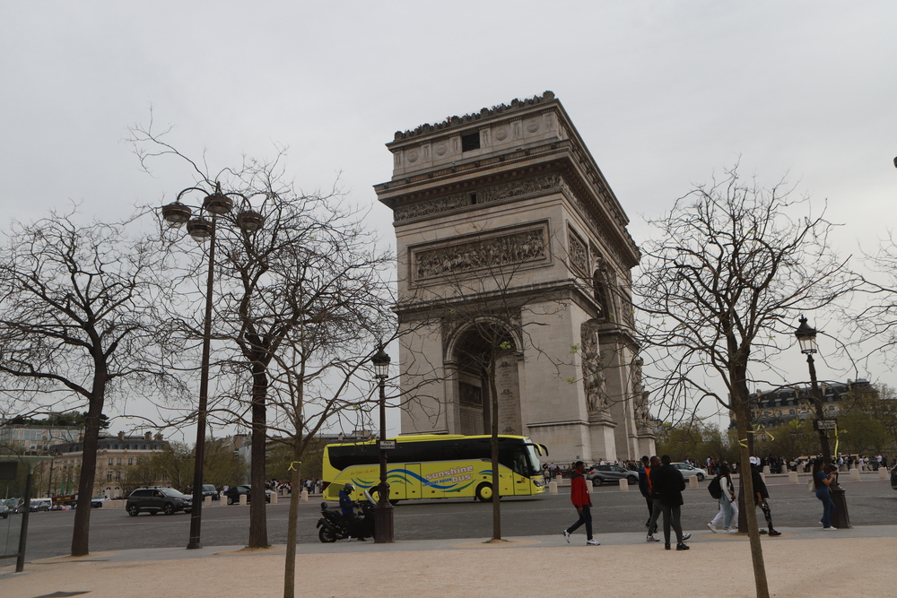
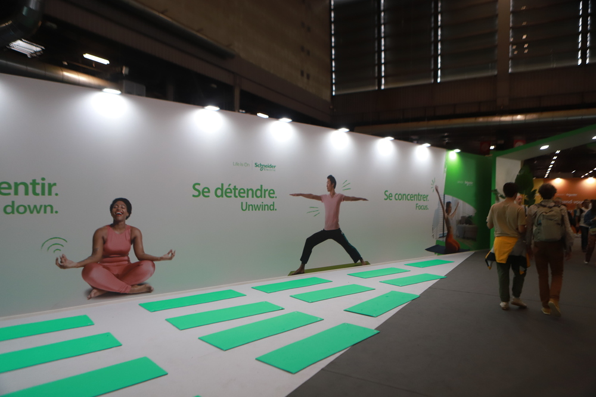
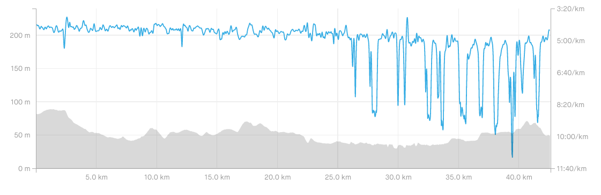
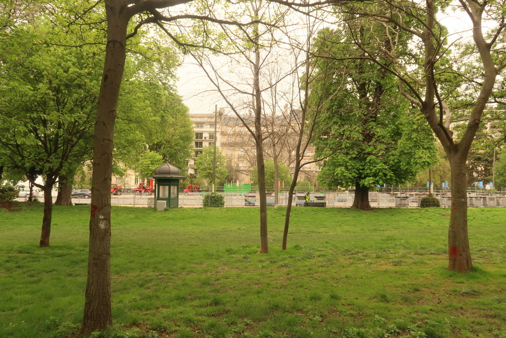
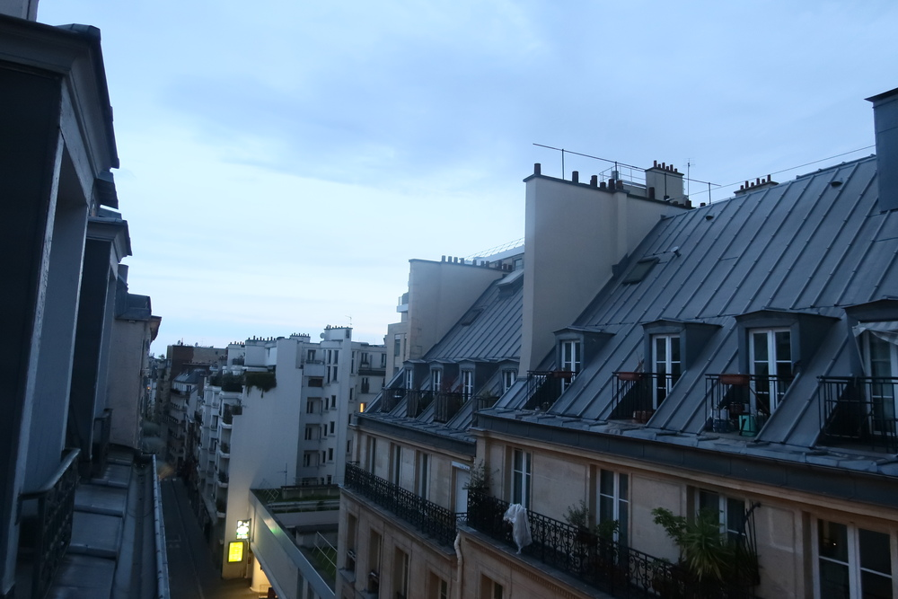

Dans une course à pied normalement il y a toujours une partie où on prend du plaisir et une autre ou c'est plus difficile. Cette fois-ci je pense pourvoir dire qu'il n'y a pas eu du tout de plaisir. Voici comment j'en suis arrivé là.

## Les marathons en général

<!-- Normalement j'avais prévu d'écrire un article sur les marathons, j'en profite pour le terminer et mettre le lien: [Inscrit (enfin) à un marathon]( "Inscrit (enfin) à un marathon"). -->

|  |
|:--:|
| _L'Arc de Triomphe._|

## La préparation

Ce sera sans doute la section la plus courte de l'article, car la prépa, elle a été inexistente, ou quasi. Fin décembre, j'étais en super forme, et j'avais même pris 2 semaines de coupure qui avaient été très positives. Tout commençait pour le mieux jusqu'à ce que ... _shit happened_.

En fait je n'ai pas même envie d'expliquer ce qui s'est passé à ce moment-là, sinon ça fait comme si j'essayais de trouver des excuses alors qu'il n'y en a pas: mauvaise préparation → mauvaise course, _y punto_. En tout cas j'ai eu mon certificat médical moins de 48 heures avant le marathon.

## L'avant course

Je pense pouvoir dire que ça s'était bien passé:
- bonne récupération les jours précédents l'épreuve,
- bonne alimentation et hydratation,
- pas de typique stress d'avant course.

Pour le dernier point ça me paraissait d'ailleurs bizarre: d'habitude avant un gros objectif il y a une part de stress, qui n'est pas toujours négatif, ça veut juste dire qu'on a investi beaucoup de temps et d'énergie pour se préparer donc c'est logique de sentir une pression. Ici il n'y avait pas vraiment eu de sacrifices pour la prépa, j'imagine que l'absence de stress en découle.

|  |
|:--:|
| _Le Salon "Run Experience", passage obligé après le retrait du dossard._|

Peut-être petit bémol: la veille de la course, entre les trajets en voiture, en tram, en métro, à pied, ça fait quand même une grosse journée (retrait du dossard, hotel etc) où on est souvent debout, idéalement il faudrait venir 2 jours avant, mais les tarifs des hotels et l'organisation famililale rendent la chose un peu compliquée.

## La course

On était dans le sas des "moins de 3 heures", ce qui était normal vu l'état de forme lors de l'inscription (novembre 2023 environ). Le départ se donne vers 8h10, ça part vite vu que c'est en descente, mais je sais qu'il ne faut pas exagérer, donc je gère l'allure. J'ai l'impression que dès le premier km, ça n'ira pas: alors que l'allure (vers 4'15/km) doit être facile, ça ne va pas, et surtout ça ne pourra pas aller sur 42 km. Parfois je jette un oeil à la montre et vois 4'45/km, alors que j'ai l'impression de tirer. 

Je passe les 10K un peu au dessus des 40 minutes, pas trop mal. Comme prévu je prends un gel toutes les 30 ou 35 minutes, ça passe très bien et j'en suis content vu que je m'y étais préparé ("_gut training_" comme on appelle ça). Toujours aucun plaisir dans la course alors qu'on entre dans le Bois de Vincennes et que le public est très présent. 



Je ne me vois pas terminer les 42 bornes, et vers la mi-course on passe près d'où la voiture est garée: pendant une fraction de seconde, je pense: "et si je m'arrêtais là et attendait Arnaud?" Non, mauvaise idée: aucun moyen de la contacter, et puis même, ce serait pas cool qu'il doive se ramener en métro avec nos 2 sacs. Bref, une grosse idée bien pourrie.

À partie des 21K je crois que je ralentis, ça va casser c'est sûr, mais quand? Ce sera aux 25K, boum, d'un coup, je ne cours plus, je marche, je ne suis plus un coureur. Le fameux mur du marathon? Je ne pense pas, c'est plutôt l'évolution logique de ce qu'a été la course les 24 km précédents. Je dis souvent que quand on commence à faire des calculs, c'est que ça va mal. Ici ça calcule justement: il reste 17K, en marchant ça fait au moins 3 heures, ça ne sent pas bon. Abandon? OK mais après comment je rentre à la ligne de départ?? Sans doute le mieux est de terminer.

|  |
|:--:|
| _Pas besoin d'être un statisticien pour comprendre que quelque chose a foiré._|

J'arrive à repartir, pas mauvais rythme mais des douleurs bizarres (épaule et côtes droites) m'empêche de courir longtemps. Dans ma tête, si j'arrive au 30°, je finirai (ok ça n'a pas de sens), donc péniblement j'alterne course et marche: course jusqu'au kilomètre suivant, et puis marche une fois que je passe la balise. C'est vraiment tout pourri, mais l'arrivée approche. Le corps a terminé la course après 25 km, la tête est resté dedans jusqu'au bout. 

Jusqu'à la fin, rien de nouveau, je me fais dépasser 4000 fois, tant pis, plutôt que de me sentir mal j'essaie d'être _grateful_ (reconnaissant), content d'être là, d'avoir pu prendre le départ malgré les problèmes, content de pouvoir continuer. Dernière descente, impossible de terminer sans marcher, mon épaule est KO, et puis de toute façon, qu'est-ce que ça va changer? 

Temsp final: 3 heures et 37 minutes, aucune minute de plaisir, sans dire non plus que c'était l'agonie: juste un long tour dans "la plus belle du monde" (mouais) entouré de milliers de coureurs.

## L'après course

Le plan: sortir le plus vite de la zone d'arrivée: trop de monde! L'hôtel est pas trop loin mais je fais un détour juste pour éviter la foule. Une douche vite fait, des fringues propres, et on entame le retour vers Verviers!

|  |
|:--:|
| _Merveilleux parc parisien._|

## Les conclusions

Un beau foirage mais pas du gachis: ça aurait été du gachis si je m'étais entrainé correctement, en fait ça aurait même été anormal de faire un temps correct. Maintenant il faut penser au suivant (Eindhoven?) et remonter la pente.

### Les trucs à améliorer

- Le plus important: suivre un vrai plan pour la préparation. Sorties longues, séances à allure marathon, etc. Sans ça, ça ne peut pas passer.
- Les chaussures: je continue de courir avec mes Nikes Zoom Streak, qui sont des chaussures fort légères mais aussi avec un amorti très faible. Autant ça passe super sur un 10K voire un semi, pour un marathon c'est peut-être pas le mieux. 
- Mon poids (?): je me dis qu'avec 5 kg de moins ça irait mieux ;)
- La veille de la course: une journée usante, mais comme dit au début: on n'a pas toujours le choix.
- Mon épaule: il faudrait bien que je trouve d'où ça vient, car ça faisait un mal de chien.

|  |
|:--:|
| _Vue de la chambre..._|

### Les points positifs

- L'alimentation en course: je crois que la prise de gels a bien fonctionné, avec une bonne régularité.
- L'alimentation d'avant course: pareil, la prise de glucide et d'eau est bien passée.
- Le mental: maigre consolation, mais je suis content d'avoir fait ce qu'il fallait pour terminer. 

    

