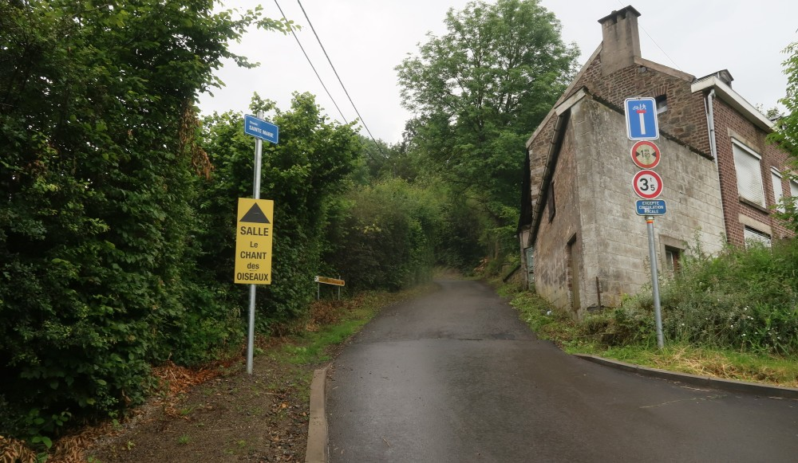

> Cette fois-ci c'est promis, je ne me ferai plus avoir au départ!

C'est ce que je m'étais dit plusieurs fois la semaine précédent la course. Chaque fois c'est pareil: je crois que je suis (relativement) bien placé, et puis je termine dans un gros bouchon. On ne m'y reprendra plus. Les jambes étaient pas top vendredi et samedi mais au final ça ne change rien le jour de la course. Un bon échauffement bien complet, 14h50 je me dirige vers la ligne de départ afin d'avoir une bonne place. Je vois l'ami Gwen qui s'avance pas mal: lui il doit savoir... mieux que moi. Et puis non, il continue et va encore plus loin. Que faire? Trop tard, mon cerveau me dit: "tracasse, t'es bien ici". Pas de stress donc.

Décompte (en anglais), ça va partir, on est serrés. Coup de pistolet, ça part. Le gars devant n'avance pas. Le gars derrière me pousse. Vous faites déjà ch*** les mecs. Je tente un dépassement rapide sur le côté droit. Raté. Ça bloque comme c'est pas possible. La question qui me taraude: 

> Mais bo*** qu'est-ce que vous foutez en première ligne si c'est pour courir à du 10 km/h? 

Ça va, je ne m'énerve pas pour ce genre de truc, ça va aller. On tourne rue de Jehanster et je peux dérouler. Il y a du monde devant, plus que prévu. Chaussée de Heusy ça trace, bye bye le monsieur que je n'aime pas trop parce qu'il planque des ravitos en course. Ça va vite mais ça fait (un peu) mal d'être dans le rouge si tôt. Je ne regarde pas du tout le chrono, juste une fois ou deux l'allure, ça indique du 3'40''/km, perso j'aurais dit du 3'30/km (aux sensations). On est à Ensival et je ne me demande comment je vais arriver si ça continue comme ça. Le premier ravito nous attend, toujours pareil: une bouteille dont 80% du contenu terminera par terre (désolé).



On commence à monter, je me traine mais visiblement je ne suis pas le seul, vu que personne ne me dépasse. Rue du Canal je tente d'avaler un gel (je n'avais quasi rien mangé depuis le petit-déj afin d'éviter des soucis de digestion), pas facile et pas très bon cette fois-ci. Pfff mais où vais-je donc le jeter? Bon OK demain j'irai voir si quelqu'un l'a ramassé, désolé. Pied Vache n'est plus très loin (ou le Pied de la Vache comme disait une dame), ça se sent car l'allure ralentit fort chez certains. Une fois la première rampe passée, mars et ça repart, on est à l'ombre, il fait bon, que demandez de plus? Par contre il n'y avait plus de musique dans le parcours Vita, dommage.

|  |
|:--:|
| _Voilà j'ai retrouvé mon gel le lendemain._|

Fin du _Trophée des Grimpeurs_, où j'ai encore eu l'impression de peser 150 kg. Ça commence seulement à aller. La descente est rapide, la montée rue de l'Usine aussi, je suis dans le flow. Enfin. Après, que dire?, je tire mais ça va, il y a des gens partout et c'est bien, on doit être au km 10 et je n'ai toujours pas regardé le chrono, de toute façon je ne crois pas que je pourrais aller beaucoup plus vite, enfin si il y a toujours moyen, mais pas très longtemps alors. 

|  |
|:--:|
| _Début de Pied Vache, qui s'appelle en réalité Sainte Marie (le vrai Pied Vache est la rue de droite à l'intersection)._|

Beaucoup de plaisir sur cette fin de course, ça tourne bien, les kilomètres défilent (étaient-ils affichés d'ailleurs? je n'ai rien vu). Premier coup d'oeil sur le chrono de la montre avant la dernière côte: 48 minutes et quelques... Le but étant de faire mieux que l'année dernière (54 minutes et quelques), ça devrait aller. Ça trace toujours, j'arrive sur la piste et je suis content, car la piste je l'aime bien. Alors est-ce que je fais une figure sur la ligne ou pas? Et non, rien de spécial, je vois plein de coureurs au sol, bien déchirés, pas trop de coureurs d'ailleurs, donc voilà c'est fini.

> Je me suis bien fait avoir au départ encore.

## Conclusion

Encore une belle édition de cette course, ça fait plaisir de voir autant de gens qui courent, je ne sais pas s'il y a plus qu'avant qui courent, mais quand je vois le nombre de parents de l'école des petits qui font cette course, c'est sympa.

 
