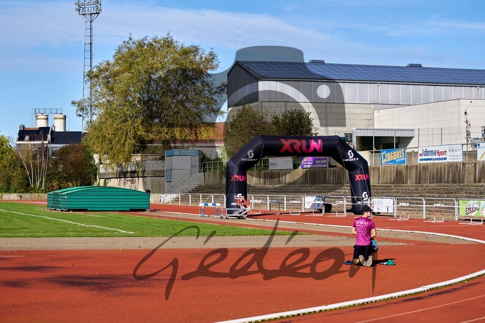

Quand quelqu'un début en course à pied, il y a une phrase que cette personne devra entendre plein de fois. Allez-y, réfléchissez, qu'est-ce que ça pourrait bien être? C'est sûr qu'on vous l'a déjà sortie. Et oui, voilà:

> Et surtout, pars pas trop vite, hein!!

J'ai presqu'envie de dire: cette p*** de phrase qui saoule et qui en même temps fait peur. 

Alors dans mon cas, j'ai l'impression que depuis que je fais des courses (2007?), je ne me souviens pas vraiment d'avoir connu cette situation de partir trop vite. Au contraire, c'est plutôt des cas où j'aurais sûrement dû partir plus fort.

Bref, l'intro de cet article est faire, parlons maintenant du semi-marathon de Herve, aussi connu sous le nom de _Mémorial Stéphane Dmyterko_.

## Qui était Stéphane Dmyterko?

Décédé en octobre 2020, il était le directeur sportif du Herve Athlétique Club. Il a été entraineur pendant de longues années, tout en remplissant le rôle de dirigeant, d'organisateur, mais aussi de speaker. Au bord de la piste on trouve une photo de lui, ainsi qu'une phrase qu'il affectionait certainement: 

> Quand on aime, on ne compte pas!

## Le parcours

Bon moi comme toujours, le parcours je m'en tape un peu: c'est un semi, donc 21K, et en étant à Herve, on se doute que ce ne sera pas plat. Malheureusement, lors de l'échauffement, je tombe sur des coureurs qui discutent du parcours. Pitié, pas ça, les gars! J'entends, ou crois entendre, qu'il y a une grosse descente au 17°, jusqu'au 19°, puis là ça remonte fort jusqu'à l'arrivée. 



À part ça je ne sais pas trop où on va aller, à la base ça a l'air plutôt sympa comme parcours!

## La course et la stratégie

Après un bon échauffement sur la Ligne 38, ponctué d'exercices d'éducatifs et de dévérouillage, je suis chaud, ou presque. Pas d'objectif spécifique en tête, enfin si: j'aimerais passer sous la barre des 1h30, ça semble réalisable. Dès le départ, ça va vite, en quelques secondes le groupe de tête est déjà formé. Je me dis que si je voulais (hahahhaha), je pourrais me coller à eux. Mais combien de temps cela durerait-il, ça c'est une autre question.

|  |
|:--:|
| _Quelques étirements sur la piste ne font jamais de tord. Photo: [Gédéon Baltazard](https://www.gedeonbaltazard.be)_|

Dès que ça descend un peu plus fort, le trou se fait. Le cardio et la respiration vont bien, on va s'amuser. Les premiers kilomètres s'enchainent vite. J'ai mis quelques temps de référence ci-dessous. Dans ma tête je sais que ça ne peut pas durer toute la course comme ça mais peu importe, c'est pas le moment de ralentir. 

| Distance &nbsp; | &nbsp; Temps lors du semi &nbsp; | &nbsp; Meilleur temps &nbsp; |
|-------:|-------:|-------:|
|5 km  |  19:00   |  17:25 | 
|10 km |  39:17   | 38:04  | 
|15 km | 01:00:49 | 57:30  | 

## La transition

Je ne sais pas exactement quand je suis passé du "tracasse, je gère" au "purée, comment je vais pouvoir terminer cette course???", mais la transition a été rapide. Dans les descentes ça va, et dans les montées j'entends des pas se rapprocher, je suis sur le point de dire:
> Allez les gars vous voyez bien que je suis à la ramasse en montée, passez!!

|  |
|:--:|
| _Un moment de la course où, je pense, ça allait encore. Photo: [Gédéon Baltazard](https://www.gedeonbaltazard.be)_|

C'est un peu ce qui s'est passé: je me suis fait manger en montée, j'ai un peu essayé de relancer mais il y a malheureusement des limites. J'encourage ceux qui me dépassent (et oui je suis quand même un coureur sympa), même s'ils n'en ont pas vraiment besoin (ou si?). 

Il y a un peu de monde pour nous encourager, j'essaie d'en profiter pour garder le rythme et la motivation. 

## Résultat

La fin de course a été un peu délicate, je me demande souvent si je me fais assez mal en course pour faire de bons temps, ici je crois que c'était le cas, que j'étais bel et bien dans le rouge. Au final mission remplie, étant donné que je finis en moins d'1h30. Par contre j'ai dû marcher quelques dizaines de secondes dans une côte à laquelle je ne m'attendais et ça c'est vraiment pas bon. Pas d'excuses pour ça, promis je ferai en sorte que ça n'arrive plus!

Sur ce type de distance et de profil (300 m de dénivelé positif), je me trompe peut-être mais j'ai tendance à penser que mon poids est quand même un facteur limitant. Sur du plat, quand il ne faut pas se relancer tout le temps, j'ai l'impression que ça va. Ici je me traine comme un boulet, surtout à partir de 15 km. Mais avec ces histoires de poids on s'éloigne un peu du sujet de la course.

On ne peut pas dire que ce soit de bon augure pour les [4 Cîmes de Herve](http://www.lesquatrecimes.be/) (10 novembre 2024), mais ce n'est pas ça qui va me tracasser. Comme je dis (ou pense) souvent: on a déjà beaucoup de chance de pouvoir courir comme on le fait, de profiter du beau temps (parfois), des paysages (souvent), d'avoir des belles courses organisées à quelques kilomètres de la maison. 

