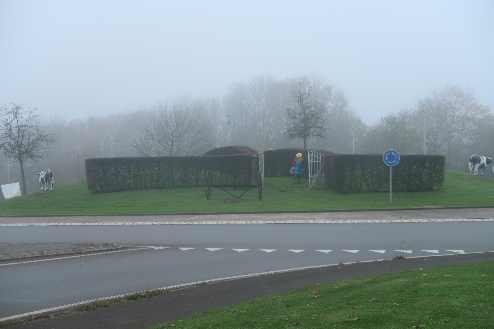
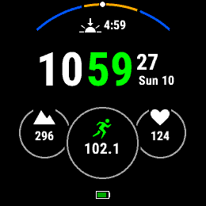
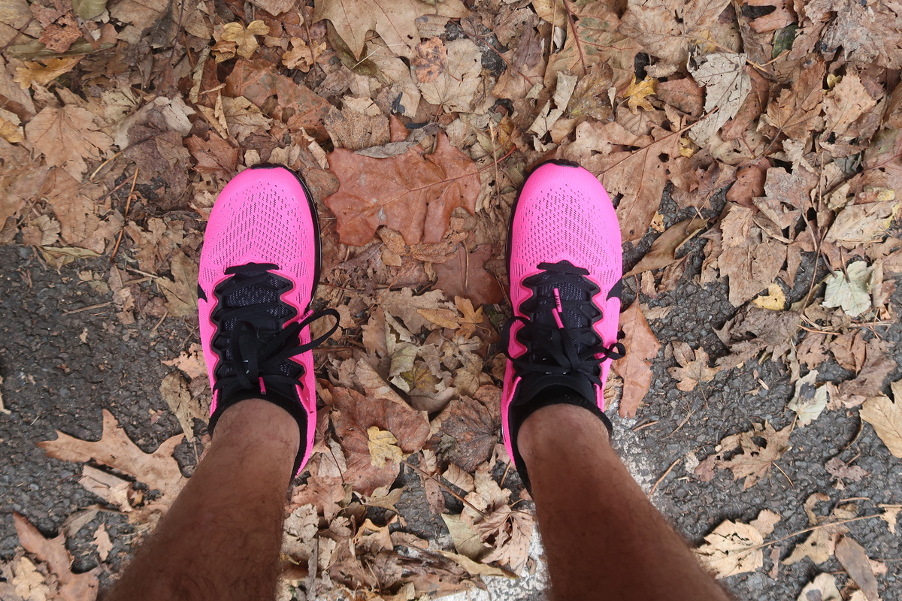
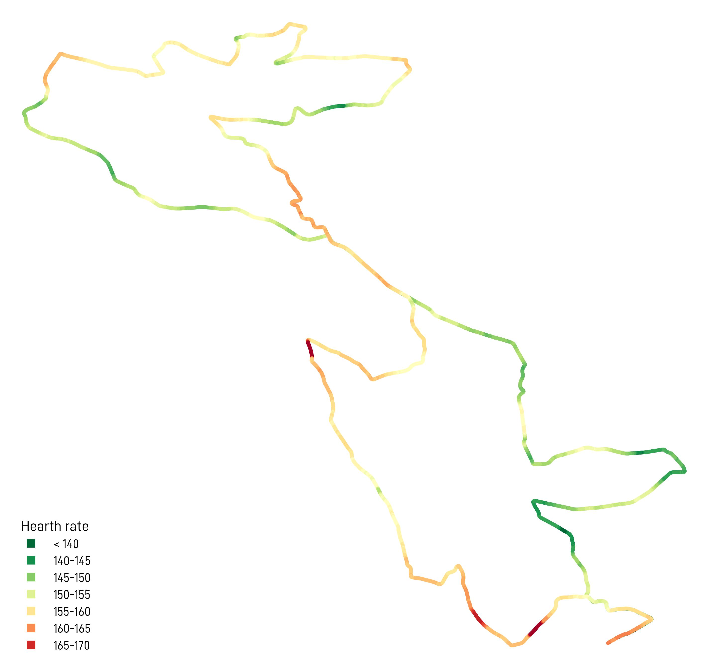
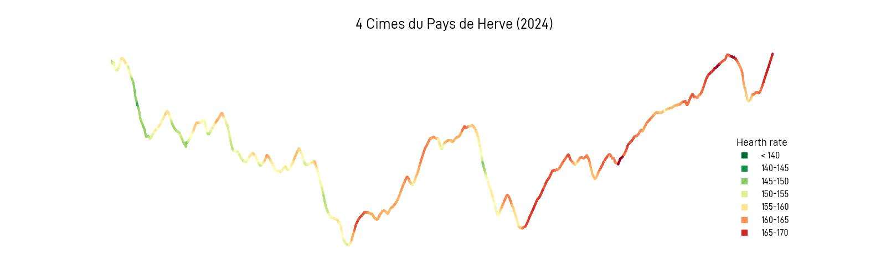
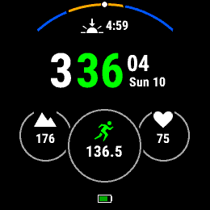

> Une course, un défi, une légende.

J'avais envie de commencer l'article comme celui de l'année dernière. Car ces 3 motes définissent vraiment bien cette épreuve. 
- Une course: pas besoin d'explications!
- Un défi: parce qu'avec une distance entre le marathon et le semi, ça ne sera jamais facile.
- Une légende: déjà la 37° ou 38° édition, que dire de plus?

## Les 4 Cimes, en chiffres

- __33__ km de distance
- __650__ m de dénivelé positif
- __805__ finishers sur la course principale
- __1436__ finishers sur les 2 Cimes
- __4__ cimes: Croix de Charneux, Fort d'Aubin, Mauhin et Transpineux
- __102__: le nombre de kilomètres que j'avais dans la jambe cette semaine, avant d'entamer la course.

|  |
|:--:|
| _Le rond point des vaches, et une météo maussade._|

## Avant la course

Pour être honnête la course n'était pas vraiment un objectif de cette saison, bien que je m'étais inscrit quelques semaines (mois?) à l'avance, chose qui n'arrive pas très souvent. Deux semaines auparavant j'avais pris le départ du [Semi Marathon de Herve](../20241026_semimarathonherve/), ce qui pouvait constituer une bonne préparation aussi bien mentale que physique.

J'avais quand même en tête un plan:
1. Faire beaucoup de volume l'avant-dernière semaine avant la course,
2. Relâcher la semaine de la course.

Comme toujours les plans sont faits pour être adaptés, la vie n'est pas un long fleuve tranquille où tout ce qui est prévu se produit (ou alors j'ai dû foiré quelque chose ces 25 dernières années). Pour revenir au plan, j'ai donc enchainé une semaine à 100K (alors que j'aurais pu/voulu atteindre les 120 voire 130K), puis la semaine de la course, les trajets depuis/vers le boulot se sont enchainés, ce qui fait qu'au départ j'avais déjà passé la barre des 100K. Ce n'était a priori pas un problème vu que vendredi et samedi avaient été des journées de repos, et surtout j'avais été prudent à la muscu.

|  |
|:--:|
| _C'est l'heure du départ..._|

## Les chaussures?

Question que je ne me pose jamais: quelle paire vais-je porter? Depuis peu j'ai un peu changé et expérimenté avec les Nike Zoom Streakfly, une paire très légère, que la marque recommande pour des distances inférieures à 10 km. Ça me fait un peu rigoler lire ce genre de truc, dans le sens où, si ça va pour 10 km, pourquoi pas 15 km? Que va-t-il se passer à 10 km qui va être un problème? J'ai un peu cherché la réponse et n'ai rien trouvé. Enfin si, sur un blog de coureur, il y avait une explication un peu débile, que j'ai d'ailleurs oubliée. Il fait reconnaitre que les coureurs, en tant que communauté, avalent pas mal de trucs point de vue marketing et aussi pseudo-sciences, donc les marques ont bien raison de s'engouffrer là-dedans.

Donc ces bonnes Zoom Streakfly: option 1, ou bien les habituelles Zoom Streak 7, avec lesquelles je cours depuis plus de 4 ans? Comme il me restait une dernière paire de Zoom Streak 7 inutilisée dans la cave, j'ai opté pour ces dernières, car je pensais que je n'avais pas assez couru avec les autres, en dehors du Semi de Herve et de quelques sorties longues en préparation du marathon. 

|  |
|:--:|
| _Nike Zoom Streak 7 💣💣._|

Les Zoom Streak sont vraiment les chaussures que j'ai le plus aimés depuis que je cours. Il suffit de les mettre pour sentir que ça va aller vite. Il y a de l'amorti juste assez, de belles couleurs, et ce que j'aime particulièrement, c'est que j'ai l'impression que le pied est proche de la route.

Si on s'en réfère au site de la [Clinique du coureur](https://lacliniqueducoureur.com/chaussures/) et se son calcul de l'_indice minimaliste_, on trouve ceci:

| Chaussures |     |&nbsp; &nbsp; &nbsp; Zoom Streak 7 |    |&nbsp; &nbsp; &nbsp; Zoom Streakfy |
| --------:  | --- | --------------: |--- | ---:        | 
| Poids      |     | 181 g          |    |   171 g      |
| Drop       |     | 7 mm           |    |   6 mm       |
| Indice minimaliste |  | 56%       |    |   56%        |

Il y a pas mal de personnes qui me disent qu'elles ne pourraient pas courir avec ça aux pieds, mais je pense le contraire: il suffit de les essayer pour sentir que ça va aller vite! 

## La course

Le plan pour l'échauffement: aller voir le départ des 2 Cimes (10h30), retourner à la voiture pour changer de chaussures, puis revenir au départ des 4 Cimes. Timing parfait, j'arrive moins de 5 minutes avant le départ, juste à temps pour me placer décemment parmi la foule de coureurs. Comme je vois que ce n'est pas trop serré, j'en profite pour aller un peu plus loin que d'habitude, histoire de ne pas devoir slalomer sur les premiers kilomètres.

Avant le départ j'étais tombé sur un pote, on discute 2 minutes et je lui dis qu'on se verra à l'arrivée. Il me répond que le temps qu'il arrive, j'aurai eu le temps de boire 10 bières. Mais ce qu'il ne sait pas, c'est que pour que je descende 10 bières, il me faudrait probablement une semaine!

Le départ est donné, pas besoin de dire que ça part très vite (en descente), je me mets à un petit rythme qu'on pourrait qualifier de conservateur, peut-être la conséquence mon _explosion_ deux semaines auparavant. Après un kilomètre de course, quelqu'un sort:
> Il ne reste que 32 km!

et là je me dis qu'on sort tout le temps les mêmes blagues (pas marrantes). Le parcours est comme je me souvenais: tout sauf plat. L'année dernnière j'avais été très prudent dans les descentes car c'est parfois là qu'on s'explose les jambes. Ici je me lâche un peu plus, ou en tout cas c'est l'impression que j'ai. Je profite du paysage, du public, de la bonne _vibe_ comme on dit.



Les kilomètres défilent plutôt vite et ça c'est bon signe. En fait c'est même une bonne manière de savoir que le rythme est OK: si c'est trop lent, ça ne défile pas assez vite; si c'est trop rapide, ça défile plus vite mais on est tellement dans le rouge que ça ne va pas. 

Avec du recul c'est marrant de voir ce qu'on retient ou non d'une course. Par exemple il y a des choses dont je me souviens parce qu'en course j'ai pensé:
> Ça, il faut que je le note dans mon article.

L'ambiance est vraiment excellente, les gens profitent bien, même s'il fait froid. Moi je profite en depassant des coureurs et en ne me faisant pas dépasser. D'ailleurs quand j'y repense je crois que je ne me suis pas fait dépasser, sauf par Louis dans la montée finale, et ça justement, le fait de ne faire que dépasser, ça peut vouloir dire qu'on est pas parti assez vite...

|  |
|:--:|
| _Ma fréquence cardiaque le long du parcours._|

Les 4 cimes, c'est avec envie que je les aborde. Je baisse le rythme mais en garde assez pour dépasser pas mal et pouvoir bien relancer dès que ça redescend. KM-16 environ, je vois un vélo qui accompagne un coureur. Ça par contre je ne suis pas fan. Se faire accompagner par un autre coureur, pourquoi pas, mais un vélo? Un peu plus loin, le gars demande une boisson à son pote. Des gens du public, qui visiblement les connaissaient, rigolent à leur passage; et moi quelques secondes après je leur sort que c'est un tricheur. Ça les fait rigoler, moi pas trop, mais c'est vrai qu'on a tous une sensibilité différente concernant le respect des règles et du sport en général.

Une fois arrivé sur la grand route vers le KM-18 dans ma tête je sais que ça va aller, il y a quelques kilomètres de descente, puis on doit encore traverser une grand route, et là, ça monte mais ça doit aller. Je profite vraiment des montées, bizarrement d'ailleurs, car même sans aller hyper vite, je dépasse beaucoup de coureurs. Dont le gars accompagné par son vélo. 

|  |
|:--:|
| _Le profil et où je me suis mis dans le rouge._|

Les kilomètres continuent de défiler à un bon rythme, toujours aucune douleur, mais j'essaie vraiment de relacher les épaules et le dos pour ne pas me ramasser d'horribles douleurs comme au marathon de Paris et dans une moindre mesure au semi de Herve. Les gels aussi passent bien, les fameux 226ERS, dont mes préférés sont ceux au goût de miel + noisette. 

La fin approche petit à petit, je commence à calculer pour voir si un 2h25 est faisable, mais ça semble ambitieux à ce moment là de la course. Peu importe, on verra à l'arrivée. Dernier ravito, je tombe sur un pote et on discute un peu. J'hésite à lui proposer de terminer ensemble, mais visiblement je vais plus vite. Lucide, je lui dis quand même:
> Si je pars maintenant, tu me reprendras à l'arrivée.

Et j'avais raison. La fin elle est bien dure, avec une longue descente avant la montée finale. Elle est longue celle-là. Je relance modérément et entends derrière moi quelqu'un qui lance quasi un sprint. Et oui, l'ami Louis a les jambes en feu, il termine 15 secondes avant moi.

## Les leçons à tirer

Je dirais qu'il y a 3 choses importantes:
1. Non, ce n'est pas un type de course pour moi. J'aime les montées mais c'est vraiment limite pour moi ce genre de distance. 
2. Pas facile de savoir à quelle vitesse aller pour faire un temps déterminé. Il fallait avoir une moyenne de 4'25/km, allure tout à fait raisonnable sur du plat, par contre calculer ça en prenant en compte le dénivelé, pas évident pour moi. J'étais légèrement au dessus des 14 km parcourus sur la première heure, le problème est que la 2° partie était plus compliquée. Il faudra que je calcule un peu mieux la prochaine fois.
3. Manque de puissance: cela fait vraiment longtemps que je ne fais plus de travail de côte, alors que j'adore ça. Combiné à la muscu je pense que ça pourrait vraiment m'aider. On ne peut malheureusement pas tout faire.

|  |
|:--:|
| _Fallait pas se garer aussi loin du départ._|

Le mot de la fin c'est un remerciement que les organisateurs de la course ne liront jamais: une organisation impecable, une ambiance exceptionnelle, un parcours qui fait mal, on a vraiment de la chance d'avoir dans la région ce genre de course!

