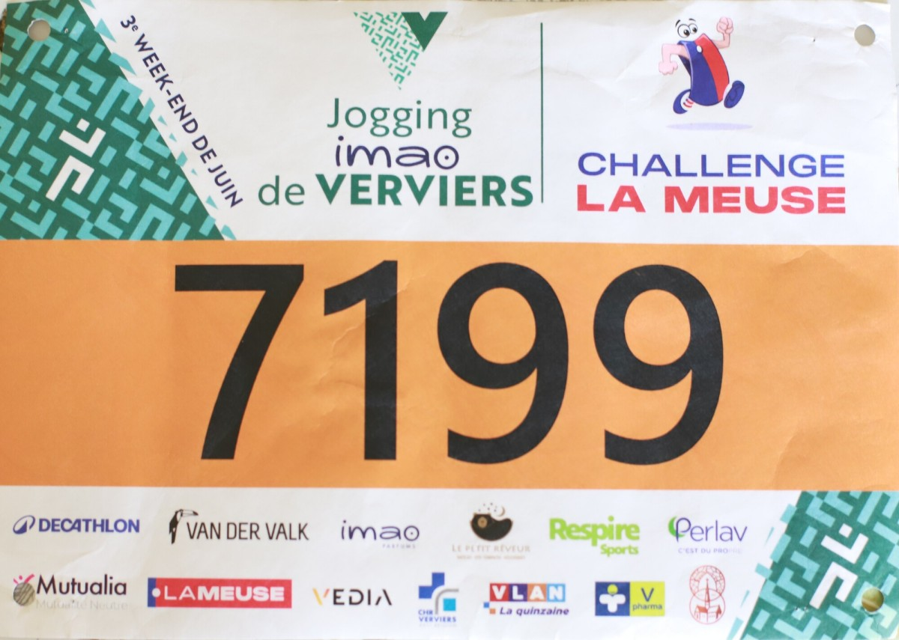
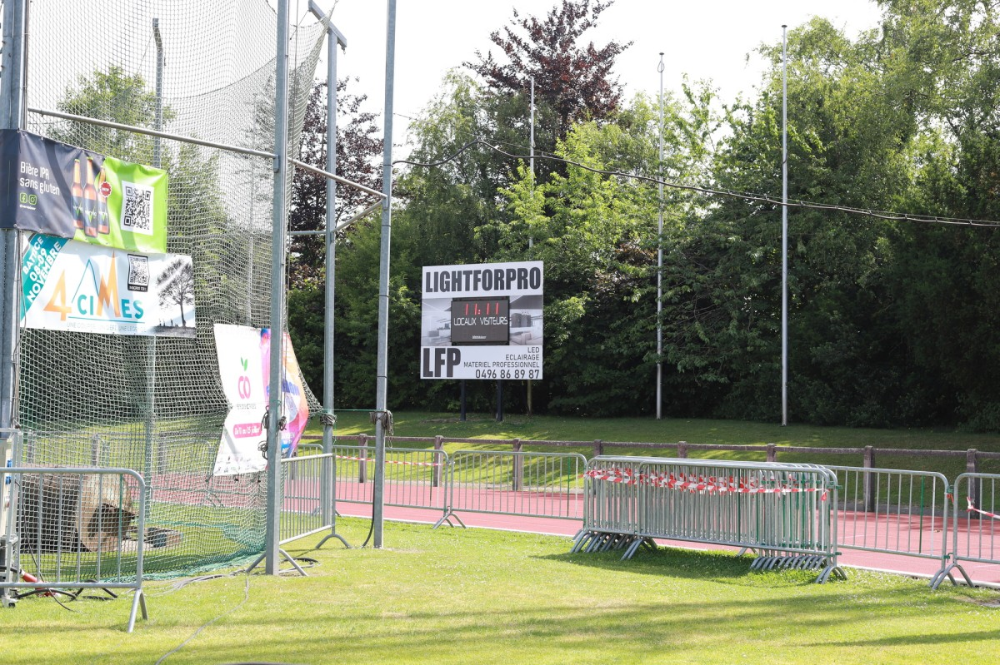
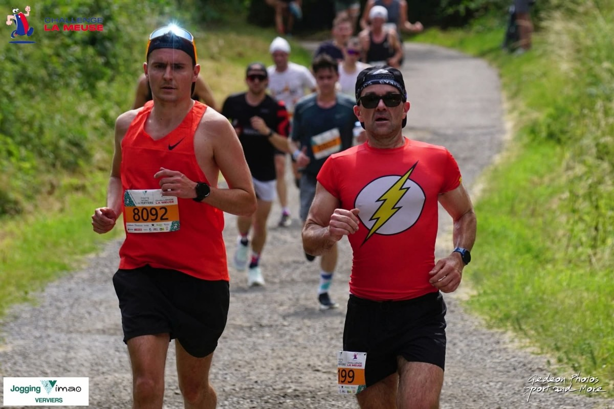
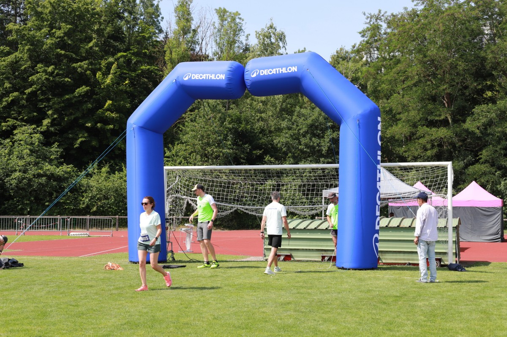
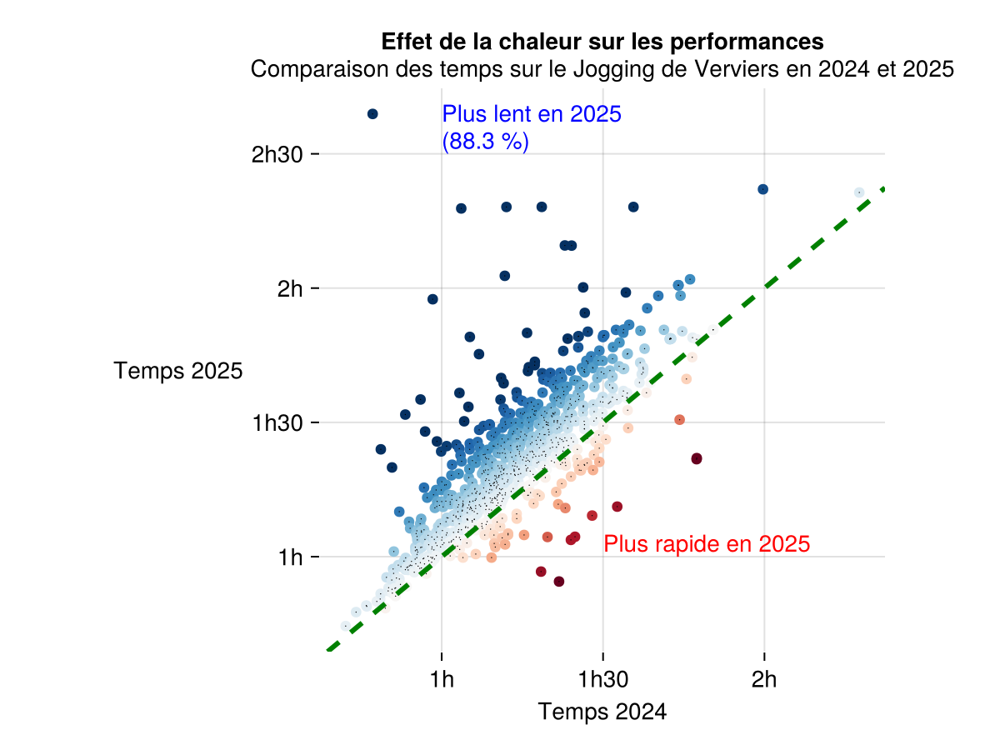

J'ai toujours trouvé sympa d'avoir une vision avant la course, pour savoir un peu quel était l'état d'esprit, commen allaient les jambes etc. Ici on est samedi soir, journée calme mais pas intensive: jogging (court) le matin, marché, muscu, quelques trucs à la maisonn... de toute façon avec les enfants ça n'allait pas être de tout repos.

## Le plan

Pour revenir en forme, il faut déjà expliquer ce qui s'était passé ces derniers mois: une opération chirurgicale, plusieurs semaines (presque mois) sans courir, juste avec de la marche, et progressivement, de la muscu. 

Une fois que j'ai eu le feu vert, je savais qu'un risque non négligeable était bien connu: la blessure. On dit que les blessures arrivent suite à un changement: changement de chaussures, de volume, d'entraineur, de types d'entrainement... Passer d'un volume nul à X km/semaine est donc risqué si X est trop grand.

|  |
|:--:|
| _Premier dossard depuis longtemps._|

Avant l'opération j'étais facilement au dessus de 100 km par semaine, donc je me dis que si j'arrive à retrouver ce volume en 4-5 semaines, ce serait déjà pas mal. Rapidement j'ai trouvé que l'endurance n'allait pas mal du tout, par contre la vitesse, ce n'était pas encore ça. Donc j'ai essayé d'avoir 2 séances de qualité, sur piste, par semaine. En privilégiant les allures 10K et 21K, tout en introduisant quelques répétitions plus courtes. 

Je ne sais pas dire si ça fonctionner, mais:
1. Je ne me suis pas blesser jusqu'à présent.
2. Les sensations sont tout le temps meilleures.

Parfois on me dit que je n'ai rien perdu mais bien sûr, 2 mois d'arrêt ça doit obligatoirement laissé des traces, sinon tout le monde arrêterait! Pour moi la grosse différence ce n'est ni l'endurance, ni les séries courtes (200 m, 400 m, ...), mais justement l'allure autour de ce qu'on vise pour les courses. Typiquement avant, maintenir du 3'45''/km me semblait facile, ou quasi, maintenant je peux toujours aller à cette vitesse, mais au prix d'en effort physique beaucoup plus élevé.

## La stratégie de course

J'aimerais évidemment passer sous l'heure, quelque chose comme 56 minutes serait super, et en relisant le compte-rendu de l'année dernière, je sais qu'il y a quelque chose à bien gérer: le départ. Il faut absolument que je me place correctement, sinon ça va encore me faire perdre du temps et surtout de l'énergie.

Bien que la course ne me fasse pas stresser, pour le départ c'est différent, j'en ai peur. C'est toujours chaud de partir à fond, slalomer entre les gens, éviter (parfois) des enfants, ne pas se prendre de barrières etc. Donc il faut une stratégie pour éviter cette situation, même si je crois toujours qu'on ne perd pas tellement de temps.

Je me suis quand même calmé les derniers jours, surtout dans mes activités de jardinage en fin de soirée, je ne sais pas si cela sert, j'avais juste un peu peur de me prendre de bêtes douleurs gênantes. 

## La course 

Vu que la course avait lieu hier je devrais bien me souvenir!



### Le départ

Comme décidé mentalement, je savais que je devais me placer correctement. Ce fut chose faite, j'étais dans les premières lignes, devancés par les starts locales! Je savais évidemment que ça allait partir très vite mais j'ai quand même été bloqué un peu au début. Une fois rue de Jehanster plus trop de soucis. Ouf, une bonne chose de faite.

|  |
|:--:|
| _11h11, il faisait déjà fort chaud._|

### Jusque la place d'Ensival

Première descente, on est à du 3'10/km, normal, sans forcer, je me fais dépasser un peu mais ça ne me tracasse pas, c'est le début, il faut étouffant (35°C), ça fait mal à la gorge. Une fois sur le plat, vers la Place Verte, je jette un oeil au chrono: l'allure n'est pas top du tout et pourtant j'ai l'impression de tout donner. Je crois qu'à ce moment là, donc très tôt dans la course, ça ne va pas aller!

Au ravito, j'essaie de boire mais l'eau est chaude, c'est pas facile d'en avaler, donc je verse quasi tout sur moi.

### Montée Pied-Vache

La montée commence, le rythme ralentit, et ça me convient. Je ne me fais pas trop dépasser, on mente calmement, en essayant de se rafraichir sous les tuyaux d'arrosage des riverains, c'est bien sympa de leur part. Dans le tout début de Pied-Vache, pas mal de gens qui marchent, assez étonnant vu qu'on était quand même dans les 70-80 premiers. En les dépassant j'essaie de les encourager, même si ce sont des "concurrents", je préfère quand même qu'ils arrivent à courir.

|  |
|:--:|
| _On discute un peu dans la fin de Pied-Vache. Photo de Gédéon._|

Point de vue sensations je me sens super lourd, beaucoup moins fluide que l'année dernière. Là où vers le 4° KM je me dis que je pourrais avoir envie d'arrêter, ici ça va beaucoup mieux et je sais que je finirai (sauf gros soucis). Dans la dernière partir de la montée, je discute un peu avec un gars, on rigole de l'eau chaude qu'on nous refile.

### Heusy

Dans la descente avant la rue de l'Usine j'essaie d'accélérer mais je reste lent, à peine sous les 4'00/km. Dans la montée je donne tout, il y a plein de monde et ça fait plaisir. Il doit rester 6 km, j'ai l'impression qu'il fait déjà moins chaud, on continue et on essaye de limiter la casse.

|  |
|:--:|
| _Une photo quelconque pour remplir les trous._|

Quelques têtes connues dans le public, j'essaie toujours de les saluer, surtout ceux que je ne vois qu'une fois par an (au jogging). Big up à mon ancien entraineur de basket, il ne manque jamais de me faire un "high five" limite trop fort!

### Rouheid et l'arrivée

Toujours pas mal de parents de l'école qui disent: 

> "hey, c'est le papa de Paola"

ça me fait rigoler et je me retourne en leur disant que oui, c'est moi! Je me fais définitivement à l'idée que l'objectif de passer sous les 56 minutes était un peu délicat compte tenu de 
1. ma préparation,
2. les conditions météorologiques (et non pas climatiques comme on lit parfois).

Je passe la ligne d'arrivée en 59 minutes, classé 83° sur 1895 _finishers_.

## Conclusions

Une performance bonne et mauvaise en même temps, comme c'est souvent le cas:
- bonne vu le temps final,
- mauvaise considérant que je suis 6 minutes plus lent que l'année dernière.

|  |
|:--:|
| _Petit graphe pour montrer que la plupart des coureurs ont plutôt souffert._|

Dans les bons points: la gestion du départ, bien placé et bien parti, c'est déjà une bonne chose.      
Dans les trucs à améliorer:
- évidemment les entrainements: même si je tourne à 100K/semaine, une grosse partie de ces kilomètres vient de trajet vers ou depuis le bureau, souvent à une vitesse relaxe vu que je porte le sac à dos assez rempli. 
- les montées: même si je dépassais pas mal, je me sens super lent dans les montées
- le poids: toujours la même discussion quasi philosophique: est-ce qu'il faut mieux être moins massif et courir plus vite? Pour le moment je n'ai pas envie d'y penser mais peut-être qu'à un moment il faudra.

