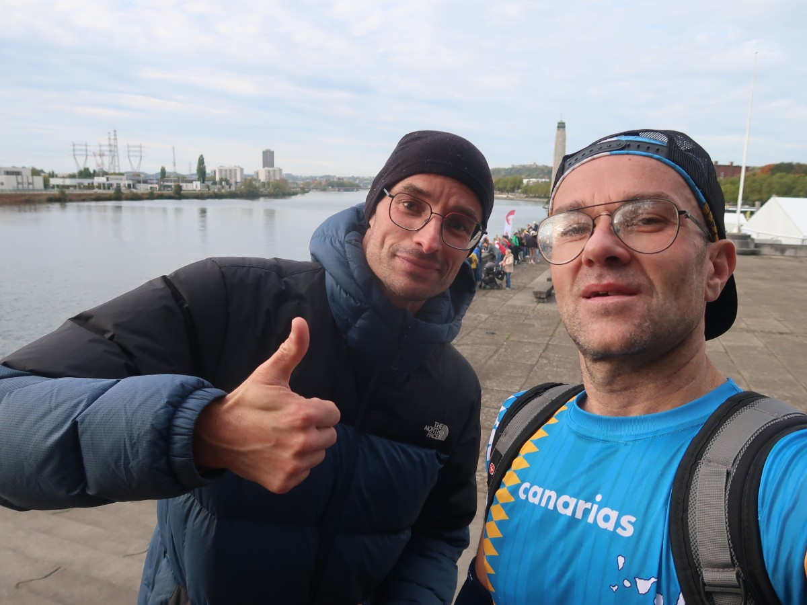

2° participation au semi de la Province de Liège. L'objectif était simple (à formuler, pas à accomplir): terminer en moins d'une heure et vingt minutes. On est passé près du but. Tout ce qui concerne la prépa se trouve dans [cet article](https://ctroupin.github.io/run/blog/20251019_semiliege/).

## Le plan 

### Allure

Le plan était une fois encore très simple: pour finir sous 1:20:00, il faut aller un peu plus vite que du 3'48''/km. Donc je choisis de partir à du 3'45''/km, une allure que j'aime bien car les kilomètres passent vite, et aussi une allure que je considérais jusqu'à il y a peu, être mon allure sur 10 km. Et de voir jusqu'à quand ça tiendra. Dans ma tête je me dis qu'une fois arrivé mi-course et après avoir traversé la Meuse, ça sera facile, je ne sais pas pourquoi.

### Alimentation

À la base je pensais prendre 2 gels, plus ou moins après 30 minutes et puis un autre à l'heure de course. Toutefois comme je n'avais quasi rien mangé au déjeuner (mauvaise digestion ces jours-ci), avant le départ j'ai opté pour déjà prendre un gel. Les deux autres restaient dans la poche.

### Mentalement

En 2023 j'avais fini un peu en dessous de 1:21 donc ici en étant mieux préparé, ça ne pouvais que mieux se passer! Et puis aussi après avoir lu la fameuse _Bible de la préparation mentale_ (méthode Target), je savais comment me mettre dedans.

## La course

### Le parcours

Plus besoin de présenter le parcours, même s'il était un peu différent ce qu'on avait eu il y a deux ans. En résumé: du plat, une traversée de la Meuse via une montée sur un pont, puis de nouveau plat.



### Déroulement

Départ dans le sas _rapide_ (merci l'organisation!), ce n'est plus une surprise de dire qu'on est parti fort vite, plus vite que l'allure cible, mais ce n'est pas grave. Rapidement les groupes se forment, on discute un peu entre coureurs pour voir qui pense faire 1:20. On aligne les kilomètres à du 3'45/km, pas spécialement difficile mais pas non plus la sortie typique du dimanche. 

On passe les 8 km en moins d'une demi-heure, tout va bien, sauf le fait de se dire qu'on est pas encore à la moitié. Au loin je vois le fameux pont qui marque psychologiquement pour moi la mi-course, même si ce n'est pas le cas point de vue distance. Sur le pont j'arrive à recoller à certains qui m'avaient dépassés dans la première partie. Par contre quand je regarde la montre je vois parfois des 4'15''/km, 3'55''/km... rarement du 3'45''/km. Le deuxième gel pris à 35 minutes fait son effet, j'ai l'impression d'être facile, plus facile que pendant la première partie.

Certains kilomètres passent super vite, je ne calcule pas trop mais selon la distance de la montre ça passera. Par contre selon les kilomètres affichés sur la parcours, ça va être fort juste. Il ne reste plus grand chose et voilà qu'on se retrouve sur la course en même temps que ceux qui faisaient le 10K. Pas vraiment un soucis, moi ça me motive, mais clairement on doit slalomer pour pouvoir dépasser, parfois se frayer un passage entre 2 groupes. 

Voilà qu'il ne reste plus que 2 kilomètres, j'essaie de remettre un coup d'accélérateur. Petite côte avant de redescendre vers l'Île Monsin, mais où est cette pu*** de ligne d'arrivée? Réponse: juste un peu trop loin.

### Résultat

1:20:10 selon mon chrono, un peu moins selon le temps officiel. Défi presque réalisé. Mais comment on peut gagner (ou perdre) 10 seconces? 
- En prenant de l'eau au ravito: j'ai parfois essayé de boire mais ça n'a pas trop été. Le gars devant moi en profitait pour prendre un peu plus d'avance. Sans doute une mauvaise idée.
- En baissant l'allure sans s'en rendre compte.
- En slalomant entre des coureurs en fin de course.
- En ralentissant trop à cause de virages trop serrés.

|  |
|:--:|
| _Comparaison du cardio lors du semi de 2023 et celui-ci._ | 

## Conclusions

Une course dont je garderais un bon souvenir, même si je ne la referai probablement plus. Il y avait 2600 participants pour le semi, et à côté de ça:
- grosse file pour utiliser la consigne; pas idéal avant la course;
- douches disponibles à 8 km de site de la course;
- zone d'arrivée saturée, entre coureurs du 21K et ceux du 10K.
  

Terminer en 1:19 semble réaliste, point de vue entrainements ce qu'il m'a manqué c'est quelque chose du genre 10K à `AS21` ou 2 X 6 km à `AS21`. 

