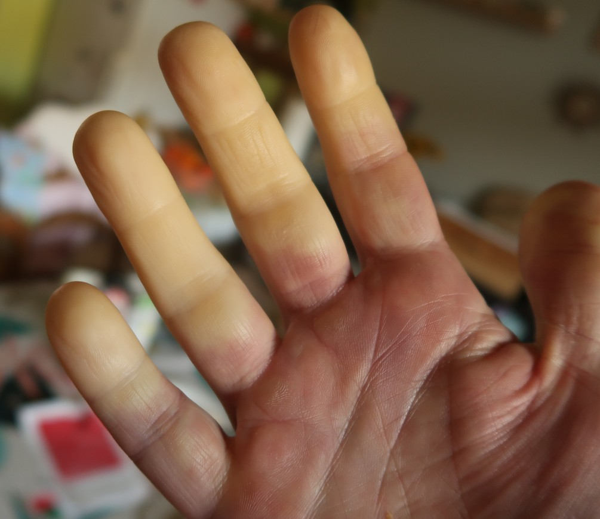
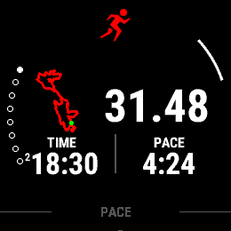

---------------

Déjà la 3° participation consécutive, le temps passe vite. J'avais aussi dû la faire dans une autre vie, c'est-à-dire avant d'avoir passé quelques années à Majorque, à l'époque je courais pas trop bien, sans vouloir insinuer que je cours bien maintenant. Les récits des éditions antérieures se trouvent ici: [2023](  ) et [2024](  ).

## L'objectif

Un peu comme dans toutes les autres courses, le but est d'améliorer le temps de la fois précédente. Dans ce cas ça veut dire passer sous 2:27:00. En pratique avec n'importe quel temps entre 2:20:00 et 2:30:00 je serais déjà bien content. Un de ces jours passer sous 2:20 semble possible, mais il faut bien avouer que c'est une course qui fait mal.

|  |
|:--:|
|_Courir 2 heures en Tshirt, OK, par contre une fois que c'est fini, c'est la cata._|

## La prépa

Pas vraiment de plan particulier, la prépa visait surtout un [semi-marathon]( ) il y a 3 semaines, lequel s'était plutôt bien passé. Mon idée était d'essayer de récupérer vite du semi, repartir sur une grosse semaine (volume + fréquence + intensité), puis de me calmer 3-4 jours avant la course.

D'ailleurs l'année passée j'avais écrit qu'un des points à peut-être améliorer serait d'arriver plus frais sur la ligne de départ: en 2024 je prenais le départ avec 102 km dans les jambes. Certes pas excessif, mais pas non plus nécessaire. 

La semaine de la course, les sensations étaient excellentes, j'avais avancé la séance de piste du jeudi au mercredi pour permettre une bonne récupération, et aussi j'avais évité les séances de muscu trop proches de la course (en général ça n'influence pas les jambes, par contre passer plus de 2 heures avec une douleur dans les pecs, par exemple, c'est pénible).

Dans ma tête je pensais ajouter des séances spécifiques de descentes, c'est vraiment un truc qui casse les cuisses, malheureusement on ne fait pas toujours ce qu'on veut.

Point de vue nutrition, tout comme pour le semi j'ai essayé de bouffer assez pour en pas perdre de poids. Vu que je ne me pèse pas, difficile de dire si ça a fonctionné. 

## Les chaussures?

Même question qu'en 2024: avec quoi courir? La dernière fois j'avais fait avec les _pantoufles_, les Nike Zoom Streak 7, mais ici elles commencent à se déchirer de partout et c'était ma toute dernière paire. Ce sera alors les Zoom Streak Fly, plus légère mais aussi avec plus d'amorti. 

Attention, sur la chaussure il est indiqué "5K-10K", ce qui laisse à supposer que ce n'est pas l'idéal pour un 33K. Dans ce cas la question ne se pose pas car je n'ai rien d'autre à me mettre aux pieds, en dehors de chaussures de trails qui servent quasi uniquement pour la course d'orientation.

## La course



### Le parcours
 
Plus besoin de détailler le parcours, tout le monde sait que:
1. Il n'y a quasi pas de zone plate, 2 km au total selon le site web de l'organisation.
2. Il n'y a quasi que de l'asphalte, excepté 700 m de chemin selon mon collègue Marc.
3. Ça tape et ça fait mal la plupart du temps.
   
Ce sont surtout les descentes que je redoute, les cîmes en elles-mêmes j'ai l'impression que ça passe plutôt bien.

### Le récit

Enfin arrivé au plus intéressant: 
> Comment ça s'est passé?

Directement ça a (un peu) foiré: après plusieurs minutes je me rends compte que je suis à 0 minute et 0 km: le chrono ne s'est pas lancé. J'estime l'avoir mis en marche vers le KM 1.5, et c'est parti pour les calculs afin de savoir combien de minutes (6?) je dois ajouter à mon temps pour avoir le vrai temps (ou alors juste regarder l'heure).

Bref ça me saoule déjà et décide de faire sans regarder la montre, en dehors de 2 ou 3 coups d'oeil pour voir l'allure. Comme d'habitude ça part vite, il y a quelques groupes qui se forment mais quand même pas beaucoup de monde autour de nous.

KM 12 environ, coup de gueule: un gars qui est dans le groupe fait toute sa course avec son ami à vélo électrique. Il lui refile ses boissons, lui dit ses temps, OK jusque là, mais surtout, nous casse les c*** en passant devant nous, à côté, se colle à notre cul etc. Moi rien que son bruit de dérailleur me saoulait. Donc je leur dis:
> Hey les gars vous savez pas vous casser? Avancez, allez plus vite mais cassez vous!

Les 2 me regardent, pas trop contents, visiblement c'est moi qui devrait partir. Je ralentis un coup pour qu'ils s'éloignent, mais ça ne marche pas trop, en tout cas au début. Puis finalement ils prennent le large. Si jamais vous le lisez les gars (probabilité: 0%): désolé d'être un peu brusque, mais c'est une course à pied, il y a 5 ou 6 ravitaillements, plein de gens courent avec une ceinture, un sac, ... alors ne me faites pas croire que courir avec une assitance vélo permanente n'est pas lamentable.

Bref, une fois cet épisode terminé, je passe encore quelques kilomètres plutôt agréables, jusqu'à la 2° cime, celle du _Fort d’Aubin_ (KM 17): ça monte mais ce n'est pas vraiment la gloire. Je commence à me faire dépasser, on est à peine à mi-course, ça va faire mal.

De là ça descend longtemps, jusqu'à la 3° cime (_Mauhin_), j'en profite pour m'arrêter pour pisser, truc qui ne m'arrive quasi jamais en course, raison pour lequel je le mets ici. Les gens descendent comme des missiles, et ils ont bien raison! Au début de cette cime je ne fais évidemment plus le malin, ça n'avance plus et j'ai mal à plein d'endroits où je n'ai jamais mal en course. Peut-être il faudra que j'explique pourquoi...
> Et si j'abandonnais?

Si, sérieusement, j'y ai pensé: trouver un signaleur, lui donner mon dossard, puis trouver une voiture pour retourner sur Battice. Un plan bien foireux. KM 25: je marche. Et on sait que quand on marche c'est le début de la fin. Rapidement je me relance mais pour combien de temps? 33 - 25 = 8. Si je marche 8 km, j'en ai pour presque 2 heures. Pfff. Tant pis, je continue, sur le plat je limite la casse, en montée je suis un escargot avec du lest. Le truc marrant c'est que les gens sur le bord de la route disent: 
> Ohh regardez il est vraiment à l'aise! 

Si seulement ils savaient... Les kilomètres s'enchainent suffisament vite pour que je ne craque plus trop, je me souviens bien de la fin et sais que ça va faire très, très mal. Je marche encore un peu avant le KM 30, puis la douleur passe assez vite et je repars pour le dernier assaut.

Aucune idée du chrono, rien à faire de toute façon, ce sera moins bien qu'en 2024, sans doute au dessus de 2:30. Je termine la dernière côte en courant, chose que je ne pensais pas possible quelques minutes auparavant, et franchis finalement cette superbe ligne d'arrivée. J'arrête le chrono, sauvegarde la course et part directement pour la prochaine mission: récupérer le Tshirt de la course que j'avais commandé! 

## La fin

Après quelques discussions j'arrive enfin à recevoir le Tshirt, je discute un peu avec un ami et regarde l'heure: 13h30. Mon cerveau calcule un peu: départ à 11h environ, il est 13h30, ça fait déjà quelques minutes que j'ai fini: peut-être que tout n'est pas perdu. Rapide coup d'oeil à la montre:

|  |
|:--:|
|_Capture d'écran de la montre, au cas où ce n'était pas clair._|

1:18:30, et il manque 1.5 km. Peut-être que ça passera. Une fois à la maison, je vois (enfin) le temps. Pas si mal, beaucoup mieux que l'année dernière, même si les sensations étaient pas terribles sur le dernier tiers de l'épreuve.

## Qu'est-ce qui a foiré?

Avant j'avais une amie qui disait souvent:
> Les excuses sont faites pour s'en servir.

Ici j'ai une excuse _valable_, mais après réflexion je n'ai pas envie de l'utiliser. Donc ce sera le joker habituel: je suis parti trop vite, ce qui est sans doute un peu vrai.

Il ne me reste plus qu'à ajouter quelques photos et puis en route pour la prochaine course!