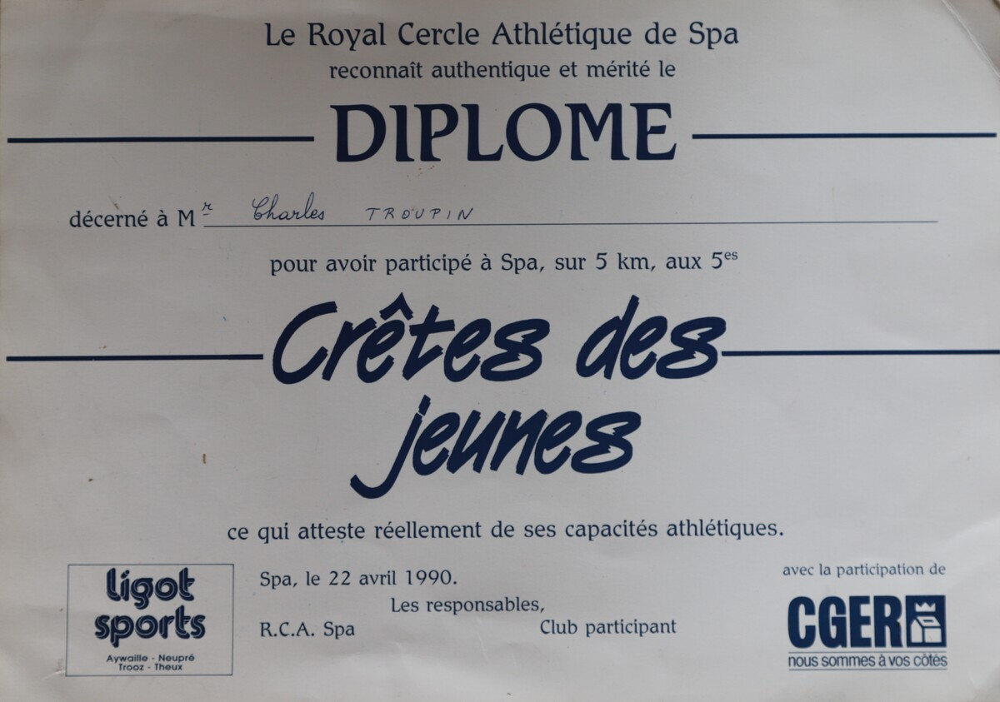
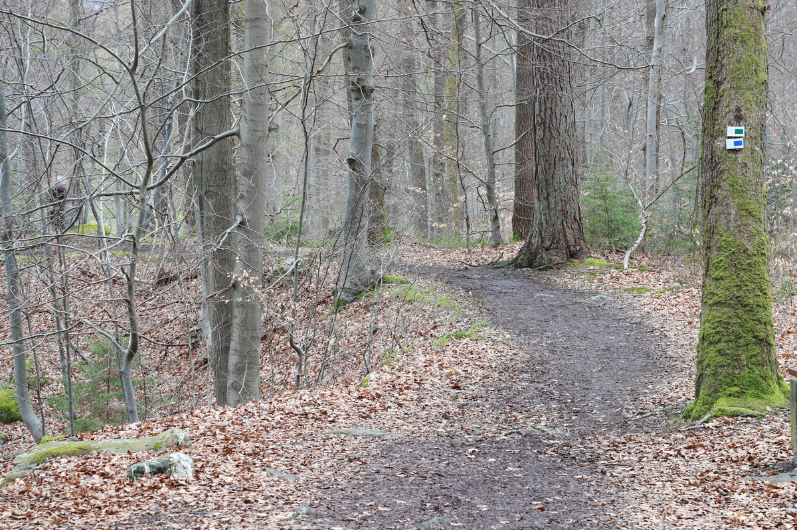
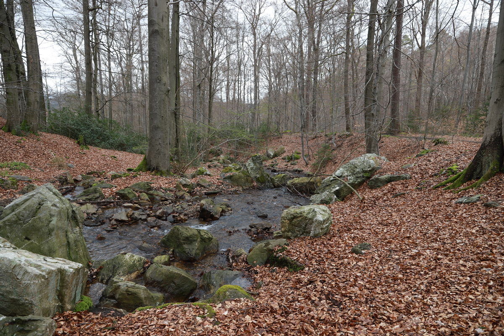
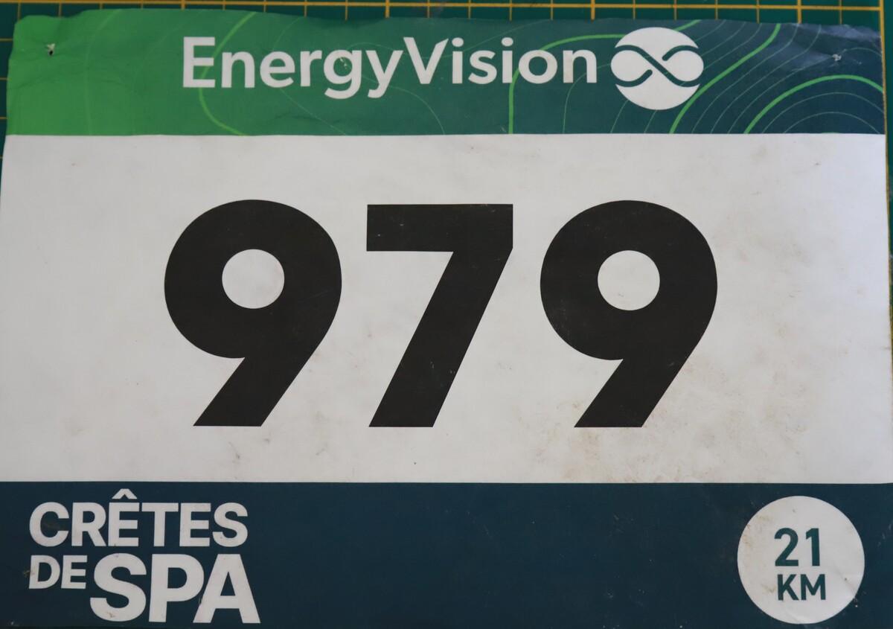

---------------

Dans la région il y a un groupe de courses qu'il faut avoir courues: les Crêtes de Spa en font partie. Je les avais évidemment déjà faite, j'ai presqu'envie de dire dans une autre vie, cette-fois ci le but était simple: faire la course correctement. Autrement dit, dans un temps proche de 1h30. Voilà pour l'intro.

## Les Crêtes & moi

Mon histoire avec les Crêtes débute il y a vraiment longtemps. Pas lors de la dernière participation en 2011, mais bien avant, dans les années 1990. À cette époque dans notre école primaire tout le monde en parlait, d'ailleurs notre instituteur Monsieur Dodrimont était connu pour avoir fait les 21 km (une vraie star), chose qui pour nous semblait impossible. De mon côté je m'étais inscrit deux fois aux 5 km. J'en garde un souvenir horrible, j'avais commencé en courant, puis après ça n'avait plus été du tout et un adulte avait dû m'aider. Pour ma défense, à l'époque on n'expliquait pas trop aux enfants qu'il ne fallait pas commencer trop vite... 

Ensuite j'ai coupé les ponts avec la course à pied en général (pas à cause de cette course), jusqu'à ce qu'en [2010](http://www.chronorace.be/Classements/ListeRapports.aspx?eventId=5514738008064), avec une préparation que je qualifierais de décente, je décide de reprendre le départ des Crêtes. Après un peu de recherche, je trouve enfin mon classement: 685°/855, avec un temps de ... roulements de tambour: `2:13:43` ! Pour me réconforter: 265° place pour le _classement de la montagne_ (total des temps sur les 3 côtes). Honnêtement, 16 ans plus tard, je n'ai quasiment plus aucun souvenir de cette course.

En [2011](http://www.chronorace.be/Classements/ListeRapports.aspx?eventId=6347961663488), la catastrophe: après avoir bu beaucoup trop d'eau au départ, j'ai dû m'arrêté à la mi-parcours afin d'aller faire mes besoins. Ça reste vraiment un mauvais souvenir, heureusement depuis j'ai _appris_ des choses. Résultat: je termine en `1:59:59`, en 644° position. 

[2012](http://www.chronorace.be/Classements/ListeRapports.aspx?eventId=6111738462213): le retour. On avait refait le parcours en mode entrainement avec 2 potes, ça s'était super bien passé, et ça m'avait motivé à m'inscrire au trail de 50 km, qui en était à sa première édition. Un tout bon souvenir car les james et la tête étaient là. Je termine en `5:16:24` (44°/242), bien content de m'être réconcilié avec la course.

|  |
|:--:|
| _._|

2016 (ou 2017, à vérifier): ma dernière apparation sur la course, cette fois-ci pas en tant que coureur, mais comme photographe. À l'époque je ne vivais plus en Belgique, et je suppose que je profitais d'un passage en Belgique pour passer par là. Un très bon souvenir malgré tout!

## La course

Le trajet a très peu variés lors des dernières années. Le principal changement est qu'au niveau de la caserne milaire, on ne monte plus par le Chemin de Moutons, mais par un chemin dans les bois assez technique. D'ailleurs dans ma tête j'avais totalement oublié que cette course est plus un trail qu'une course normale sur route. De la route il y en a durant les 3 premiers kilomètres, ensuite c'est plutôt chemins et forêt.

Coup de chance: la météo était très mauvaise, je n'ai pas eu besoin de réfléchir pour les chaussures: des trails (Salomon). S'il avait fait sec, j'aurais sans doute hésité (et ne pas prendre des trails auraient été une mauvaise idée)



### Les côtes

La course est connu pour ses 3 côtes principales:
1. La _Côte des Moutons_, qui ne fait malheureusement plus partie du parcours.
2. La fameuse _piste de ski_, aussi connue sous le nom de _Thier des Rexhons_. Elle fait souvent peur mais finalement ce n'est qu'un court moment à passer, l'important étant de pouvoir relancer le rythme dès la fin de la montée. 
3. La _Côté de Cherville_, qui n'est pas spécialement difficile mais qui arrive assez tard dans la course (entre le 16° et le 17° kilomètre), ce qui lui donne du potentiel pour faire mal.

|  |
|:--:|
| _._|

Pour moi cette fois ça a été plutôt bien dans la côte, probablement parce que la météo avait rendu le terrain très très difficile, et donc dans les descentes et sur le plat ce n'était pas facile d'aller très vite.

## Le résultat?

Je termine les 20.5 km en `1:30:35`, en 23° position (sur 795 finishers), donc plutôt content du résultat, bien qu'il m'en restait pas mal sous la pédale en fin de course. La météo a vraiment compliqué la course, et pour moi la prudence était vraiment de mise.

|  |
|:--:|
| _._|

Passer sous les `1:30:00` semble clairement faisable, d'abord avec un terrain plus sec, mais aussi:
- avec des descentes un peu plus aggressive, et pour cela il y a clairement du travail à faire;
- un peu plus d'allure sur les portions moins techniques, afin de grapiller quelques secondes par-ci par-là.

### What's next?

Le 12 avril: 15 km de Liège, un type de course tout à fait différent, a priori une météo plus clémente et aussi certainement un public plus abondant.