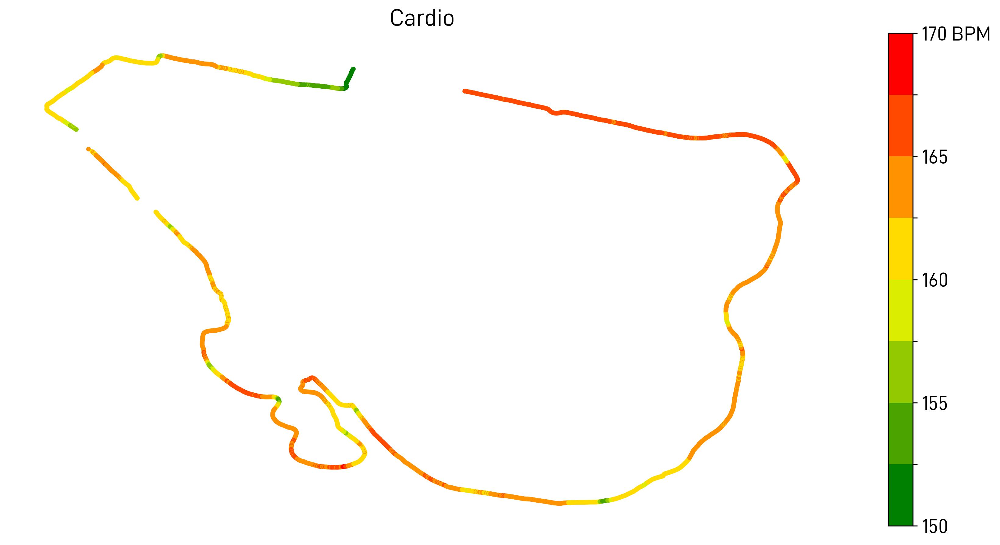
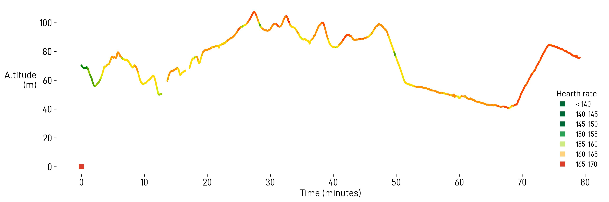

---------------

Les 20 KM de Bruxelles, encore un _monument_ de la course à pied auquel j'ai eu la chance de pouvoir participer cette année. Initialement ce n'était pas prévu, puis je m'étais quand même inscrit (sur liste d'attente), avant d'avoir obtenu le dossard de quelqu'un qui s'était blessé quelques jours avant la course.

D'ailleurs comme tout ça a été improvisé je suppose qu'il n'y a pas grand chose à raconter.

## La préparation

Elle allait dans la continuité du [Marathon de Charleroi](  ) il y a 4 semaines. Après celui-ci, j'avais passé quelques jours aux Canaries où je n'avais pas couru beaucoup, ensuite une bonne semaine en Belgique avec 130K mais sans vraiment faire de qualité. Puis une semaine que l'on qualifiera de compliquée au boulot, avec des obstacles pour courir et des tentations pour (mal) manger. 

Dire que j'ai essayé de limiter la casse est bon résumé des jours précédant la course.

## ⏱️ Quel temps viser?

Mauvais prépa (voire pas de prépa du tout) est équivalent à absence de pression. Concrètement ça se traduit par:
- `1:20:00` serait super, en gros du 15 km/h en moyenne, avec le grand nombre de coureurs et le dénivelé, ça parait réaliste mais pas trivial;
- `1:30:00` serait tout aussi OK, ça ferait une bonne sortie longue, dans une très belle ville, que demander de plus?

On peut aussi aller dans des pronostiques un peu plus analytiques, par exemple, sur une distance similaire ([semi-marathon de Liège](  )), je suis à environ `1:20:00`, donc si on retire un kilomètre (environ 4 minutes), je devrais pouvoir `1:16:00`. Honnêtement je n'y pensais pas trop, c'était juste une possibilité.

## 🌮 Alimentation 

Que dire si ce n'est que j'ai entamé la course en ayant faim! Ce n'est pas quelque chose qui me faisait réellement peur, la distance est assez courte pour que ça passe sans que ça casse, bien qu'un petit gel au départ n'aurait pas été de trop. 

Le pire serait d'avoir des problèmes de digestions, heureusement aucun soucis de ce côté-là.

## La course

Ce que je retiendrai, c'est ce monde incroyable sur le parcours: quasiment 50000 coureurs et coureuses, c'est impressionnant. Dans certains montées, en voyant au loin tout ce cortège avançant dans les rues, je me disais que ce n'était pas possible, et que ça allait bloquer d'un moment à l'autre. Sauf que non, c'était la perspective qui trompait, il y avait vraiment beaucoup de place entre les personnes et on pouvait dépasser plus ou moins facilement (il suffisait de slalomer).

### 🗺️ Le parcours 

Comme veut l'habitude je n'avais pas étudié le parcours, je savais que ce n'était pas facile, et surtout on m'avait dit qu'il y avait une petite montée à la fin, qu'il fallait en garder sous la pédale comme on dit.



### 📖 Le déroulement 

Le départ, un vrai merdier: on était dans le premier sas, celui où normalement les gens finissent en 1h30, et je crois qu'on a passé la ligne de départ 4 minutes après le vrai départ. Ce n'est pas grave vu que les temps sont pris de manière automatique mais n'empêche, ça veut dire qu'il y a des centaines voire des milliers de personnes devant nous.

Cette impression s'est vite confirmée: du monde partout et avec des vitesses bien différentes: du rapide, du moyen et aussi du très lent, même de la marche après 2 km. J'avais essayé de suivre un rapide qui se frayait bien un chemin, puis finalement j'ai préféré prendre ma propre trajectoire qui ne ressemblait à rien.

Point de vue allure j'ai testé la technique de ne pas regarder la montrer, technique qui a malheureusement ses limites: quand je pensais avoir une bonne allure, j'étais en fait trop lent (4'15/km) et quand je pensais être lent, j'étais à du 3'45/km.

En tout cas les kilomètres défilaient, ce qui est toujours bon signe. Les 10 premiers KM passent en moins de 40 minutes, plus ou moins ce que je pensais. Pour le reste de la course pas grand chose à dire, je n'étais pas à l'aise mais pas non plus dans le rouge: ça manquait cruelement d'un rythme constant, peut-être un meneur d'allure ou un groupe auquel se coller, je ne sais pas.

Vers la fin je sens que ça monte, mais il me faut un peu de temps avant de comprendre que oui, c'est bien ça la fameuse côte, l'avenue de _Turvuerenlaan_, alias l'avenue de Tervueren. Il suffit de la monter à un bon rythme, puis ça descend encore quelques hectomètres jusque la fameuse arrivée. Ça finit en `01:19:03`, plutôt pas mal.

## Les conclusions

Vu que ça va faire déjà 3 semaines que la course a eu lieu, j'ai tendance à oublier ce que je voulais dire. Avec du recul je crois que j'aurais peut-être dû aller un rien plus loin dans l'effort, mais je n'étais pas super à l'aise. 

Sans doute une des courses où j'ai vu le plus de monde, avec le marathon de Paris, il y a quelques années je n'aurais jamais fait ça, maintenant ça passe sans aucun stress. 