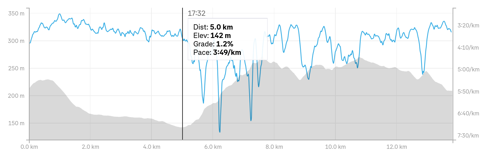

Chaque fois que j'y pense, je me dis qu'écrire un article sur une course n'est vraiment pas aisé.
En gros, on essaie de se rappeler, quelques heures ou quelques jours après, de trucs qu'on a fait ou qu'on a dit, alors qu'on est dans un état pas vraiment normal (une course où on est normalement dans le rouge).
Malgré tout ça reste un exercice amusant, raison pour laquelle je tente le coup sur ce 43° Jogging de Verviers.

Pour changer l'habitude, je vais commencer par la fin, pour progressivement aller vers l'avant-course et la prépa!

## Après-course

Ouf, enfin fini, pas d'ombre au Stade de Bielmont, je vais vite à la maison prendre une bonne douche et surtout changer de chaussures, les Nikes sont toutes trempées et je n'aime pas ça. Globalement ça va, pas crevé, pas cramé, je dirais même que ça va mieux qu'avant le départ. Et surtout je me dis qu'il y a de la marge pour  l'année prochaine.

## Fin de course

54 minutes et quelques secondes, je passe la ligne en cherchant du regard s'il n'y a pas un photographe. Je n'en vois pas, Gédéon où es-tu? De l'eau, de la tarte au riz, une canette de je ne sais pas quoi, tout est bon pour récupérer.

Les enfants me rejoignent près des châteaux gonflables, le calme de la course (puis de la douche) prend une fin abrupte mais attendue. 54 minutes de tranquilité, presque de _flow_, où il faut juste mettre un pied devant l'autre. Un bon temps, pas excellent mais de quoi être content:  il faisait vraiment chaud, j'ai hésité à prendre le départ (pour d'autres raisons), et voilà c'est fait.

## La course

Pour une fois me voilà pas trop mal placé au départ. Je dépense directement pas mal de gens, sans regarder l'allure à la montre, mais soyons honnêtes: le plan est de partir trop vite, ou juste à la limite, pour faire 5 km en `17:30`. Ni plus ni moins.

Je ne prépare jamais le déroulement d'une course, je m'en tape des parcours que je ne connais pas, donc ici c'est l'exception: j'ai ouvert la course d'il y a 2 ans sur [Strava](https://www.strava.com/activities/11668888080) pour voir comment j'avais géré le début. `17:30` c'est faisable, ensuite 10 minutes de montée depuis Ensival jusque le haut de Piedvache, et puis c'est fini (dans ma tête), car il ne reste plus que rue de l'Usine, Moraifosse, rue des Prés, ... et des rues tranquiles où les jambes savent dérouler.

|  |
|:--:|
| _Les 5 premiers km passent comme une lettre à la poste._|

J'arrive donc à Ensival au KM 5 en `17:32`, de la précision suisse pourrait-on dire, le tout sans regarder la montre. On entame la montée, gros ralentissement, comme d'habitude, je m'attends à me faire dépasser par 10 personnes par minute, sauf que la montée c'est pour tout le monde, donc même à du 12 km/h, voire moins, ça limite la casse. Voici le tapis qui chronomètre le début de Piedvache, un peu après il y a cette sale bosse, le début de la montée, un sal moment à passer car après la montée se fait plus douce. Quelqu'un m'a dit que j'étais 71°, aucune idée si c'est vrai, en tout cas il n'y pas des masses de coureurs en vue devant ou derrière. Je ne sais pas trop ce que j'ai fait dans ce tronçon, j'étais sûrement perdu dans mes pensées, souvent je regarde les gens du public, pour voir s'il y a quelqu'un que je connais, s'ils disent "allez, courage", je leur réponds "merci!", s'il y a des enfants qui veulent qu'on leur tape dans la main je vais vers eux (en essuyant ma main avant autant que possible).



Fin de Piedvache, j'entends "allez Charles!", aucune idée de qui c'était, nous voilà déjà dans la descente du Champs des Oiseaux, où de l'eau nous attend. Que c'est compliqué de boire... Même en m'entrainement, pas sûr d'y arriver. Bientôt la montée de la rue de l'Usine, plein de monde et aussi des gens qui nous arrosent, ça fait plaisir!

2 secondes après me voici déjà au Club de Tennis, genre téléportation, c'est sans doute la meilleure ambiance de tout le jogging. Après il y encore des chemins sympas avant de retourner sur l'asphalte. Il y a une coureuse assise, on dirait qu'elle a fait un malaise, mais ça va elle est biene entourée.

Dernier ravito, près de la plaine de Rouheid, et là, miracle, je parviens à boire presque normalement. Je sens que le rythme est meilleur, ça tourne bien, il ne peut plus rien arriver. Dans le tournant je vois comme chaque année mon ancien entraineur de basket qui me fait un gros _high-five_. Après, je sais plus trop, je sais juste que ça trace bien. 

Dans la dernière descente avant de tourner vers la piste, je vois un gars qui fait un petit malaise, chance pour lui il y a plein de pompiers à côté, il est entre de bonnes mains. Sur la piste pas trop de monde, je laisse tourner sans forcer.

## L'avant-course

11h20, soit 10 minutes avant le départ: je suis chez moi 🚽. J'envoie un ptit SMS à Arnaud.
> Ça passe ou ça casse, mais je vais tenter.

J'ai jamais aimé raconter les circonstances, ça fait un peu le gars qui cherche des excuses, mais si on veut résumer ça en un symbole, ce serait 🦠.

## La prépa? 

Quelle prépa? Ici on est dans une phase de reprise de vitesse, suite au [Marathon de Charleroi](  ), et sans doute avant une phase de prépa semi-marathon pour plus tard. Se préparer spécifiquement pour Verviers ne serait pas vraiment nécessaire. 

## Bonus!

Vous avez toujours voulu connaitre le nombre de participants au jogging, ainsi que les meilleurs temps?
Les voici, depuis 2012. J'essaierai de mettre à jour quand j'ai du temps.

| Année |  Distance | Finishers | Meilleur temps |  |
|------|-----------|-----------|-----------|--------|
| 2026 | 14 km | 2230 (2320 started) | 44:24 | Arnaud Collard |
| 2025 | 14 km | 1851 (2022 started) | 44:30 | Amaury Paquet |
| 2024 | 13 km | 2235                | 42:09 | Amaury Paquet |
| 2023 | 14 km | 1723 (1776 started) | 41:54 | Amaury Paquet |
| 2022 | 13 km | 1820                | 41:49 | Nicolas Schyns |
| 2021 |       | 🦠 | — | — |
| 2020 |       | 🦠 | — | — |
| 2019 | 13 km | 2246 (2267 started) | 41:21 | Michael Brandenbourg |
| 2018 | 13 km | 2398 (2408 started) | 41:45 | Florent Caelen |
| 2017 | 13 km | 2389 (2418 started) | 41:04 | Noah Kemei |
| 2016 | 13 km | 2332 (2351 started) | 41:36 | Régis Thonon |
| 2015 | 13 km | 2678 (2702 started) | 42:26 | Florent Caelen |
| 2014 | 13 km | 2768 (2785 started) | 40:02 | James Barmasai |
| 2013 | 13 km | 2977 (3014 started) | 42:27 | Olivier Pierron |
| 2012 | 13 km | 2845 (2897 started) | 40:39 | Jamal Baligha |