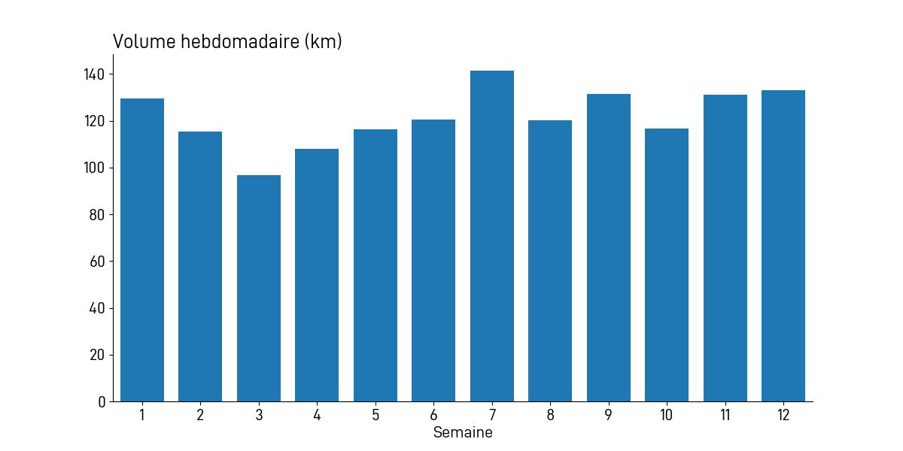
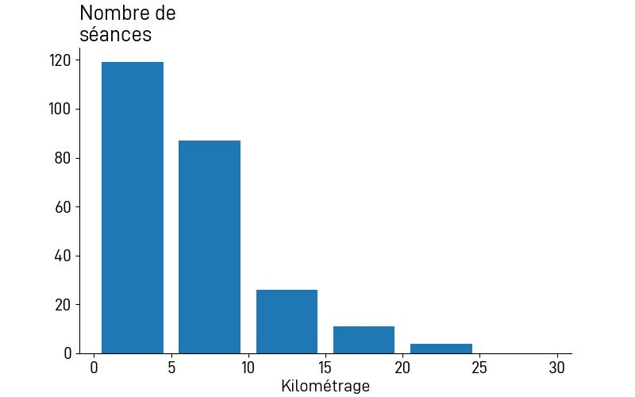

---------------

> Comme vous le voyez, certains coureurs ont encore une belle foulée, même après 42 km.

Tels sont les mots de la speakerine quand je suis arrivé. 3 heures 10 minutes et quelques secondes d'efforts. Cependant je suis très mal placé pour faire le malin: j'ai couru comme une me***. Ça devenait moins fréquents ces temps, mais de temps en temps il faut bien que ça se passe.

## Avant la course: la prépa etc

Cette fois c'est bien parce qu'il n'y a pas eu de préparation spéficique: il y a quelques mois j'avais commencé à mettre pas mal d'intervales à `AS42`. Ça se passait super bien. Mais je n'étais pas encore inscrit à la course, pour des raisons que je n'expliquerai pas ici. Dans ces conditions je n'avais pas super envie de faire une vraie prépa sans être inscrit.

### La préparation

Les séances qui ont bien marché étaient celle de farlek au Sart Tilman, j'arrivais à prendre de bonnes allures, peut-être trop rapides.
Puis il y a eu les courses:
1. Les [Crêtes de Spa](  ), objectif accompli avec un temps de `1:30:35`. Pas le même type d'effort mais quand même un bon signal pour la suite.
2. Les [15 km de Liège]( ), deux semaines avant le marathon, avec un temps plutôt bon.
C'est à ce moment-là que je me suis dit qu'il fallait profiter du pic de forme (merci Arnaud pour m'avoir motivé!). 

Pour le reste, j'ai vraiment essayé de faire du volume, il y a eu des semaines à 140 km qui sont passées comme une lettre à la poste. Il n'y a pas eu vraiment d'affutage, j'avais quand même bien diminué l'intensité, surtout après les 15 km de Liège.

|  |
|:--:|
| _Volume couru lors des 12 semaines avant le marathon._|
|------------------------------   | 

Le manque de sorties longues est évident, j'ai malgré tout l'impression qu'il est possible de s'en passer. Concrêtement, ma sortie la plus longue a été 23 km, je ne sais plus trop à quoi elle correspond. Il y a toujours une énorme quantité de petites sorties (> 5km), qui correspondent à mes trajets vers le bureau, principalement. 

|  |
|:--:|
| _Nombre de séances par intervales de 5 km._|
|------------------------------   | 

### ⏱️ Quel temps viser?

Un truc que je n'aime pas de faire et que j'ai fait malgré tout, c'est de calculer les temps qu'on peut faire à partir d'autres résultats de course. J'aime bien ce site: https://vdoto2.com/ pour ce type de calculs.

Par exemple:
- `1:20:08` au semi (mon temps en octobre), ça donne théoriquement `2:47:28`. Mouais. 
- `55:23` au 15 km, ça donnerait `2:47:02`. Un peu optimiste l'algorithme. 

Évidemment ça ne tient pas compte du fait qu'un coureur n'est pas toujours performant de la même façon sur plusieurs distances. Sinon ce ne serait pas drôle. 

Quand on m'a demandé ce que je pensais faire comme temps, j'ai dit que `2:50:00` me semblait possible, mais que je pouvais tout autant finir en `3:30:00`. Il y a tellement de possibilités d'avoir quelque chose qui foire durant 42 km...

### 🌮 Alimentation 

Pas de révolution non plus de ce côté-là: je mange déjà énormément en temps normmal, donc le plan était de continuer comme ça, en faisant juste attention aux aliments qui pourraient générer des soucis de digestion. 

Le matin de la course pareil, j'ai opté pour la simplicité avec eau chaude + miel comme boisson, et quelques tranches de pain blanc avec confiture. Aussi, initialement j'avais pensé que perdre un peu de poids serait une bonnne chose, puis finalement j'ai laissé tomber.

## La course

Un truc positif : avant, certaines courses, surtout les longues, me faisaient un peu stresser. Je dormais pas super bien, mal au ventre etc. C'est sûr que pour réduire le stress il faut éviter les surprises, essayer de planifier. Ici j'avais donc bien préparé mon sac l'avant-veille, préparé le trajet, choisir le parking... Et là c'est vraiment une des premières fois où je me suis senti super à l'aise.

### 🗺️ Le parcours 

Il y a toujours 2 version d'un parcours:
1. L'officielle, la réelle, avec tous les détails, les montées, etc.
2. _Ma_ version: une simplification (foireuse) de la réalité, où j'oublie 3/4 des infos.
Dans ce cas ma version était comme suit:
- une partie plus ou moins plate jusqu'au **KM 25**, dont une longue portion de long du Canal Charleroi - Bruxelles.
- une longue montée jusqu'au **KM 30**, voire plus.
- une descente jusque l'arrivée. 



En fonction de ça j'avais élaboré un plan, aussi en 2 parties:
1. Partir un peu vite, vers les 4'05/km, jusqu'au **KM 25**, pour prendre de l'avance.
2. Limiter la casse en montée à partir du **KM 25**, puis laisser dérouler en descente.

### 📖 Le déroulement 

Le départ (au [Bois du Cazier](https://www.leboisducazier.be/)) ayant lieu à environ 4.5 km du Village Marathon, j'avais décidé d'y aller en courant, ça ferait un bon échauffement. Il y avait des navettes mais elles partaient à 7h30, perso je préférais rester autant que possible au Palais des Expos à l'intérieur avec des chaises, pas trop froid et surtout: des toilettes. D'ailleurs ce petit trajet d'échauffemeng m'a vraiment plu, et le Bois du Cazier a l'air intéressant à visiter.

Sur le site du départ il y a beaucoup de monde, vu que les coureurs du 21 et du 10K sont déjà là aussi. On a donc accès à un sas pour le marathon, et à l'intérieur de ce sas se trouvent successivement les différents meneurs d'allure. C'est clair et bien organisé. J'avance jusqu'au `3h15` puis me dit que `3h` c'est chouette aussi. On discute un peu avec le meneur d'allure, il est 8h59 mais personne ne semble bouger.  Je m'ouvre directement un gel juste avant le départ. On écoute un décompte, mais au moment du "GO!', personne ne bouge. C'est ça le départ? Et oui. Donc on part finalement quelques secondes plus tard, on en rigole, et puis on accélère, départ en descente ça fait plaisir.

Sur le plat je suis souvent à du 4'05/km, je me sens bien, pas de stress, aucune douleur, _just cruisin'_. Une fois en ville, on nous fait passer par des trottoires, des couloirs de bus, je ne sais pas ce que je fais mais je me tors la cheville sur un bord. La chaussure a fait un de ces bruits, comme si elle avait peté. Je me dis: fin prématurée? Ça fait mal mais pas assez pour avoir un impact. Le début de parcours n'est ni plat, ni sexy: on se tape déjà de petites bosses, pas mal de tournants serrés.

Au **KM 7.7** on est déjà le long du Canal. Plus de 7 km vers le nord, ensuite un pont, et on revient par l'autre rive. Les écarts sont déjà faits, le gars devant moi est super loin, inaccessible, celui derrière n'a pas l'air de me rejoindre. J'essaie de gérer les gels et de les prendre juste avant les ravitaillements, afin d'avoir de l'eau. Ça marche plutôt bien. Une fois passé le pont et la changement de direction, je vois le meneur d'allure `3h` (appelons-le Christophe puisque c'est son nom) de l'autre côté est me dit que c'est cool, je suis bien en avance.

Par contre, mauvaise nouvelle, vers le 15° km je commence à sentir une gène aux épaules. J'essaie de les étirer, de rester souple et détendu. Ça ne fonctionne pas. Et ça me fait un peu peur. Je passe la mi-course en `1:28` environ. Il y a de l'avance mais pas énorme, je visais plutôt `1:25` - `1:26`. En fait cette première partie qui, dans ma version de la course, était facile, était déjà un peu traitre. Le sub-3 est encore possible.

KM 22, ça monte déjà bien, dans ma tête c'était au 25° mais pas grave. **KM 26**, la pente est sérieuse, je n'avance plus, et voilà: premier dépassement depuis le début. Logique. Peu après, j'entends plusieurs voix derrière moi: Christophe est là, avec 2-3 autres coureurs. Il essaie de les motiver, aussi ceux qui ont décroché. J'essaie de me coller, ça va sur le plat mais en montée pas. Et de la montée il en reste. 

Je sens que ça va craquer mais j'essaie de repousser ça. Et au **KM 30**, ça craque vraiment, je marche comme une me***, en essayant d'étirer ces épaules. Rien à y faire. Je repars vite, en sachant que le reste de la course ne sera pas une partie de plaisir. En effet: je marche plusieurs fois, et à partir de la 2° ou 3° fois, j'ai compris que le sub-3 n'est plus possible. En soi ça ne me tracasse pas. Je finirai quand je devrai finir, et si je marche c'est clair que je ne mérite pas un sub-3.

Les derniers km sont aussi pénibles que ce que j'imaginais, en plus on est en même temps que les coureurs du 21 km, ça n'aide pas trop. On se prend encore quelques côtes, dont la toute dernière qui mène vers le Palais des Expos. Comme dit au début: la foulée est encore souple, bien que je sois (un peu) détruit. 

## After party

Comme dit le proverbe:
> Une course n'est terminée qu'une fois qu'on est rentré chez soi.

### 🚗 Le retour 
Je ne sais pas pourquoi j'ai eu la riche idée de prendre directement la voiture après la course.  Moins de 10 minutes après avoir passé le ligne d'arrivée j'étais déjà sur l'autoroute! J'avais bien mangé et bu, mais après un moment ça n'allait plus trop, chaud, froid, fatigue, mal au ventre... Un petit arrêt nécessaire sur une aire d'autoroute, _safety first_. Avec du recul je crois que ce trajet m'a encore plus cassé que la course, je n'aime pas être assis aussi longtemps pour rouler. 

### ✅ Les trucs à corriger 

Pas super compliqué à savoir. D'abord point de vue entrainements il faudra sûrement faire de vraies sorties longues (~2h30), cette fois-ci j'ai préféré faire des courses les weekends, on ne peut pas tout faire. Plus de séances à allure marathon aussi. 

Les douleurs aux épaules ce sera la priorité. En cherchant un peu je crois avoir trouvé d'où ça venait, ce qui est bien c'est que la douleur disparait directement après la course, pas comme certaines douleurs aux jambes qui persistent plusieurs jours.

### Prochaines courses

Rien de particulier en vue, probablement des distances plus raisonnables. En tout cas je ne suis pas dégouté des marathons, j'ai presque l'impression que c'est une course comme une autre, sauf qu'il faut être mieux préparé et que ça fait plus mal, mais pour laquelle il ne faut pas stresser plus.

### Les remerciements

Comme toujours, les premiers remerciements vont aux personnes avec qui je fais les séances, aussi bien au Sart Tilman qu'à Verviers. 
Puis merci à l'organisation du marathon, il y a un énorme boulot avec des centaines de bénévoles, franchement chapeau, du très beau boulot!

